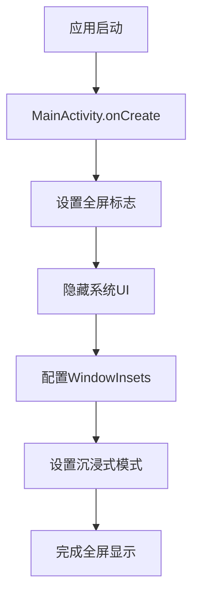
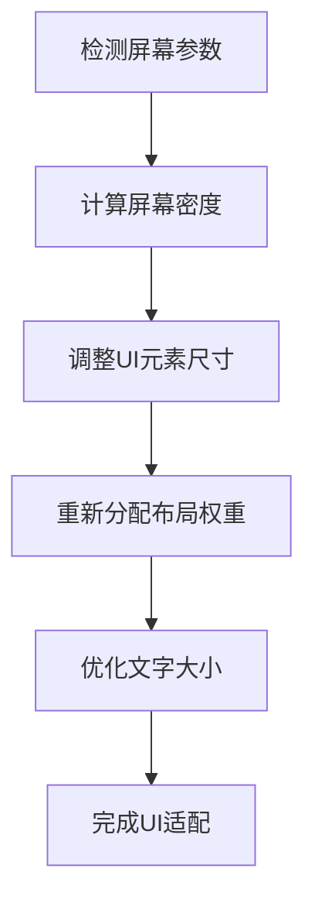

# iQOO Z10 Turbo Pro UI适配优化方案

## 1. 问题概述

针对iQOO Z10 Turbo Pro手机（分辨率2800x1260）在游戏公司模拟经营APP中出现的UI显示问题：
- 游戏速度按钮显示被截断，无法完整显示
- 游戏未强制全屏显示，底部仍能看到手机导航键
- 高分辨率设备上的UI元素布局需要优化

## 2. 核心功能

### 2.1 全屏显示优化

**问题分析：**
- 当前AndroidManifest.xml中已配置全屏相关属性，但在高分辨率设备上可能存在兼容性问题
- 需要增强全屏显示的兼容性和稳定性

**解决方案：**
- 在MainActivity.onCreate()中添加系统UI隐藏代码
- 使用WindowInsetsController API确保全屏显示
- 添加刘海屏和异形屏适配
- 设置沉浸式状态栏和导航栏

### 2.2 顶部信息栏布局优化

**问题分析：**
- TopInfoBar组件中游戏速度下拉按钮在高分辨率设备上显示空间不足
- 中间区域权重分配不合理，导致内容被压缩
- GameSpeedDropdown组件尺寸固定，未考虑不同屏幕密度

**解决方案：**
- 调整TopInfoBar中各区域的权重分配
- 优化GameSpeedDropdown组件的尺寸和布局
- 增加响应式设计，根据屏幕宽度动态调整
- 改进文字大小和间距适配

### 2.3 游戏速度按钮组件优化

**问题分析：**
- GameSpeedDropdown按钮宽度固定为60.dp，在高分辨率设备上可能显示不全
- 下拉菜单项的文字可能被截断
- 按钮点击区域可能过小

**解决方案：**
- 将固定宽度改为最小宽度约束
- 增加内容自适应宽度
- 优化下拉菜单的显示效果
- 增大点击区域提升用户体验

## 3. 核心流程

### 3.1 全屏显示流程

### 3.2 UI适配流程

## 4. 用户界面设计

### 4.1 设计原则
- **响应式设计**：根据屏幕尺寸和密度动态调整UI元素
- **内容优先**：确保重要信息完整显示
- **触控友好**：保证足够的点击区域
- **视觉一致性**：在不同设备上保持一致的视觉效果

### 4.2 具体优化方案

| 组件名称 | 当前问题 | 优化方案 |
|---------|---------|----------|
| TopInfoBar | 中间区域权重不足 | 调整权重分配，增加中间区域空间 |
| GameSpeedDropdown | 固定宽度导致截断 | 改为最小宽度+内容自适应 |
| 全屏显示 | 底部导航键可见 | 增强全屏模式配置 |
| 文字大小 | 高分辨率设备显示过小 | 根据屏幕密度动态调整 |

### 4.3 响应式适配

**屏幕密度适配：**
- 超高密度屏幕（xxxhdpi）：增大文字和按钮尺寸
- 高密度屏幕（xxhdpi）：标准尺寸
- 中密度屏幕（xhdpi）：适当缩小尺寸

**屏幕宽度适配：**
- 宽屏设备（>400dp）：增加水平间距
- 标准屏幕（320-400dp）：标准布局
- 窄屏设备（<320dp）：紧凑布局

## 5. 技术实现要点

### 5.1 全屏显示实现
- 使用WindowInsetsController隐藏系统UI
- 设置LAYOUT_IN_DISPLAY_CUTOUT_MODE_SHORT_EDGES适配刘海屏
- 配置FLAG_LAYOUT_NO_LIMITS确保内容延伸到屏幕边缘

### 5.2 UI组件优化
- TopInfoBar权重调整：左侧1f，中间1.5f，右侧1f
- GameSpeedDropdown最小宽度：80.dp，最大宽度：120.dp
- 文字大小动态计算：基础大小 × 屏幕密度系数

### 5.3 兼容性保证
- 支持Android 7.0+的全屏API
- 向下兼容旧版本的全屏实现
- 异形屏和刘海屏适配

## 6. 预期效果

- **全屏显示**：完全隐藏系统导航栏，实现真正的全屏游戏体验
- **UI完整性**：游戏速度按钮完整显示，不再被截断
- **响应式适配**：在不同分辨率设备上都能正常显示
- **用户体验**：提升触控操作的便利性和视觉效果

## 7. 测试验证

### 7.1 测试设备
- 主要测试：iQOO Z10 Turbo Pro（2800x1260）
- 兼容性测试：其他高分辨率Android设备

### 7.2 测试要点
- 全屏显示是否完全生效
- 游戏速度按钮是否完整显示
- 各UI元素是否正确对齐
- 触控操作是否正常响应