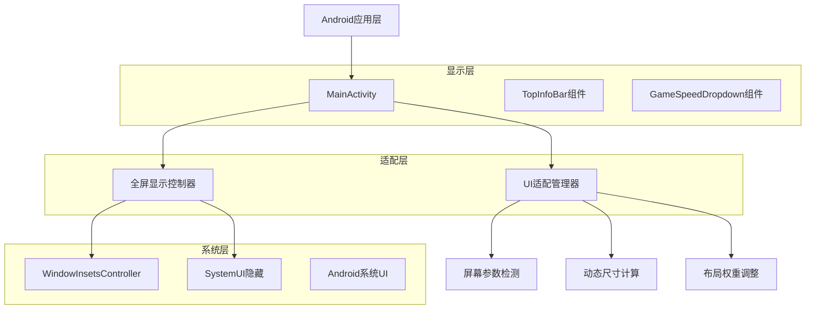
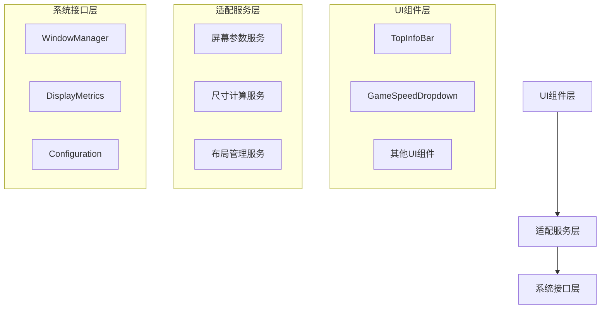

# iQOO Z10 Turbo Pro UI适配技术架构文档

## 1. 架构设计



## 2. 技术描述

- Frontend: Android Kotlin + Jetpack Compose
- UI框架: Material Design 3
- 适配方案: 响应式布局 + 动态尺寸计算
- 全屏实现: WindowInsetsController + SystemUI隐藏

## 3. 核心组件定义

### 3.1 全屏显示控制器

**功能职责：**
- 管理系统UI的显示和隐藏
- 处理不同Android版本的兼容性
- 适配异形屏和刘海屏

**实现要点：**
- 使用WindowInsetsController API（Android 11+）
- 向下兼容使用SystemUiVisibility（Android 7-10）
- 设置LAYOUT_IN_DISPLAY_CUTOUT_MODE_SHORT_EDGES

### 3.2 UI适配管理器

**功能职责：**
- 检测设备屏幕参数（分辨率、密度、尺寸）
- 计算适配后的UI元素尺寸
- 管理响应式布局参数

**核心算法：**
```kotlin
// 屏幕密度适配系数
val densityFactor = when {
    density >= 4.0f -> 1.2f  // xxxhdpi
    density >= 3.0f -> 1.0f  // xxhdpi
    density >= 2.0f -> 0.9f  // xhdpi
    else -> 0.8f             // hdpi及以下
}

// 动态文字大小计算
val adaptedTextSize = baseTextSize * densityFactor

// 动态按钮宽度计算
val adaptedButtonWidth = max(minWidth, contentWidth + padding)
```

## 4. API定义

### 4.1 全屏显示API

**enableFullScreen()**
```kotlin
fun enableFullScreen(activity: ComponentActivity) {
    // 隐藏系统UI
    // 设置沉浸式模式
    // 配置窗口标志
}
```

参数：
| 参数名 | 参数类型 | 是否必需 | 描述 |
|--------|----------|----------|------|
| activity | ComponentActivity | true | 当前Activity实例 |

返回值：
| 参数名 | 参数类型 | 描述 |
|--------|----------|------|
| success | Boolean | 全屏设置是否成功 |

### 4.2 UI适配API

**calculateAdaptedSize()**
```kotlin
fun calculateAdaptedSize(
    baseSize: Dp,
    screenDensity: Float,
    screenWidth: Dp
): Dp
```

参数：
| 参数名 | 参数类型 | 是否必需 | 描述 |
|--------|----------|----------|------|
| baseSize | Dp | true | 基础尺寸 |
| screenDensity | Float | true | 屏幕密度 |
| screenWidth | Dp | true | 屏幕宽度 |

返回值：
| 参数名 | 参数类型 | 描述 |
|--------|----------|------|
| adaptedSize | Dp | 适配后的尺寸 |

### 4.3 布局权重API

**calculateLayoutWeights()**
```kotlin
fun calculateLayoutWeights(
    screenWidth: Dp,
    contentComplexity: Int
): LayoutWeights
```

参数：
| 参数名 | 参数类型 | 是否必需 | 描述 |
|--------|----------|----------|------|
| screenWidth | Dp | true | 屏幕宽度 |
| contentComplexity | Int | true | 内容复杂度（1-3） |

返回值：
```kotlin
data class LayoutWeights(
    val leftWeight: Float,
    val centerWeight: Float,
    val rightWeight: Float
)
```

## 5. 服务架构图



## 6. 数据模型

### 6.1 屏幕参数模型

```kotlin
data class ScreenParams(
    val width: Int,           // 屏幕宽度（像素）
    val height: Int,          // 屏幕高度（像素）
    val density: Float,       // 屏幕密度
    val densityDpi: Int,      // DPI值
    val widthDp: Float,       // 屏幕宽度（dp）
    val heightDp: Float,      // 屏幕高度（dp）
    val isTablet: Boolean,    // 是否为平板
    val hasNotch: Boolean     // 是否有刘海屏
)
```

### 6.2 UI适配配置模型

```kotlin
data class UIAdaptConfig(
    val textSizeMultiplier: Float,    // 文字大小倍数
    val buttonSizeMultiplier: Float,  // 按钮大小倍数
    val spacingMultiplier: Float,     // 间距倍数
    val layoutWeights: LayoutWeights, // 布局权重
    val minTouchTarget: Dp,           // 最小触控目标
    val isCompactLayout: Boolean      // 是否使用紧凑布局
)
```

### 6.3 全屏配置模型

```kotlin
data class FullScreenConfig(
    val hideStatusBar: Boolean,       // 隐藏状态栏
    val hideNavigationBar: Boolean,   // 隐藏导航栏
    val immersiveMode: Boolean,       // 沉浸式模式
    val layoutInDisplayCutout: Int,   // 刘海屏布局模式
    val systemUiVisibility: Int       // 系统UI可见性标志
)
```

## 7. 实现细节

### 7.1 全屏显示实现

**Android 11+ 实现：**
```kotlin
if (Build.VERSION.SDK_INT >= Build.VERSION_CODES.R) {
    window.insetsController?.let { controller ->
        controller.hide(WindowInsets.Type.statusBars() or WindowInsets.Type.navigationBars())
        controller.systemBarsBehavior = WindowInsetsController.BEHAVIOR_SHOW_TRANSIENT_BARS_BY_SWIPE
    }
}
```

**Android 7-10 兼容实现：**
```kotlin
else {
    window.decorView.systemUiVisibility = (
        View.SYSTEM_UI_FLAG_FULLSCREEN or
        View.SYSTEM_UI_FLAG_HIDE_NAVIGATION or
        View.SYSTEM_UI_FLAG_IMMERSIVE_STICKY
    )
}
```

### 7.2 TopInfoBar优化实现

**权重调整：**
```kotlin
// 原始权重：左1f，中1.2f，右1f
// 优化权重：左1f，中1.5f，右1f
Row(
    modifier = Modifier.fillMaxWidth()
) {
    // 左侧区域
    Column(modifier = Modifier.weight(1f)) { ... }
    
    // 中间区域（增加权重）
    Column(modifier = Modifier.weight(1.5f)) { ... }
    
    // 右侧区域
    Column(modifier = Modifier.weight(1f)) { ... }
}
```

### 7.3 GameSpeedDropdown优化实现

**自适应宽度：**
```kotlin
Button(
    onClick = { expanded = true },
    modifier = Modifier
        .height(32.dp)
        .widthIn(min = 80.dp, max = 120.dp) // 最小80dp，最大120dp
        .wrapContentWidth() // 内容自适应宽度
) {
    Text(
        text = if (isPaused) "暂停" else "${currentSpeed}x",
        fontSize = 12.sp,
        fontWeight = FontWeight.Medium,
        maxLines = 1,
        overflow = TextOverflow.Ellipsis
    )
}
```

## 8. 性能优化

### 8.1 布局性能
- 使用Modifier.weight()替代固定尺寸
- 减少嵌套层级，优化布局结构
- 使用LazyColumn/LazyRow处理长列表

### 8.2 内存优化
- 缓存计算结果，避免重复计算
- 使用remember缓存Composable状态
- 及时释放不需要的资源

### 8.3 渲染优化
- 使用Modifier.clip()减少过度绘制
- 合理使用动画，避免频繁重组
- 优化图片资源，使用合适的格式和尺寸

## 9. 兼容性保证

### 9.1 Android版本兼容
- 最低支持：Android 7.0 (API 24)
- 推荐版本：Android 11+ (API 30+)
- 全屏API向下兼容处理

### 9.2 设备兼容
- 支持各种屏幕尺寸（4-12英寸）
- 支持各种屏幕密度（hdpi-xxxhdpi）
- 支持异形屏和刘海屏设备

### 9.3 厂商适配
- 小米MIUI系统适配
- 华为EMUI/HarmonyOS适配
- OPPO ColorOS适配
- vivo OriginOS适配