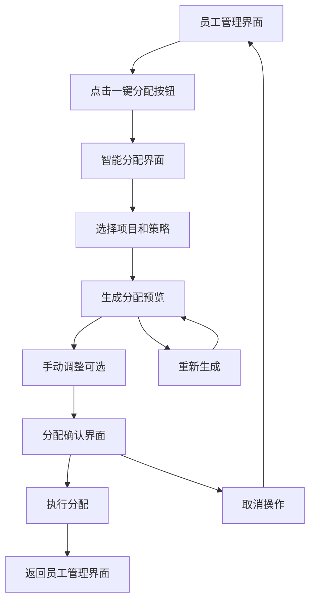

# 一键分配员工功能产品需求文档

## 1. 功能概述

为游戏公司模拟经营APP新增一键分配员工功能，允许用户快速将现有员工分配到不同的游戏开发项目或任务中。该功能将集成到现有员工管理界面，通过智能算法实现最优员工配置，提升游戏开发效率和用户体验。

- **核心价值**：简化员工管理流程，通过自动化分配减少手动操作，提高项目开发效率
- **目标用户**：游戏公司模拟经营APP的所有玩家，特别是管理大量员工的高级玩家
- **业务目标**：提升用户游戏体验，增加游戏的策略深度和可玩性

## 2. 核心功能

### 2.1 用户角色

| 角色 | 使用权限 | 核心功能 |
|------|----------|----------|
| 玩家 | 完全访问权限 | 可使用一键分配功能管理所有员工 |

### 2.2 功能模块

我们的一键分配员工功能包含以下主要组件：
1. **智能分配引擎**：自动分析项目需求和员工技能，生成最优分配方案
2. **分配预览界面**：展示分配结果，允许用户预览和调整
3. **项目管理集成**：与现有项目开发模块无缝集成
4. **分配历史记录**：保存分配记录，支持快速回滚和重复应用

### 2.3 页面详情

| 页面名称 | 模块名称 | 功能描述 |
|----------|----------|----------|
| 员工管理界面 | 一键分配按钮 | 在现有员工管理界面顶部添加醒目的"一键分配"按钮，支持快速触发分配流程 |
| 员工管理界面 | 分配状态指示器 | 为每个员工卡片添加当前分配状态标识（空闲/忙碌/项目名称） |
| 智能分配界面 | 项目选择器 | 显示当前可分配的项目列表，支持多选和优先级设置 |
| 智能分配界面 | 分配策略选择 | 提供多种分配策略：技能优先、负载均衡、成本优化等 |
| 智能分配界面 | 分配预览 | 实时显示分配结果预览，包括每个项目的员工配置和预期效果 |
| 智能分配界面 | 手动调整工具 | 允许用户拖拽调整分配结果，支持个性化优化 |
| 分配确认界面 | 结果汇总 | 展示最终分配方案的详细信息和预期收益 |
| 分配确认界面 | 执行控制 | 提供确认执行、保存方案、取消操作等选项 |

## 3. 核心流程

**一键分配员工操作流程：**

用户在员工管理界面点击"一键分配"按钮，系统进入智能分配界面。用户选择需要分配员工的项目和分配策略，系统基于员工技能、项目需求、当前工作负载等因素计算最优分配方案。用户可以在分配预览中查看结果，并进行手动调整。确认无误后执行分配，系统更新员工状态和项目进度。

**页面导航流程图：**

## 4. 用户界面设计

### 4.1 设计风格

- **主色调**：继承现有设计，深蓝色(#1A237E)主色，橙色(#F59E0B)强调色
- **按钮样式**：现代化圆角按钮，渐变背景，添加分配相关图标 ⚡🎯
- **字体规范**：标题16sp加粗，正文14sp，辅助信息12sp
- **布局风格**：卡片式设计，保持与现有界面一致的视觉风格
- **动画效果**：分配过程添加流畅的过渡动画和进度指示

### 4.2 页面设计概览

| 页面名称 | 模块名称 | UI元素 |
|----------|----------|--------|
| 员工管理界面 | 一键分配按钮 | 顶部醒目位置，橙色渐变背景，白色文字，闪电图标⚡，圆角设计 |
| 员工管理界面 | 员工状态标识 | 员工卡片右上角添加状态徽章，绿色(空闲)/红色(忙碌)/蓝色(项目中) |
| 智能分配界面 | 项目卡片 | 项目列表采用卡片设计，显示项目名称、需求技能、当前进度 |
| 智能分配界面 | 策略选择器 | 水平滑动选择器，图标+文字组合，选中状态高亮显示 |
| 智能分配界面 | 分配预览区 | 分栏布局，左侧员工列表，右侧项目列表，连线显示分配关系 |
| 智能分配界面 | 调整工具栏 | 底部工具栏，包含重新分配、手动调整、保存草稿等功能按钮 |
| 分配确认界面 | 结果汇总卡片 | 大卡片显示分配统计，包含分配员工数、项目覆盖率、预期效率提升 |
| 分配确认界面 | 操作按钮组 | 底部固定按钮组，确认(绿色)、取消(灰色)、保存方案(蓝色) |

### 4.3 响应式设计

采用移动端优先设计，支持竖屏和横屏模式。分配预览界面在横屏模式下优化布局，提供更好的可视化效果。支持手势操作，包括拖拽分配、双击快速操作等交互方式。

## 5. 详细功能规格

### 5.1 智能分配算法

**技能匹配算法**
- 基于员工专业技能与项目需求的匹配度计算
- 考虑员工技能等级与项目难度的适配性
- 支持跨技能分配，但会有效率惩罚

**负载均衡策略**
- 避免单个员工过度分配，确保工作负载合理分布
- 考虑员工当前工作状态和剩余工作容量
- 支持设置员工最大同时参与项目数量

**成本效益优化**
- 综合考虑员工薪资成本和项目收益预期
- 优先分配高性价比员工到关键项目
- 支持设置项目预算约束

### 5.2 分配策略选项

**技能优先策略**
- 优先考虑技能匹配度，确保项目质量
- 适用于高难度或关键项目
- 可能导致部分高技能员工工作负载较重

**负载均衡策略**
- 平均分配工作负载，避免员工过劳
- 适用于多个并行项目的情况
- 可能牺牲部分技能匹配度

**成本优化策略**
- 在满足基本需求的前提下最小化人力成本
- 适用于预算紧张的项目
- 优先使用性价比高的员工

**混合策略**
- 综合考虑技能、负载、成本等多个因素
- 提供平衡的分配方案
- 适用于大多数常规情况

### 5.3 用户交互优化

**快速操作支持**
- 一键应用历史分配方案
- 快速切换分配策略并实时预览结果
- 支持批量操作和快捷键

**可视化反馈**
- 实时显示分配过程动画
- 用颜色和图标直观表示分配状态
- 提供分配效果的数据可视化

**错误处理和提示**
- 智能检测分配冲突和问题
- 提供清晰的错误提示和解决建议
- 支持分配方案的验证和优化建议

### 5.4 数据管理

**分配历史记录**
- 保存最近10次分配记录
- 支持为分配方案命名和备注
- 提供分配效果的历史对比

**方案模板系统**
- 允许用户保存常用分配模板
- 支持模板的导入导出
- 提供系统预设的优化模板

**数据同步和备份**
- 分配数据与游戏存档同步
- 支持云端备份和多设备同步
- 提供数据恢复和回滚功能

## 6. 技术实现要点

### 6.1 集成方式

**非侵入式集成**
- 通过扩展现有EmployeeManagementEnhanced组件实现
- 新增独立的分配功能模块，不修改现有代码
- 使用组合模式集成到现有界面

**数据层扩展**
- 扩展Employee数据类，添加分配状态字段
- 新增Project数据类，定义项目需求和状态
- 实现分配算法的独立服务类

### 6.2 性能考虑

**算法优化**
- 使用高效的匹配算法，支持大量员工的快速分配
- 实现分配结果的缓存机制
- 支持异步计算，避免界面卡顿

**内存管理**
- 合理管理分配历史数据的内存占用
- 实现懒加载和数据分页
- 优化大量员工数据的渲染性能

### 6.3 扩展性设计

**模块化架构**
- 分配算法模块化，支持后续算法升级
- 界面组件可复用，便于功能扩展
- 支持插件式的分配策略扩展

**配置化支持**
- 分配参数可配置，支持游戏平衡性调整
- 界面布局支持自定义配置
- 算法权重可通过配置文件调整