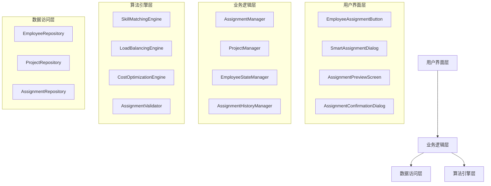
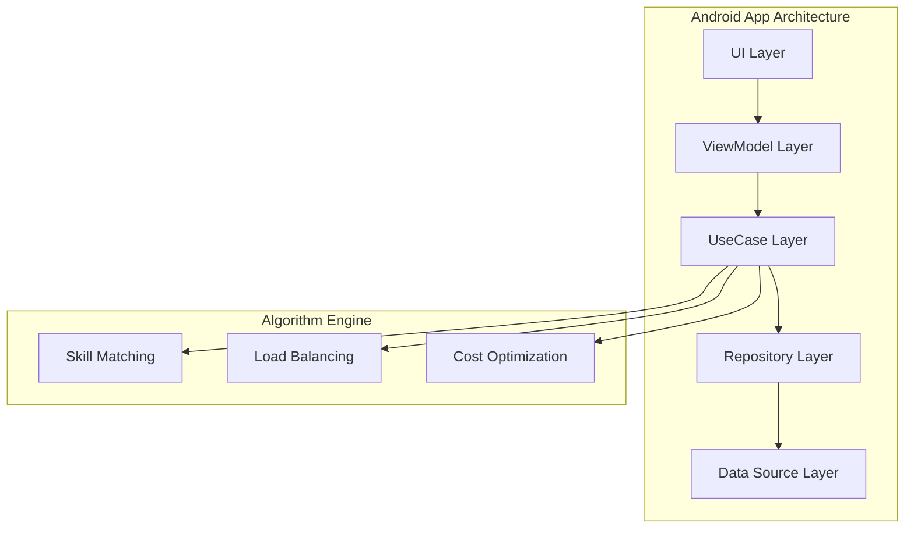
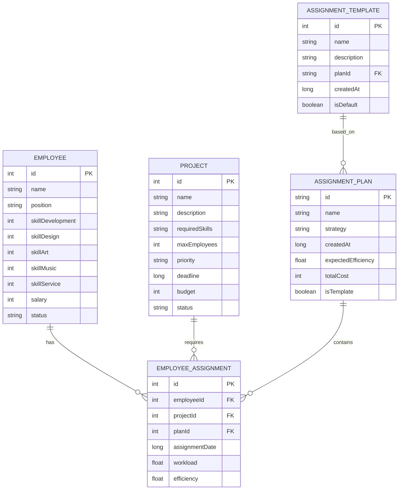

# 一键分配员工功能技术架构文档

## 1. 架构设计



## 2. 技术描述

- **前端**: Kotlin + Jetpack Compose + Material3
- **架构模式**: MVVM + Repository Pattern
- **状态管理**: Compose State + ViewModel
- **数据存储**: 本地SharedPreferences + Room Database (可选)
- **算法库**: 自定义匹配算法 + Kotlin协程

## 3. 路由定义

| 路由 | 用途 |
|------|------|
| /employee-management | 员工管理主界面，集成一键分配按钮 |
| /smart-assignment | 智能分配界面，选择项目和策略 |
| /assignment-preview | 分配预览界面，展示和调整分配结果 |
| /assignment-confirmation | 分配确认界面，最终确认和执行 |
| /assignment-history | 分配历史记录界面 |

## 4. API定义

### 4.1 核心数据模型

**项目数据模型**
```kotlin
data class Project(
    val id: Int,
    val name: String,
    val description: String,
    val requiredSkills: Map<String, Int>, // 技能类型 -> 所需等级
    val maxEmployees: Int,
    val currentEmployees: List<Int>, // 员工ID列表
    val priority: ProjectPriority,
    val deadline: Long?,
    val budget: Int?,
    val status: ProjectStatus
)

enum class ProjectPriority {
    LOW, MEDIUM, HIGH, CRITICAL
}

enum class ProjectStatus {
    PLANNING, IN_PROGRESS, COMPLETED, CANCELLED
}
```

**员工分配状态模型**
```kotlin
data class EmployeeAssignment(
    val employeeId: Int,
    val projectId: Int?,
    val assignmentDate: Long,
    val workload: Float, // 0.0 - 1.0
    val efficiency: Float // 预期效率
)

enum class EmployeeStatus {
    AVAILABLE, BUSY, OVERLOADED
}
```

**分配方案模型**
```kotlin
data class AssignmentPlan(
    val id: String,
    val name: String,
    val assignments: List<EmployeeAssignment>,
    val strategy: AssignmentStrategy,
    val createdAt: Long,
    val expectedEfficiency: Float,
    val totalCost: Int
)

enum class AssignmentStrategy {
    SKILL_PRIORITY,
    LOAD_BALANCE,
    COST_OPTIMIZATION,
    MIXED
}
```

### 4.2 核心服务接口

**分配管理服务**
```kotlin
interface AssignmentService {
    suspend fun generateAssignmentPlan(
        employees: List<Employee>,
        projects: List<Project>,
        strategy: AssignmentStrategy
    ): AssignmentPlan
    
    suspend fun executeAssignmentPlan(plan: AssignmentPlan): Boolean
    
    suspend fun validateAssignmentPlan(plan: AssignmentPlan): ValidationResult
    
    suspend fun getAssignmentHistory(): List<AssignmentPlan>
    
    suspend fun saveAssignmentTemplate(plan: AssignmentPlan, name: String)
}
```

**算法引擎接口**
```kotlin
interface AssignmentAlgorithm {
    fun calculateSkillMatch(employee: Employee, project: Project): Float
    
    fun calculateWorkload(employee: Employee, assignments: List<EmployeeAssignment>): Float
    
    fun optimizeAssignment(
        employees: List<Employee>,
        projects: List<Project>,
        constraints: AssignmentConstraints
    ): List<EmployeeAssignment>
}
```

## 5. 服务器架构图

由于这是本地Android应用，不需要服务器架构。所有逻辑在客户端实现：



## 6. 数据模型

### 6.1 数据模型定义



### 6.2 数据定义语言

**项目表 (projects)**
```sql
-- 创建项目表
CREATE TABLE projects (
    id INTEGER PRIMARY KEY AUTOINCREMENT,
    name TEXT NOT NULL,
    description TEXT,
    required_skills TEXT, -- JSON格式存储技能需求
    max_employees INTEGER DEFAULT 5,
    priority TEXT DEFAULT 'MEDIUM',
    deadline INTEGER, -- 时间戳
    budget INTEGER,
    status TEXT DEFAULT 'PLANNING',
    created_at INTEGER DEFAULT (strftime('%s', 'now')),
    updated_at INTEGER DEFAULT (strftime('%s', 'now'))
);

-- 创建索引
CREATE INDEX idx_projects_status ON projects(status);
CREATE INDEX idx_projects_priority ON projects(priority);
```

**员工分配表 (employee_assignments)**
```sql
-- 创建员工分配表
CREATE TABLE employee_assignments (
    id INTEGER PRIMARY KEY AUTOINCREMENT,
    employee_id INTEGER NOT NULL,
    project_id INTEGER,
    plan_id TEXT,
    assignment_date INTEGER DEFAULT (strftime('%s', 'now')),
    workload REAL DEFAULT 0.0,
    efficiency REAL DEFAULT 0.0,
    is_active BOOLEAN DEFAULT 1,
    FOREIGN KEY (employee_id) REFERENCES employees(id),
    FOREIGN KEY (project_id) REFERENCES projects(id)
);

-- 创建索引
CREATE INDEX idx_assignments_employee ON employee_assignments(employee_id);
CREATE INDEX idx_assignments_project ON employee_assignments(project_id);
CREATE INDEX idx_assignments_plan ON employee_assignments(plan_id);
```

**分配方案表 (assignment_plans)**
```sql
-- 创建分配方案表
CREATE TABLE assignment_plans (
    id TEXT PRIMARY KEY,
    name TEXT NOT NULL,
    strategy TEXT NOT NULL,
    created_at INTEGER DEFAULT (strftime('%s', 'now')),
    expected_efficiency REAL DEFAULT 0.0,
    total_cost INTEGER DEFAULT 0,
    is_template BOOLEAN DEFAULT 0,
    is_executed BOOLEAN DEFAULT 0
);

-- 创建索引
CREATE INDEX idx_plans_created_at ON assignment_plans(created_at DESC);
CREATE INDEX idx_plans_template ON assignment_plans(is_template);
```

**分配模板表 (assignment_templates)**
```sql
-- 创建分配模板表
CREATE TABLE assignment_templates (
    id INTEGER PRIMARY KEY AUTOINCREMENT,
    name TEXT NOT NULL,
    description TEXT,
    plan_id TEXT NOT NULL,
    created_at INTEGER DEFAULT (strftime('%s', 'now')),
    is_default BOOLEAN DEFAULT 0,
    usage_count INTEGER DEFAULT 0,
    FOREIGN KEY (plan_id) REFERENCES assignment_plans(id)
);

-- 初始化数据
INSERT INTO projects (name, description, required_skills, max_employees, priority) VALUES
('休闲益智游戏', '开发一款简单的益智类手机游戏', '{"development": 2, "design": 2, "art": 1}', 3, 'MEDIUM'),
('动作冒险游戏', '制作大型3D动作冒险游戏', '{"development": 4, "design": 3, "art": 4, "music": 2}', 8, 'HIGH'),
('客服系统优化', '改进客户服务流程和工具', '{"service": 3, "development": 1}', 2, 'LOW');

INSERT INTO assignment_templates (name, description, plan_id, is_default) VALUES
('均衡分配模板', '平均分配员工工作负载的标准模板', 'template_balanced', 1),
('技能优先模板', '优先考虑技能匹配的分配模板', 'template_skill_first', 1),
('成本优化模板', '最小化人力成本的分配模板', 'template_cost_optimized', 0);
```

## 7. 实现细节

### 7.1 核心算法实现

**技能匹配算法**
```kotlin
class SkillMatchingEngine {
    fun calculateSkillMatch(employee: Employee, project: Project): Float {
        val requiredSkills = project.requiredSkills
        var totalMatch = 0f
        var totalWeight = 0f
        
        requiredSkills.forEach { (skillType, requiredLevel) ->
            val employeeSkill = when (skillType) {
                "development" -> employee.skillDevelopment
                "design" -> employee.skillDesign
                "art" -> employee.skillArt
                "music" -> employee.skillMusic
                "service" -> employee.skillService
                else -> 1
            }
            
            val match = minOf(employeeSkill.toFloat() / requiredLevel, 1.0f)
            totalMatch += match * requiredLevel
            totalWeight += requiredLevel
        }
        
        return if (totalWeight > 0) totalMatch / totalWeight else 0f
    }
}
```

**负载均衡算法**
```kotlin
class LoadBalancingEngine {
    fun calculateOptimalWorkload(
        employees: List<Employee>,
        projects: List<Project>
    ): Map<Int, Float> {
        val totalWorkload = projects.sumOf { it.requiredSkills.values.sum() }
        val availableEmployees = employees.size
        val averageWorkload = totalWorkload.toFloat() / availableEmployees
        
        return employees.associate { employee ->
            employee.id to minOf(averageWorkload * 1.2f, 1.0f)
        }
    }
}
```

### 7.2 UI组件实现

**一键分配按钮组件**
```kotlin
@Composable
fun OneClickAssignmentButton(
    onClick: () -> Unit,
    modifier: Modifier = Modifier
) {
    Button(
        onClick = onClick,
        modifier = modifier
            .fillMaxWidth()
            .height(56.dp),
        colors = ButtonDefaults.buttonColors(
            containerColor = Brush.horizontalGradient(
                colors = listOf(
                    Color(0xFFF59E0B),
                    Color(0xFFEAB308)
                )
            )
        ),
        shape = RoundedCornerShape(12.dp)
    ) {
        Row(
            verticalAlignment = Alignment.CenterVertically,
            horizontalArrangement = Arrangement.Center
        ) {
            Icon(
                painter = painterResource(R.drawable.ic_flash),
                contentDescription = null,
                tint = Color.White
            )
            Spacer(modifier = Modifier.width(8.dp))
            Text(
                text = "⚡ 一键分配员工",
                color = Color.White,
                fontSize = 16.sp,
                fontWeight = FontWeight.Bold
            )
        }
    }
}
```

### 7.3 状态管理

**分配状态管理**
```kotlin
class AssignmentViewModel : ViewModel() {
    private val _assignmentState = mutableStateOf(AssignmentState())
    val assignmentState: State<AssignmentState> = _assignmentState
    
    private val assignmentService = AssignmentService()
    
    fun generateAssignmentPlan(
        strategy: AssignmentStrategy
    ) {
        viewModelScope.launch {
            _assignmentState.value = _assignmentState.value.copy(
                isLoading = true
            )
            
            try {
                val plan = assignmentService.generateAssignmentPlan(
                    employees = _assignmentState.value.employees,
                    projects = _assignmentState.value.projects,
                    strategy = strategy
                )
                
                _assignmentState.value = _assignmentState.value.copy(
                    currentPlan = plan,
                    isLoading = false
                )
            } catch (e: Exception) {
                _assignmentState.value = _assignmentState.value.copy(
                    error = e.message,
                    isLoading = false
                )
            }
        }
    }
}

data class AssignmentState(
    val employees: List<Employee> = emptyList(),
    val projects: List<Project> = emptyList(),
    val currentPlan: AssignmentPlan? = null,
    val isLoading: Boolean = false,
    val error: String? = null
)
```