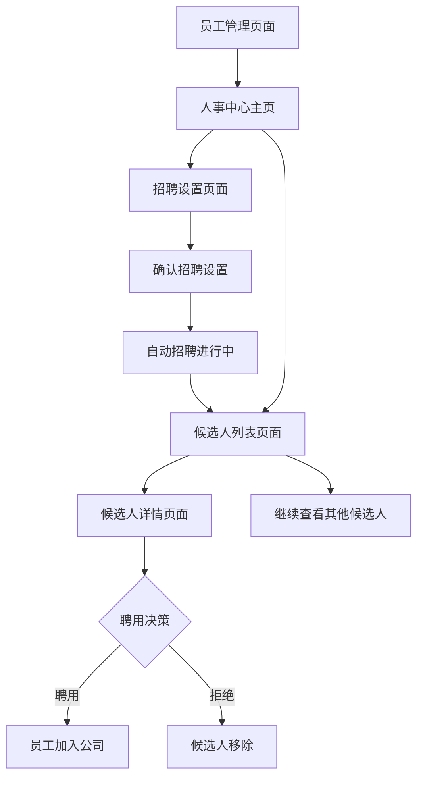

# 人事中心自动化招聘功能产品需求文档

## 1. 产品概述
本功能为游戏公司模拟经营APP新增人事中心模块，提供自动化招聘系统，让玩家能够设置招聘条件并管理候选人。
- 解决玩家手动招聘员工效率低下的问题，提供更智能的人力资源管理体验。
- 通过薪资策略影响招聘质量，增加游戏的策略性和真实感。

## 2. 核心功能

### 2.1 用户角色
本功能面向所有游戏玩家，无需区分角色权限。

### 2.2 功能模块
人事中心自动化招聘功能包含以下主要页面：
1. **员工管理页面**：现有员工管理界面，新增人事中心入口按钮
2. **人事中心主页**：招聘功能总览，显示当前招聘状态和候选人数量
3. **招聘设置页面**：配置招聘条件和招聘周期
4. **候选人列表页面**：展示招聘到的候选人，支持查看详情和聘用操作
5. **候选人详情页面**：显示候选人完整信息，确认聘用决策

### 2.3 页面详情

| 页面名称 | 模块名称 | 功能描述 |
|---------|---------|----------|
| 员工管理页面 | 人事中心入口 | 在现有界面新增"人事中心"按钮，点击进入招聘系统 |
| 人事中心主页 | 招聘状态概览 | 显示当前招聘进度、剩余天数、候选人数量等关键信息 |
| 人事中心主页 | 快速操作区 | 提供"开始招聘"、"查看候选人"、"招聘设置"等快捷按钮 |
| 招聘设置页面 | 职位选择 | 下拉选择框，包含程序员、美术师、策划师等职位类型 |
| 招聘设置页面 | 技能等级设置 | 滑动条或下拉选择，设置期望的员工技能等级（1-5级） |
| 招聘设置页面 | 月薪设置 | 数字输入框，设置招聘预算，影响招聘到高技能员工的概率 |
| 招聘设置页面 | 招聘周期 | 单选按钮组，选择30天、60天或90天的招聘周期 |
| 招聘设置页面 | 确认招聘 | 提交招聘设置，开始自动招聘流程 |
| 候选人列表页面 | 候选人卡片 | 展示候选人基本信息：姓名、职位、技能等级、期望薪资 |
| 候选人列表页面 | 筛选排序 | 按技能等级、薪资要求等条件筛选和排序候选人 |
| 候选人详情页面 | 详细信息 | 显示候选人完整属性：技能详情、工作经验、特殊能力等 |
| 候选人详情页面 | 聘用决策 | 提供"聘用"和"拒绝"按钮，确认是否录用该候选人 |

## 3. 核心流程

**主要用户操作流程：**
1. 玩家在员工管理界面点击"人事中心"按钮
2. 进入人事中心主页，查看当前招聘状态
3. 点击"开始招聘"或"招聘设置"进入设置页面
4. 设置招聘条件：选择职位、技能等级、月薪预算和招聘天数
5. 确认设置后，系统开始自动招聘流程
6. 招聘期间，系统根据设置条件和概率算法生成候选人
7. 玩家可随时查看候选人列表，点击候选人查看详情
8. 在候选人详情页面决定是否聘用
9. 聘用成功的员工加入公司，拒绝的候选人从列表移除

## 4. 用户界面设计

### 4.1 设计风格
- **主色调**：深蓝色背景(#1a237e)，保持与现有游戏界面一致
- **辅助色**：橙色按钮(#ff9800)用于主要操作，绿色(#4caf50)表示成功状态
- **按钮风格**：圆角矩形按钮，带有轻微阴影效果
- **字体**：中文使用微软雅黑，英文使用Roboto，主要文字16sp，标题18sp
- **布局风格**：卡片式设计，顶部导航栏，内容区域使用白色卡片承载
- **图标风格**：线性图标，简洁现代，使用Material Design图标库

### 4.2 页面设计概览

| 页面名称 | 模块名称 | UI元素 |
|---------|---------|--------|
| 员工管理页面 | 人事中心入口 | 在右上角添加"人事中心"按钮，橙色背景，白色文字，圆角设计 |
| 人事中心主页 | 状态卡片 | 白色卡片显示招聘进度，使用进度条和数字显示，配色为蓝色渐变 |
| 人事中心主页 | 操作按钮组 | 三个并排按钮：开始招聘(橙色)、查看候选人(蓝色)、设置(灰色) |
| 招聘设置页面 | 表单区域 | 白色背景表单，每个设置项占一行，左侧标签右侧控件，间距16dp |
| 招聘设置页面 | 月薪影响提示 | 黄色背景提示框，说明月薪对招聘质量的影响机制 |
| 候选人列表页面 | 候选人卡片 | 白色卡片列表，每张卡片显示头像、姓名、职位、技能等级星级显示 |
| 候选人详情页面 | 信息展示区 | 大卡片布局，顶部候选人基本信息，下方技能详情使用标签云展示 |
| 候选人详情页面 | 决策按钮 | 底部固定两个按钮：聘用(绿色)和拒绝(红色)，全宽设计 |

### 4.3 响应式设计
- 采用移动端优先设计，适配Android手机屏幕
- 支持竖屏和横屏切换，横屏时采用左右分栏布局
- 针对触摸操作优化，按钮最小点击区域44dp，支持手势滑动