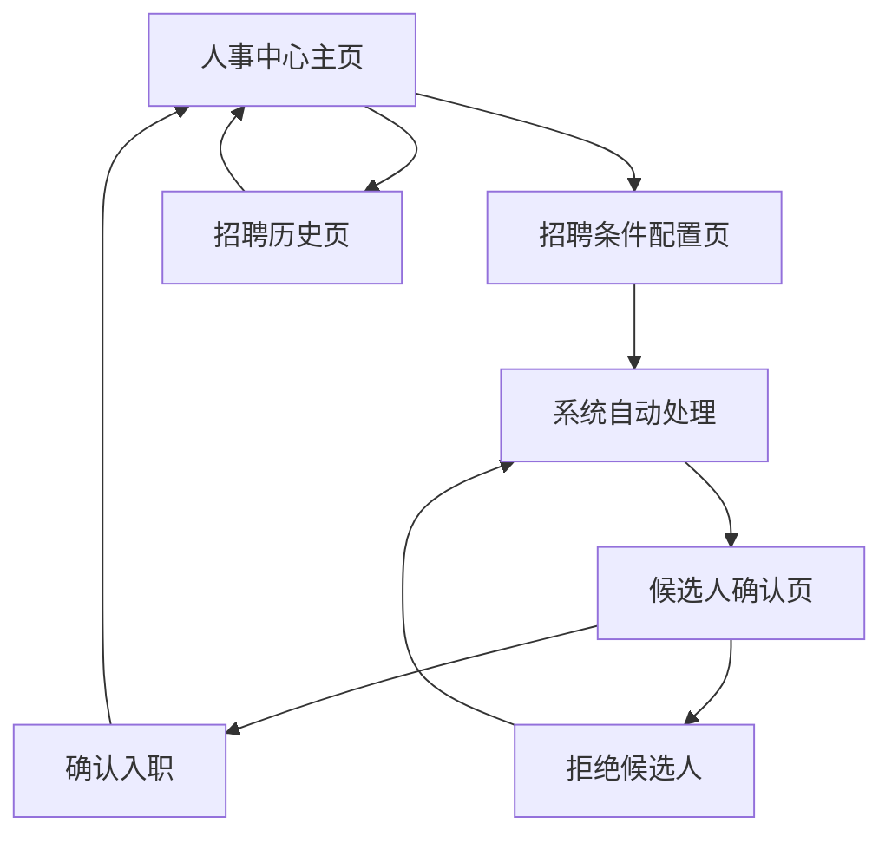

# 人事中心自动化招聘功能产品需求文档

## 1. 产品概述

将原有的招聘中心重构为智能化人事中心，实现自动化招聘流程管理。玩家可以设置具体的招聘条件，人事系统自动处理招聘事务，玩家只需要对候选人进行最终确认即可。

该功能旨在简化游戏中的人员招聘流程，提升玩家体验，让玩家能够专注于公司战略而非繁琐的招聘细节。

## 2. 核心功能

### 2.1 用户角色

| 角色 | 权限说明 | 核心功能 |
|------|----------|----------|
| 玩家 | 公司管理者 | 设置招聘条件、确认入职、查看招聘进度 |

### 2.2 功能模块

我们的人事中心需求包含以下主要页面：
1. **人事中心主页**：招聘条件设置、当前招聘状态、待确认候选人列表
2. **招聘条件配置页**：职位类型选择、技能等级设置、薪资范围配置
3. **候选人确认页**：候选人详细信息、入职确认操作
4. **招聘历史页**：历史招聘记录、员工入职统计

### 2.3 页面详情

| 页面名称 | 模块名称 | 功能描述 |
|----------|----------|----------|
| 人事中心主页 | 招聘状态面板 | 显示当前活跃的招聘需求、进行中的招聘数量、待确认候选人数量 |
| 人事中心主页 | 快速设置区 | 提供常用职位的快速招聘设置按钮（程序员、美术师、策划师等） |
| 人事中心主页 | 待确认列表 | 展示系统推荐的候选人，包含基本信息和推荐理由 |
| 招聘条件配置页 | 职位选择器 | 选择要招聘的职位类型（程序员、美术师、策划师、测试员等） |
| 招聘条件配置页 | 技能等级设置 | 设置最低技能等级要求（1-10级可选） |
| 招聘条件配置页 | 薪资范围配置 | 设置薪资预算范围，系统提供建议范围 |
| 招聘条件配置页 | 高级筛选 | 设置年龄范围、工作经验、特殊技能等额外条件 |
| 候选人确认页 | 候选人信息卡 | 显示候选人详细属性、技能等级、期望薪资、工作经验 |
| 候选人确认页 | 匹配度分析 | 显示候选人与招聘条件的匹配程度和推荐指数 |
| 候选人确认页 | 确认操作区 | 提供同意入职、拒绝、稍后决定三个操作选项 |
| 招聘历史页 | 历史记录列表 | 显示过往招聘记录，包含招聘条件、结果、入职员工信息 |
| 招聘历史页 | 统计分析 | 展示招聘成功率、平均招聘时间、各职位招聘数据统计 |

## 3. 核心流程

**主要用户操作流程：**

1. **设置招聘需求**：玩家进入人事中心，选择要招聘的职位，设置技能等级要求（如5级程序员）、薪资范围等条件
2. **系统自动招聘**：人事系统根据设置的条件自动在人才市场中搜索合适的候选人
3. **候选人推荐**：系统找到符合条件的候选人后，自动进行初步筛选和面试
4. **玩家确认决策**：系统将筛选后的优质候选人推荐给玩家，玩家查看详细信息后决定是否录用
5. **完成入职**：玩家确认后，新员工自动加入公司，开始工作

## 4. 用户界面设计

### 4.1 设计风格

- **主色调**：深蓝色 (#2C3E50) 作为主色，橙色 (#E67E22) 作为强调色
- **按钮样式**：圆角矩形按钮，带有轻微阴影效果
- **字体**：主标题使用 18px 粗体，正文使用 14px 常规字体
- **布局风格**：卡片式布局，清晰的模块分割
- **图标风格**：使用简洁的线性图标，配合适当的彩色填充

### 4.2 页面设计概览

| 页面名称 | 模块名称 | UI元素 |
|----------|----------|--------|
| 人事中心主页 | 招聘状态面板 | 使用仪表盘样式，圆形进度条显示招聘进度，卡片布局展示关键数据 |
| 人事中心主页 | 快速设置区 | 大按钮网格布局，每个职位用不同颜色和图标区分 |
| 人事中心主页 | 待确认列表 | 列表卡片样式，头像+姓名+关键信息的紧凑布局 |
| 招聘条件配置页 | 职位选择器 | 下拉选择框配合图标，支持搜索功能 |
| 招聘条件配置页 | 技能等级设置 | 滑动条控件，实时显示等级数值和对应能力描述 |
| 招聘条件配置页 | 薪资范围配置 | 双端滑动条，显示最小值和最大值，配合建议薪资提示 |
| 候选人确认页 | 候选人信息卡 | 大卡片布局，左侧头像，右侧详细信息，技能用进度条展示 |
| 候选人确认页 | 匹配度分析 | 雷达图显示各项能力匹配度，整体匹配度用百分比和星级显示 |
| 候选人确认页 | 确认操作区 | 底部固定的三个大按钮，绿色同意、红色拒绝、灰色稍后 |

### 4.3 响应式设计

采用移动优先的响应式设计，确保在不同屏幕尺寸下都有良好的用户体验。支持触摸操作优化，按钮和交互区域足够大以便手指操作。