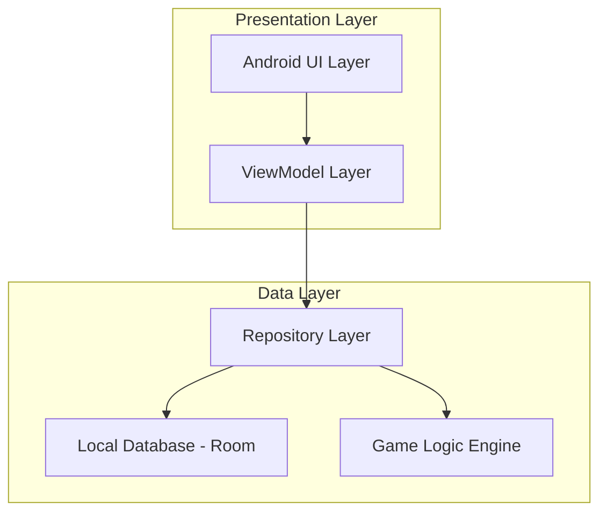
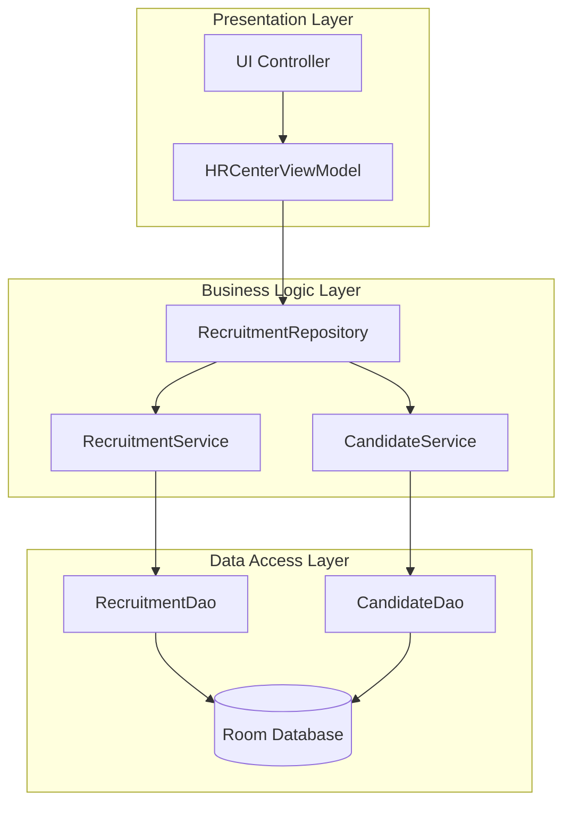
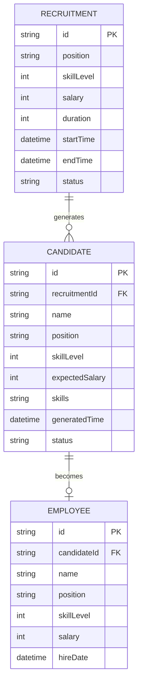

# 人事中心自动化招聘功能技术架构文档

## 1. 架构设计



## 2. 技术描述
- Frontend: Android Native (Kotlin) + Jetpack Compose + Room Database
- Architecture: MVVM + Repository Pattern
- Database: SQLite (Room ORM)

## 3. 路由定义

| 路由 | 目的 |
|------|------|
| /employee-management | 员工管理主页面，包含人事中心入口 |
| /hr-center | 人事中心主页，显示招聘状态概览 |
| /recruitment-settings | 招聘设置页面，配置招聘条件 |
| /candidates-list | 候选人列表页面，展示所有候选人 |
| /candidate-detail/{id} | 候选人详情页面，显示具体候选人信息 |

## 4. API定义

### 4.1 核心API

招聘设置相关
```
POST /api/recruitment/start
```

请求参数:
| 参数名称 | 参数类型 | 是否必需 | 描述 |
|---------|---------|---------|------|
| position | String | true | 招聘职位类型 |
| skillLevel | Int | true | 期望技能等级(1-5) |
| salary | Int | true | 月薪预算 |
| duration | Int | true | 招聘天数(30/60/90) |

响应参数:
| 参数名称 | 参数类型 | 描述 |
|---------|---------|------|
| recruitmentId | String | 招聘任务ID |
| status | Boolean | 操作状态 |

候选人管理相关
```
GET /api/candidates
```

响应参数:
| 参数名称 | 参数类型 | 描述 |
|---------|---------|------|
| candidates | List<Candidate> | 候选人列表 |
| totalCount | Int | 候选人总数 |

```
POST /api/candidates/{id}/hire
```

请求参数:
| 参数名称 | 参数类型 | 是否必需 | 描述 |
|---------|---------|---------|------|
| candidateId | String | true | 候选人ID |
| decision | Boolean | true | 聘用决策(true=聘用, false=拒绝) |

## 5. 服务器架构图



## 6. 数据模型

### 6.1 数据模型定义



### 6.2 数据定义语言

招聘任务表 (recruitments)
```sql
-- 创建招聘任务表
CREATE TABLE recruitments (
    id TEXT PRIMARY KEY,
    position TEXT NOT NULL,
    skill_level INTEGER NOT NULL CHECK (skill_level BETWEEN 1 AND 5),
    salary INTEGER NOT NULL,
    duration INTEGER NOT NULL CHECK (duration IN (30, 60, 90)),
    start_time INTEGER NOT NULL,
    end_time INTEGER NOT NULL,
    status TEXT NOT NULL DEFAULT 'active' CHECK (status IN ('active', 'completed', 'cancelled')),
    created_at INTEGER DEFAULT (strftime('%s', 'now')),
    updated_at INTEGER DEFAULT (strftime('%s', 'now'))
);

-- 创建索引
CREATE INDEX idx_recruitments_status ON recruitments(status);
CREATE INDEX idx_recruitments_end_time ON recruitments(end_time);
```

候选人表 (candidates)
```sql
-- 创建候选人表
CREATE TABLE candidates (
    id TEXT PRIMARY KEY,
    recruitment_id TEXT NOT NULL,
    name TEXT NOT NULL,
    position TEXT NOT NULL,
    skill_level INTEGER NOT NULL CHECK (skill_level BETWEEN 1 AND 5),
    expected_salary INTEGER NOT NULL,
    skills TEXT, -- JSON格式存储技能详情
    experience_years INTEGER DEFAULT 0,
    special_abilities TEXT, -- JSON格式存储特殊能力
    generated_time INTEGER NOT NULL,
    status TEXT NOT NULL DEFAULT 'pending' CHECK (status IN ('pending', 'hired', 'rejected')),
    created_at INTEGER DEFAULT (strftime('%s', 'now')),
    FOREIGN KEY (recruitment_id) REFERENCES recruitments(id) ON DELETE CASCADE
);

-- 创建索引
CREATE INDEX idx_candidates_recruitment_id ON candidates(recruitment_id);
CREATE INDEX idx_candidates_status ON candidates(status);
CREATE INDEX idx_candidates_skill_level ON candidates(skill_level DESC);
```

员工表 (employees) - 扩展现有表
```sql
-- 为现有员工表添加招聘相关字段
ALTER TABLE employees ADD COLUMN candidate_id TEXT;
ALTER TABLE employees ADD COLUMN hire_date INTEGER;
ALTER TABLE employees ADD COLUMN recruitment_source TEXT DEFAULT 'manual';

-- 创建索引
CREATE INDEX idx_employees_candidate_id ON employees(candidate_id);
CREATE INDEX idx_employees_hire_date ON employees(hire_date DESC);
```

初始化数据
```sql
-- 插入职位类型配置
INSERT INTO game_config (key, value) VALUES 
('recruitment_positions', '["程序员", "美术师", "策划师", "音效师", "测试员"]'),
('recruitment_skill_weights', '{"salary_factor": 0.3, "random_factor": 0.7}'),
('recruitment_generation_rate', '{"30": 0.8, "60": 1.2, "90": 1.5}');
```