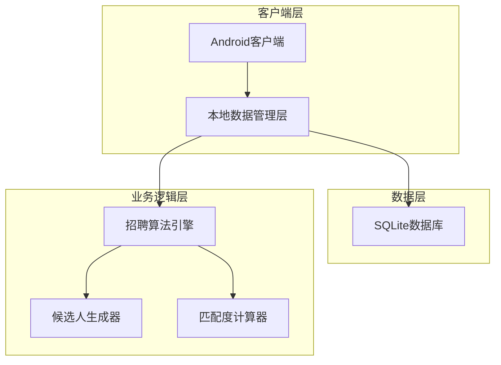

# 人事中心自动化招聘功能技术架构文档

## 1. 架构设计



## 2. 技术描述

- 前端：Android原生开发 + Kotlin + Jetpack Compose
- 数据库：SQLite（本地存储）
- 架构模式：MVVM + Repository模式

## 3. 路由定义

| 路由 | 用途 |
|------|------|
| /hr-center | 人事中心主页，显示招聘状态和待确认候选人 |
| /hr-center/config | 招聘条件配置页，设置职位要求和薪资范围 |
| /hr-center/candidate/{id} | 候选人确认页，查看候选人详情并做决策 |
| /hr-center/history | 招聘历史页，查看过往招聘记录和统计 |

## 4. 数据模型

### 4.1 数据模型定义

```mermaid
erDiagram
    RECRUITMENT_CONFIG ||--o{ RECRUITMENT_TASK : creates
    RECRUITMENT_TASK ||--o{ CANDIDATE : generates
    CANDIDATE ||--o{ EMPLOYEE : becomes
    EMPLOYEE }|--|| COMPANY : works_for

    RECRUITMENT_CONFIG {
        int id PK
        string position_type
        int min_skill_level
        int max_skill_level
        int min_salary
        int max_salary
        int min_age
        int max_age
        string special_requirements
        boolean is_active
        datetime created_at
        datetime updated_at
    }
    
    RECRUITMENT_TASK {
        int id PK
        int config_id FK
        string status
        int target_count
        int current_count
        datetime start_time
        datetime end_time
        datetime created_at
    }
    
    CANDIDATE {
        int id PK
        int task_id FK
        string name
        int age
        int skill_level
        int expected_salary
        string position_type
        int experience_years
        string special_skills
        float match_score
        string status
        datetime generated_at
        datetime reviewed_at
    }
    
    EMPLOYEE {
        int id PK
        int candidate_id FK
        string name
        int age
        int skill_level
        int salary
        string position_type
        int experience_years
        string special_skills
        datetime hire_date
        string employment_status
    }
```



### 4.2 数据定义语言

**招聘配置表 (recruitment_configs)**
```sql
-- 创建招聘配置表
CREATE TABLE recruitment_configs (
    id INTEGER PRIMARY KEY AUTOINCREMENT,
    position_type TEXT NOT NULL,
    min_skill_level INTEGER NOT NULL DEFAULT 1,
    max_skill_level INTEGER NOT NULL DEFAULT 10,
    min_salary INTEGER NOT NULL,
    max_salary INTEGER NOT NULL,
    min_age INTEGER DEFAULT 18,
    max_age INTEGER DEFAULT 65,
    special_requirements TEXT,
    is_active BOOLEAN DEFAULT 1,
    created_at DATETIME DEFAULT CURRENT_TIMESTAMP,
    updated_at DATETIME DEFAULT CURRENT_TIMESTAMP
);

-- 创建索引
CREATE INDEX idx_recruitment_configs_position ON recruitment_configs(position_type);
CREATE INDEX idx_recruitment_configs_active ON recruitment_configs(is_active);
```

**招聘任务表 (recruitment_tasks)**
```sql
-- 创建招聘任务表
CREATE TABLE recruitment_tasks (
    id INTEGER PRIMARY KEY AUTOINCREMENT,
    config_id INTEGER NOT NULL,
    status TEXT NOT NULL DEFAULT 'active',
    target_count INTEGER NOT NULL DEFAULT 1,
    current_count INTEGER DEFAULT 0,
    start_time DATETIME DEFAULT CURRENT_TIMESTAMP,
    end_time DATETIME,
    created_at DATETIME DEFAULT CURRENT_TIMESTAMP,
    FOREIGN KEY (config_id) REFERENCES recruitment_configs(id)
);

-- 创建索引
CREATE INDEX idx_recruitment_tasks_config ON recruitment_tasks(config_id);
CREATE INDEX idx_recruitment_tasks_status ON recruitment_tasks(status);
```

**候选人表 (candidates)**
```sql
-- 创建候选人表
CREATE TABLE candidates (
    id INTEGER PRIMARY KEY AUTOINCREMENT,
    task_id INTEGER NOT NULL,
    name TEXT NOT NULL,
    age INTEGER NOT NULL,
    skill_level INTEGER NOT NULL,
    expected_salary INTEGER NOT NULL,
    position_type TEXT NOT NULL,
    experience_years INTEGER DEFAULT 0,
    special_skills TEXT,
    match_score REAL NOT NULL,
    status TEXT DEFAULT 'pending',
    generated_at DATETIME DEFAULT CURRENT_TIMESTAMP,
    reviewed_at DATETIME,
    FOREIGN KEY (task_id) REFERENCES recruitment_tasks(id)
);

-- 创建索引
CREATE INDEX idx_candidates_task ON candidates(task_id);
CREATE INDEX idx_candidates_status ON candidates(status);
CREATE INDEX idx_candidates_match_score ON candidates(match_score DESC);
```

**员工表 (employees)**
```sql
-- 创建员工表
CREATE TABLE employees (
    id INTEGER PRIMARY KEY AUTOINCREMENT,
    candidate_id INTEGER,
    name TEXT NOT NULL,
    age INTEGER NOT NULL,
    skill_level INTEGER NOT NULL,
    salary INTEGER NOT NULL,
    position_type TEXT NOT NULL,
    experience_years INTEGER DEFAULT 0,
    special_skills TEXT,
    hire_date DATETIME DEFAULT CURRENT_TIMESTAMP,
    employment_status TEXT DEFAULT 'active',
    FOREIGN KEY (candidate_id) REFERENCES candidates(id)
);

-- 创建索引
CREATE INDEX idx_employees_position ON employees(position_type);
CREATE INDEX idx_employees_status ON employees(employment_status);
CREATE INDEX idx_employees_hire_date ON employees(hire_date DESC);
```

**初始化数据**
```sql
-- 插入默认职位类型配置
INSERT INTO recruitment_configs (position_type, min_skill_level, max_skill_level, min_salary, max_salary) VALUES
('程序员', 3, 8, 8000, 15000),
('美术师', 3, 8, 7000, 12000),
('策划师', 2, 7, 6000, 11000),
('测试员', 2, 6, 5000, 9000);
```

## 5. 核心算法设计

### 5.1 候选人生成算法

```kotlin
class CandidateGenerator {
    fun generateCandidate(config: RecruitmentConfig): Candidate {
        val random = Random()
        
        // 基于配置生成候选人属性
        val skillLevel = random.nextInt(config.minSkillLevel, config.maxSkillLevel + 1)
        val age = random.nextInt(config.minAge, config.maxAge + 1)
        val experienceYears = calculateExperience(age, skillLevel)
        val expectedSalary = calculateExpectedSalary(skillLevel, experienceYears)
        
        // 计算匹配度
        val matchScore = calculateMatchScore(config, skillLevel, expectedSalary)
        
        return Candidate(
            name = generateRandomName(),
            age = age,
            skillLevel = skillLevel,
            expectedSalary = expectedSalary,
            positionType = config.positionType,
            experienceYears = experienceYears,
            matchScore = matchScore
        )
    }
}
```

### 5.2 匹配度计算算法

```kotlin
class MatchScoreCalculator {
    fun calculateMatchScore(
        config: RecruitmentConfig,
        skillLevel: Int,
        expectedSalary: Int
    ): Float {
        var score = 0f
        
        // 技能等级匹配度 (40%权重)
        val skillScore = when {
            skillLevel >= config.minSkillLevel -> {
                min(1f, skillLevel.toFloat() / config.maxSkillLevel)
            }
            else -> 0f
        }
        score += skillScore * 0.4f
        
        // 薪资匹配度 (35%权重)
        val salaryScore = when {
            expectedSalary in config.minSalary..config.maxSalary -> 1f
            expectedSalary < config.minSalary -> 0.8f
            else -> max(0f, 1f - (expectedSalary - config.maxSalary) / config.maxSalary.toFloat())
        }
        score += salaryScore * 0.35f
        
        // 随机因素 (25%权重)
        score += Random().nextFloat() * 0.25f
        
        return min(1f, score)
    }
}
```

## 6. 关键组件设计

### 6.1 人事中心管理器

```kotlin
class HRCenterManager {
    private val repository = HRRepository()
    private val candidateGenerator = CandidateGenerator()
    
    suspend fun startRecruitment(config: RecruitmentConfig): RecruitmentTask {
        val task = repository.createRecruitmentTask(config)
        
        // 启动后台招聘流程
        launchRecruitmentProcess(task)
        
        return task
    }
    
    private suspend fun launchRecruitmentProcess(task: RecruitmentTask) {
        while (task.currentCount < task.targetCount && task.status == "active") {
            val candidate = candidateGenerator.generateCandidate(task.config)
            
            if (candidate.matchScore >= 0.6f) {
                repository.saveCandidate(candidate)
                // 通知玩家有新候选人
                notifyPlayerNewCandidate(candidate)
            }
            
            delay(getRecruitmentInterval()) // 模拟招聘时间间隔
        }
    }
}
```