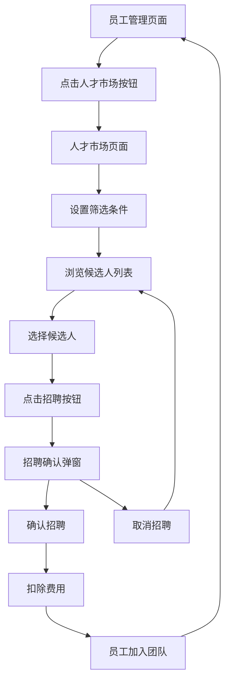

# 人才市场功能产品需求文档

## 1. 产品概述

为游戏公司模拟经营APP的员工管理模块新增人才市场功能，允许玩家通过筛选条件查找和招聘合适的员工。
- 解决玩家在游戏中缺乏多样化员工招聘渠道的问题，提供更丰富的人力资源管理体验。
- 目标用户为喜欢模拟经营类游戏的玩家，帮助他们更好地管理和扩展公司团队。

## 2. 核心功能

### 2.1 用户角色
本功能不涉及用户角色区分，所有玩家均可使用人才市场功能。

### 2.2 功能模块
人才市场功能包含以下主要页面：
1. **员工管理页面**：在现有员工管理界面添加人才市场入口按钮
2. **人才市场页面**：提供筛选条件和候选人列表的主要界面
3. **招聘确认弹窗**：确认招聘操作和费用扣除

### 2.3 页面详情

| 页面名称 | 模块名称 | 功能描述 |
|----------|----------|----------|
| 员工管理页面 | 人才市场入口 | 在员工统计信息卡片下方添加"🏢 人才市场"按钮，点击进入人才市场界面 |
| 人才市场页面 | 筛选条件区域 | 提供职位筛选（程序员、策划师、美术师、音效师、客服）、技能等级筛选（初级1-2级、中级3级、高级4级、专家级5级）、月薪范围筛选（3000-50000元） |
| 人才市场页面 | 候选人列表 | 显示符合筛选条件的候选人，包含姓名、职位、技能分布图表、期望薪资、招聘按钮 |
| 人才市场页面 | 候选人卡片 | 展示单个候选人的详细信息：头像、姓名、职位、五项技能数值（开发、设计、美工、音乐、服务）、总技能等级、期望月薪 |
| 招聘确认弹窗 | 招聘确认 | 显示候选人信息、招聘费用（期望薪资的3倍作为招聘费）、当前资金、确认和取消按钮 |

## 3. 核心流程

玩家在员工管理界面点击"人才市场"按钮 → 进入人才市场页面 → 设置筛选条件（职位、技能等级、薪资范围）→ 浏览候选人列表 → 选择心仪候选人点击"招聘"按钮 → 弹出招聘确认对话框 → 确认招聘并扣除费用 → 员工加入公司团队 → 返回员工管理页面查看新员工

## 4. 用户界面设计

### 4.1 设计风格
- 主色调：深蓝紫色渐变背景（#1A237E到#4A148C），保持与现有员工管理界面一致
- 次要色彩：白色半透明卡片（alpha=0.1f），蓝色按钮（#3B82F6），绿色确认按钮（#10B981）
- 按钮样式：圆角矩形（12dp圆角），带有图标和文字
- 字体：默认系统字体，标题24sp粗体，正文14-16sp，辅助信息12sp
- 布局风格：卡片式布局，垂直滚动列表，响应式网格布局
- 图标风格：使用emoji图标增强视觉效果（🏢💻📋🎨🎵📞）

### 4.2 页面设计概览

| 页面名称 | 模块名称 | UI元素 |
|----------|----------|--------|
| 员工管理页面 | 人才市场入口 | 蓝色渐变按钮，白色文字，🏢图标，位于员工统计卡片下方，全宽度布局 |
| 人才市场页面 | 页面标题 | "🏢 人才市场"白色粗体文字，24sp字号，顶部居中显示 |
| 人才市场页面 | 筛选条件卡片 | 白色半透明背景，包含三个筛选区域：职位下拉选择、技能等级滑块、薪资范围双滑块 |
| 人才市场页面 | 候选人列表 | 垂直滚动LazyColumn，每个候选人卡片间距8dp，白色半透明背景，圆角12dp |
| 候选人卡片 | 信息展示区 | 左侧头像圆形背景色，中间姓名职位信息，右侧技能等级徽章，底部技能分布条形图 |
| 候选人卡片 | 操作区域 | 期望薪资文字，绿色"招聘"按钮，全宽度布局 |
| 招聘确认弹窗 | 弹窗容器 | 深灰色背景（#1F2937），圆角16dp，居中显示，带有阴影效果 |
| 招聘确认弹窗 | 内容区域 | 候选人头像和信息，招聘费用高亮显示，当前资金余额，确认取消按钮水平排列 |

### 4.3 响应性
界面采用移动端优先设计，支持竖屏显示，触摸交互优化，滑动和点击手势响应流畅。