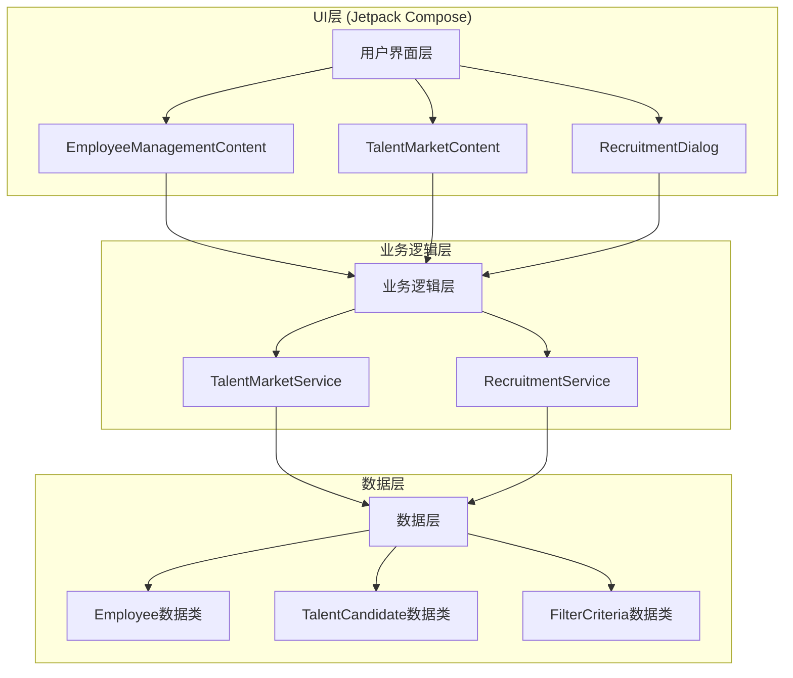
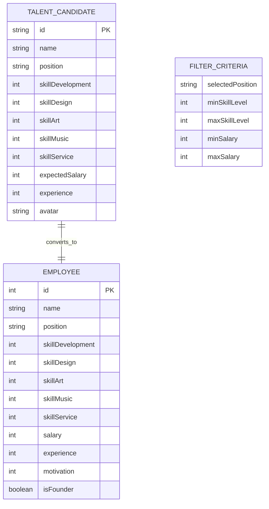

# 人才市场功能技术架构文档

## 1. 架构设计



## 2. 技术描述

- Frontend: Android Jetpack Compose + Kotlin
- UI框架: Material3 Design System
- 状态管理: Compose State + remember
- 数据存储: 本地内存存储（基于现有SaveData机制）

## 3. 路由定义

| 路由 | 目的 |
|------|------|
| EmployeeManagement | 员工管理主页面，包含现有员工列表和人才市场入口 |
| TalentMarket | 人才市场页面，显示筛选条件和候选人列表 |
| RecruitmentConfirmation | 招聘确认弹窗，处理招聘操作和费用扣除 |

## 4. API定义

### 4.1 核心数据类型

人才候选人数据类
```kotlin
data class TalentCandidate(
    val id: String,
    val name: String,
    val position: String,
    val skillDevelopment: Int,
    val skillDesign: Int,
    val skillArt: Int,
    val skillMusic: Int,
    val skillService: Int,
    val expectedSalary: Int,
    val experience: Int,
    val avatar: String? = null
) {
    fun getTotalSkill(): Int = skillDevelopment + skillDesign + skillArt + skillMusic + skillService
    
    fun getSkillLevel(): String = when (maxOf(skillDevelopment, skillDesign, skillArt, skillMusic, skillService)) {
        in 1..2 -> "初级"
        3 -> "中级"
        4 -> "高级"
        5 -> "专家级"
        else -> "未知"
    }
    
    fun toEmployee(newId: Int): Employee {
        return Employee(
            id = newId,
            name = name,
            position = position,
            skillDevelopment = skillDevelopment,
            skillDesign = skillDesign,
            skillArt = skillArt,
            skillMusic = skillMusic,
            skillService = skillService,
            salary = expectedSalary,
            experience = experience
        )
    }
}
```

筛选条件数据类
```kotlin
data class FilterCriteria(
    val selectedPosition: String? = null,
    val minSkillLevel: Int = 1,
    val maxSkillLevel: Int = 5,
    val minSalary: Int = 3000,
    val maxSalary: Int = 50000
)
```

### 4.2 核心服务接口

人才市场服务
```kotlin
class TalentMarketService {
    fun generateCandidates(count: Int = 20): List<TalentCandidate>
    fun filterCandidates(candidates: List<TalentCandidate>, criteria: FilterCriteria): List<TalentCandidate>
    fun getPositions(): List<String>
    fun calculateRecruitmentCost(candidate: TalentCandidate): Long
}
```

招聘服务
```kotlin
class RecruitmentService {
    fun canAffordRecruitment(currentMoney: Long, cost: Long): Boolean
    fun recruitCandidate(
        candidate: TalentCandidate,
        currentEmployees: List<Employee>,
        currentMoney: Long
    ): Pair<List<Employee>, Long>
}
```

### 4.3 UI组件接口

人才市场主界面
```kotlin
@Composable
fun TalentMarketContent(
    onBackClick: () -> Unit,
    currentMoney: Long,
    currentEmployees: List<Employee>,
    onEmployeesUpdate: (List<Employee>) -> Unit,
    onMoneyUpdate: (Long) -> Unit
)
```

筛选条件组件
```kotlin
@Composable
fun FilterSection(
    criteria: FilterCriteria,
    onCriteriaChange: (FilterCriteria) -> Unit,
    positions: List<String>
)
```

候选人卡片组件
```kotlin
@Composable
fun CandidateCard(
    candidate: TalentCandidate,
    onRecruitClick: (TalentCandidate) -> Unit
)
```

招聘确认弹窗
```kotlin
@Composable
fun RecruitmentDialog(
    candidate: TalentCandidate,
    recruitmentCost: Long,
    currentMoney: Long,
    onConfirm: () -> Unit,
    onDismiss: () -> Unit
)
```

## 5. 数据模型

### 5.1 数据模型定义



### 5.2 数据定义语言

候选人生成逻辑
```kotlin
// 生成随机候选人
fun generateRandomCandidate(id: String): TalentCandidate {
    val positions = listOf("程序员", "策划师", "美术师", "音效师", "客服")
    val names = listOf("张三", "李四", "王五", "赵六", "钱七", "孙八", "周九", "吴十")
    
    val position = positions.random()
    val name = names.random() + Random.nextInt(100, 999)
    
    // 根据职位生成专业技能偏向
    val (dev, design, art, music, service) = when (position) {
        "程序员" -> generateSkills(primary = "development")
        "策划师" -> generateSkills(primary = "design")
        "美术师" -> generateSkills(primary = "art")
        "音效师" -> generateSkills(primary = "music")
        "客服" -> generateSkills(primary = "service")
        else -> generateSkills()
    }
    
    val maxSkill = maxOf(dev, design, art, music, service)
    val baseSalary = when (maxSkill) {
        5 -> Random.nextInt(15000, 30000)
        4 -> Random.nextInt(10000, 20000)
        3 -> Random.nextInt(6000, 12000)
        else -> Random.nextInt(3000, 8000)
    }
    
    return TalentCandidate(
        id = id,
        name = name,
        position = position,
        skillDevelopment = dev,
        skillDesign = design,
        skillArt = art,
        skillMusic = music,
        skillService = service,
        expectedSalary = baseSalary,
        experience = Random.nextInt(0, 10)
    )
}

// 技能生成辅助函数
fun generateSkills(primary: String? = null): List<Int> {
    val skills = mutableListOf(1, 1, 1, 1, 1) // 每个技能至少1级
    
    // 为主要技能分配更高等级
    primary?.let { primarySkill ->
        val primaryIndex = when (primarySkill) {
            "development" -> 0
            "design" -> 1
            "art" -> 2
            "music" -> 3
            "service" -> 4
            else -> -1
        }
        
        if (primaryIndex >= 0) {
            skills[primaryIndex] = Random.nextInt(3, 6) // 主要技能3-5级
        }
    }
    
    // 随机提升其他技能
    repeat(Random.nextInt(0, 3)) {
        val index = Random.nextInt(5)
        if (skills[index] < 5) {
            skills[index] = minOf(5, skills[index] + Random.nextInt(1, 3))
        }
    }
    
    return skills
}
```

筛选逻辑实现
```kotlin
// 候选人筛选函数
fun filterCandidates(
    candidates: List<TalentCandidate>,
    criteria: FilterCriteria
): List<TalentCandidate> {
    return candidates.filter { candidate ->
        // 职位筛选
        val positionMatch = criteria.selectedPosition?.let { 
            candidate.position == it 
        } ?: true
        
        // 技能等级筛选（基于最高技能等级）
        val maxSkill = maxOf(candidate.skillDevelopment, candidate.skillDesign, 
                           candidate.skillArt, candidate.skillMusic, candidate.skillService)
        val skillMatch = maxSkill in criteria.minSkillLevel..criteria.maxSkillLevel
        
        // 薪资筛选
        val salaryMatch = candidate.expectedSalary in criteria.minSalary..criteria.maxSalary
        
        positionMatch && skillMatch && salaryMatch
    }
}
```