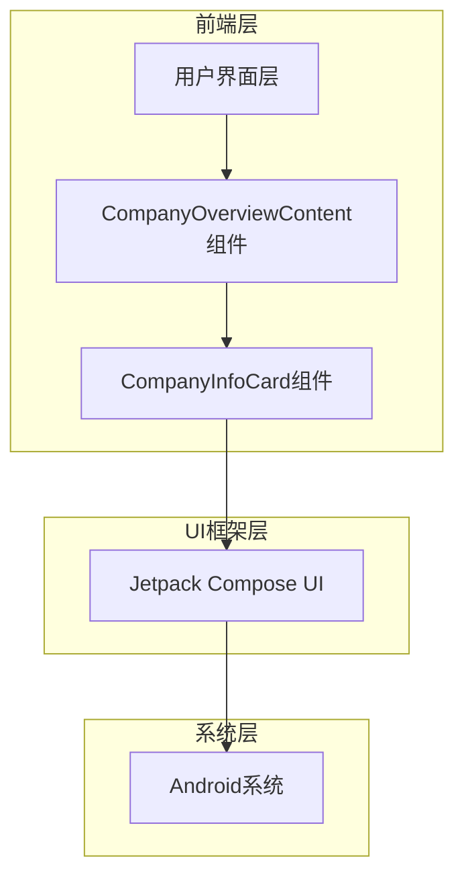

# 公司概览界面现代化重构技术架构文档

## 1. 架构设计



## 2. 技术描述

* 前端：Jetpack Compose + Kotlin + Material Design 3

* 后端：无

## 3. 路由定义

| 路由                | 用途                             |
| ----------------- | ------------------------------ |
| /company-overview | 公司概览主界面，显示公司信息、创始人信息、团队状况和项目状况 |

## 4. 组件架构设计

### 4.1 核心组件

现有组件结构：

```kotlin
@Composable
fun CompanyOverviewContent(
    companyName: String = "我的游戏公司",
    founder: Founder? = null
)

@Composable
fun CompanyInfoCard(
    title: String,
    items: List<Pair<String, String>>
)
```

### 4.2 现代化重构方案

**重构原则：**

1. 保持现有函数签名和参数不变
2. 仅修改UI样式和布局，不改变数据结构
3. 使用Jetpack Compose的现代化设计元素

**具体重构内容：**

1. **CompanyOverviewContent组件重构**

   * 移除Card容器的边框和阴影效果

   * 使用更现代的背景处理方式

   * 优化间距和布局

2. **CompanyInfoCard组件重构**

   * 移除Card的边框设计

   * 使用纯背景色替代卡片效果

   * 采用更扁平化的视觉设计

   * 优化文字排版和颜色对比

**样式修改要点：**

```kotlin
// 原有设计：使用Card + elevation
Card(
    elevation = CardDefaults.cardElevation(defaultElevation = 4.dp)
)

// 现代化设计：使用Box + 背景色
Box(
    modifier = Modifier.background(
        color = Color.White.copy(alpha = 0.05f),
        shape = RoundedCornerShape(12.dp)
    )
)
```

## 5. 设计系统规范

### 5.1 颜色系统

```kotlin
// 主要颜色
val PrimaryGradientStart = Color(0xFF1E3A8A)
val PrimaryGradientEnd = Color(0xFF7C3AED)
val AccentColor = Color(0xFFF59E0B)
val TextPrimary = Color.White
val TextSecondary = Color.White.copy(alpha = 0.8f)
val BackgroundOverlay = Color.White.copy(alpha = 0.05f)
```

### 5.2 字体系统

```kotlin
// 标题字体
val TitleTextStyle = TextStyle(
    fontSize = 20.sp,
    fontWeight = FontWeight.Bold,
    color = Color.White
)

// 副标题字体
val SubtitleTextStyle = TextStyle(
    fontSize = 16.sp,
    fontWeight = FontWeight.Bold,
    color = Color(0xFFF59E0B)
)

// 正文字体
val BodyTextStyle = TextStyle(
    fontSize = 14.sp,
    fontWeight = FontWeight.Medium,
    color = Color.White
)
```

### 5.3 间距系统

```kotlin
// 标准间距
val SpacingXS = 4.dp
val SpacingS = 8.dp
val SpacingM = 12.dp
val SpacingL = 16.dp
val SpacingXL = 20.dp
```

## 6. 实现策略

### 6.1 渐进式重构

1. **第一阶段**：移除Card组件的边框和阴影
2. **第二阶段**：优化背景和颜色系统
3. **第三阶段**：调整间距和字体样式
4. **第四阶段**：添加微交互和动画效果

### 6.2 兼容性保证

* 保持所有现有函数的参数和返回值不变

* 确保数据流和状态管理逻辑不受影响

* 维持与其他组件的接口一致性

### 6.3 性能优化

* 使用Compose的重组优化机制

* 避免不必要的UI重绘

* 合理使用remember和LaunchedEffect

## 7. 测试策略

### 7.1 UI测试

* 验证各种屏幕尺寸下的显示效果

* 测试不同数据状态下的界面表现

* 确保颜色对比度符合无障碍标准

### 7.2 集成测试

* 验证与现有代码的兼容性

* 测试数据传递的正确性

* 确保界面切换的流畅性

