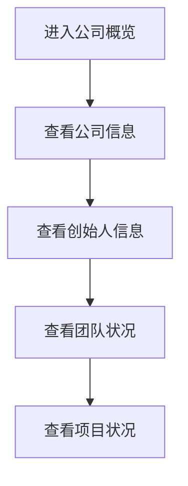

# 公司概览界面现代化重构设计方案

## 1. 产品概述

本方案旨在对游戏公司模拟经营APP的公司概览界面进行现代化重构，去除传统的线条框和卡片设计，采用扁平化、渐变背景等现代设计元素，提升用户体验和视觉效果。

## 2. 核心功能

### 2.1 用户角色
本界面无需区分用户角色，所有玩家均可查看公司概览信息。

### 2.2 功能模块

我们的公司概览界面重构包含以下主要模块：
1. **顶部标题区域**：现代化的标题展示，去除传统边框
2. **公司信息展示区**：扁平化的公司基本信息展示
3. **创始人信息区**：现代化的创始人信息布局
4. **团队状况区**：简洁的团队信息展示
5. **项目状况区**：项目进度和收益信息展示

### 2.3 页面详情

| 页面名称 | 模块名称 | 功能描述 |
|---------|---------|----------|
| 公司概览界面 | 顶部标题区域 | 显示"🏢 公司概览"标题，采用现代化字体和渐变效果 |
| 公司概览界面 | 公司信息展示区 | 展示公司名称、等级、声誉值、成立时间，使用扁平化设计 |
| 公司概览界面 | 创始人信息区 | 显示创始人姓名、职业、专属技能、技能等级，去除边框设计 |
| 公司概览界面 | 团队状况区 | 展示员工总数和各职位人数，使用现代化布局 |
| 公司概览界面 | 项目状况区 | 显示项目进度、完成情况和收益信息，采用简洁设计 |

## 3. 核心流程

用户进入公司概览界面后，可以查看公司的基本信息、创始人信息、团队状况和项目状况。界面采用垂直滚动布局，信息层次清晰，无需复杂的交互流程。

## 4. 用户界面设计

### 4.1 设计风格

- **主色调**：保持原有的紫色渐变背景 (#1E3A8A 到 #7C3AED)
- **次要色彩**：橙色强调色 (#F59E0B)，白色文字 (#FFFFFF)
- **设计风格**：扁平化设计，去除所有边框和线条
- **字体**：现代化无衬线字体，标题使用粗体
- **布局风格**：垂直流式布局，使用渐变背景和阴影效果
- **图标风格**：使用emoji图标，简洁现代

### 4.2 页面设计概览

| 页面名称 | 模块名称 | UI元素 |
|---------|---------|--------|
| 公司概览界面 | 顶部标题区域 | 白色粗体文字，20sp字号，无背景框 |
| 公司概览界面 | 公司信息展示区 | 半透明白色背景(alpha=0.05)，圆角设计，无边框 |
| 公司概览界面 | 创始人信息区 | 橙色标题，白色内容文字，扁平化布局 |
| 公司概览界面 | 团队状况区 | 简洁的文字排列，左右对齐布局，无装饰元素 |
| 公司概览界面 | 项目状况区 | 统一的视觉风格，与其他区域保持一致 |

### 4.3 响应式设计

界面采用移动端优先设计，支持不同屏幕尺寸的自适应布局，确保在各种Android设备上都能良好显示。