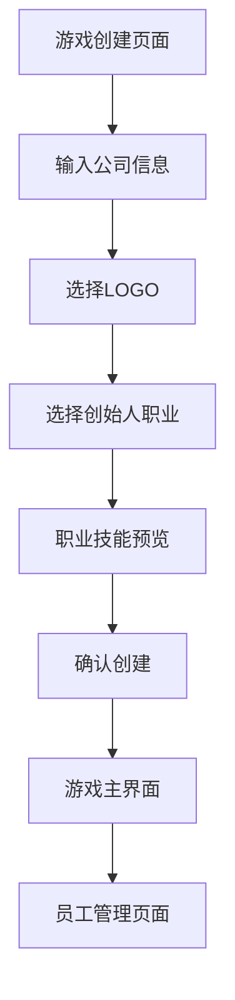

## 1. Product Overview
游戏公司模拟经营APP创始人职业功能扩展，为创建流程新增职业选择机制，让创始人拥有专业技能优势。
- 解决创始人角色单一化问题，增加游戏策略性和个性化体验
- 为不同职业背景的创始人提供差异化的游戏开局优势

## 2. Core Features

### 2.1 User Roles
本功能不涉及新的用户角色区分，仍为单一玩家体验。

### 2.2 Feature Module
创始人职业功能主要涉及以下页面扩展：
1. **游戏创建页面**：新增创始人职业选择模块
2. **游戏主界面**：显示创始人职业信息和技能等级
3. **员工管理页面**：将创始人作为特殊员工展示

### 2.3 Page Details

| Page Name | Module Name | Feature description |
|-----------|-------------|---------------------|
| 游戏创建页面 | 创始人职业选择 | 提供程序员、策划师、美术师、音效师、客服等职业选项，每个职业有独特图标和描述 |
| 游戏创建页面 | 职业技能预览 | 显示所选职业的专属技能类型和5级技能等级说明 |
| 游戏主界面 | 创始人信息卡片 | 在公司概况中展示创始人姓名、职业和专属技能等级 |
| 员工管理页面 | 创始人员工卡片 | 将创始人作为特殊员工显示，标注为"创始人"身份，技能等级为5级 |

## 3. Core Process

**创始人职业选择流程：**
1. 用户进入游戏创建页面
2. 输入公司名称和创始人姓名
3. 选择公司LOGO
4. **新增：选择创始人职业**
   - 浏览可选职业列表（程序员、策划师、美术师、音效师、客服）
   - 查看每个职业的专属技能说明
   - 确认选择的职业
5. 开始游戏，创始人以5级专属技能加入公司

## 4. User Interface Design

### 4.1 Design Style
- 主色调：保持现有的紫色渐变背景（#1E3A8A到#7C3AED）
- 按钮样式：圆角卡片式设计，支持选中状态高亮
- 字体：16sp标题，14sp正文，12sp说明文字
- 布局风格：卡片式网格布局，支持横向滚动选择
- 图标风格：使用emoji表情符号，简洁直观

### 4.2 Page Design Overview

| Page Name | Module Name | UI Elements |
|-----------|-------------|-------------|
| 游戏创建页面 | 创始人职业选择 | 5个职业卡片横向排列，每个卡片包含职业图标、名称和简短描述，选中状态有白色边框高亮 |
| 游戏创建页面 | 职业技能预览 | 在职业选择下方显示技能说明文字，格式为"专属技能：[技能类型] 5级" |
| 游戏主界面 | 创始人信息 | 在公司概况卡片中新增创始人信息行，显示职业图标+姓名+职业名称 |
| 员工管理页面 | 创始人卡片 | 特殊样式的员工卡片，背景色稍有区别，标注"创始人"标签，技能显示为5级 |

### 4.3 Responsiveness
设计为移动端优先，支持竖屏显示，职业选择采用横向滚动适配不同屏幕宽度。