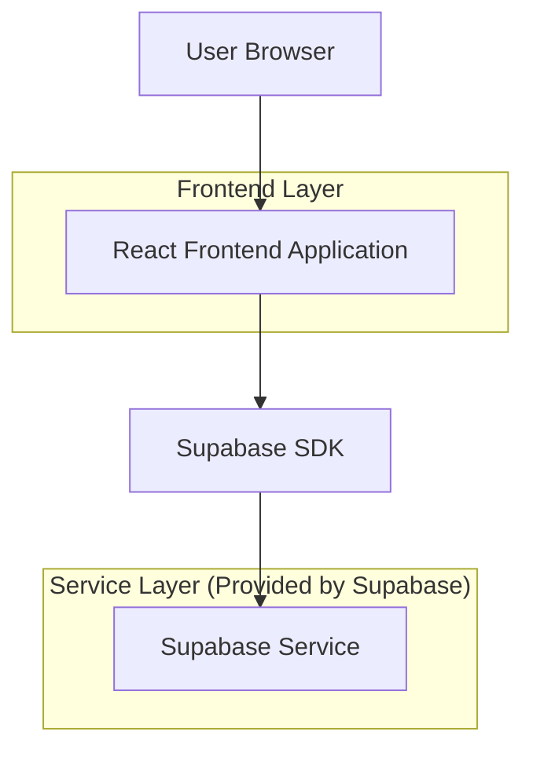
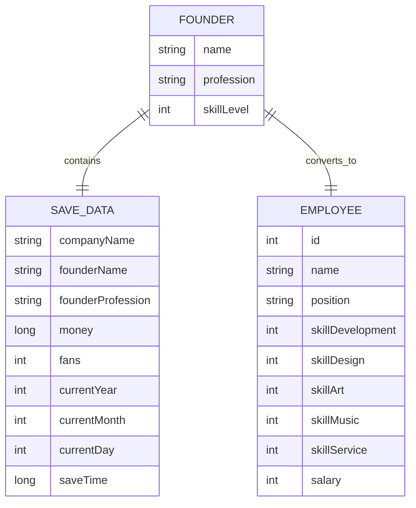

## 1.Architecture design



## 2.Technology Description
- Frontend: Android Kotlin + Jetpack Compose
- Backend: 本地存储（SharedPreferences）
- 数据库: 无需外部数据库，使用本地JSON存储

## 3.Route definitions
本功能基于现有Android Activity，无需新增路由。主要在现有页面中扩展功能：

| Route | Purpose |
|-------|----------|
| GameSetupScreen | 游戏创建页面，新增创始人职业选择功能 |
| GameScreen | 游戏主界面，显示创始人职业信息 |
| EmployeeManagement | 员工管理页面，展示创始人作为特殊员工 |

## 4.API definitions

### 4.1 Core Data Models

**创始人职业枚举**
```kotlin
enum class FounderProfession(val displayName: String, val icon: String, val specialtySkill: String) {
    PROGRAMMER("程序员", "💻", "开发"),
    DESIGNER("策划师", "📋", "设计"),
    ARTIST("美术师", "🎨", "美工"),
    SOUND_ENGINEER("音效师", "🎵", "音乐"),
    CUSTOMER_SERVICE("客服", "📞", "服务")
}
```

**创始人数据类**
```kotlin
data class Founder(
    val name: String,
    val profession: FounderProfession,
    val skillLevel: Int = 5 // 固定为5级
) {
    fun toEmployee(): Employee {
        return Employee(
            id = 0, // 特殊ID标识创始人
            name = name,
            position = profession.displayName,
            skillDevelopment = if (profession.specialtySkill == "开发") 5 else 1,
            skillDesign = if (profession.specialtySkill == "设计") 5 else 1,
            skillArt = if (profession.specialtySkill == "美工") 5 else 1,
            skillMusic = if (profession.specialtySkill == "音乐") 5 else 1,
            skillService = if (profession.specialtySkill == "服务") 5 else 1,
            salary = 0 // 创始人无薪资
        )
    }
}
```

**扩展SaveData数据类**
```kotlin
// 在现有SaveData中新增字段（向后兼容）
data class SaveData(
    val companyName: String = "我的游戏公司",
    val founderName: String = "创始人",
    val founderProfession: FounderProfession? = null, // 新增字段
    val money: Long = 1000000L,
    val fans: Int = 0,
    val currentYear: Int = 1,
    val currentMonth: Int = 1,
    val currentDay: Int = 1,
    val saveTime: Long = System.currentTimeMillis(),
    val games: List<Game> = emptyList()
)
```

## 5.Server architecture diagram
本功能无需服务器端架构，完全基于客户端实现。

## 6.Data model

### 6.1 Data model definition


### 6.2 Data Definition Language

**SharedPreferences存储结构**
```json
{
  "save_slot_1": {
    "companyName": "我的游戏公司",
    "founderName": "张三",
    "founderProfession": "PROGRAMMER",
    "money": 1000000,
    "fans": 0,
    "currentYear": 1,
    "currentMonth": 1,
    "currentDay": 1,
    "saveTime": 1703123456789,
    "games": []
  }
}
```

**实现策略**
1. **非侵入式扩展**：通过新增Composable组件实现职业选择功能
2. **数据兼容性**：新增字段使用可空类型，确保旧存档正常加载
3. **代码复用**：利用现有Employee数据结构，创始人转换为特殊员工
4. **UI一致性**：复用现有UI组件样式，保持界面风格统一

**关键实现点**
- 在GameSetupScreen中新增FounderProfessionSelector组件
- 扩展SaveData支持创始人职业信息
- 在员工列表中特殊处理创始人（ID=0）
- 创始人专属技能固定为5级，其他技能为1级