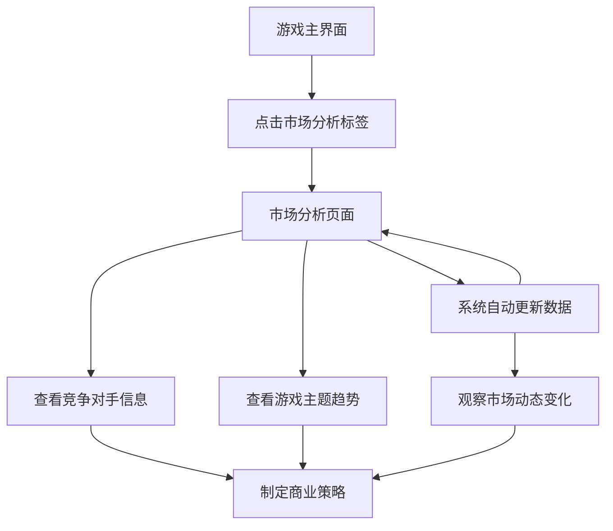

## 1. Product Overview
游戏公司模拟经营APP市场分析功能完善项目，旨在为现有的MarketAnalysisContent组件添加竞争对手分析和游戏主题趋势功能。通过展示虚构竞争对手的关键数据和市场趋势，帮助玩家更好地了解游戏行业环境，制定更明智的商业决策。
- 为玩家提供沉浸式的市场竞争体验，增强游戏的真实感和策略性
- 通过数据可视化帮助玩家理解市场动态，提升游戏的教育价值

## 2. Core Features

### 2.1 User Roles
本功能不需要区分用户角色，所有游戏玩家都可以访问市场分析功能。

### 2.2 Feature Module
市场分析功能完善包含以下核心模块：
1. **竞争对手分析模块**：展示5家虚构游戏公司的详细信息
2. **游戏主题趋势模块**：显示当前热门游戏主题的市场表现
3. **数据可视化模块**：通过图表和卡片形式展示市场数据

### 2.3 Page Details

| Page Name | Module Name | Feature description |
|-----------|-------------|---------------------|
| 市场分析页面 | 竞争对手信息卡片 | 显示5家虚构竞争对手公司名称、年收入、粉丝数、公司市值。使用卡片布局，每个竞争对手一张卡片，包含公司图标和关键数据 |
| 市场分析页面 | 游戏主题趋势分析 | 随机生成当前热门游戏主题排行，显示主题名称、热度指数、市场占有率。支持动态刷新数据 |
| 市场分析页面 | 自动数据更新功能 | 每30秒自动更新竞争对手数据和主题趋势，模拟真实市场的动态变化，增加游戏的沉浸感和真实性 |

## 3. Core Process

玩家操作流程：
1. 玩家点击底部导航栏的"市场分析"标签
2. 进入市场分析页面，自动加载竞争对手信息和游戏主题趋势
3. 玩家可以查看各竞争对手的详细数据对比
4. 玩家可以查看当前游戏主题的市场趋势
5. 系统每30秒自动更新市场数据，玩家可以观察到数据的动态变化
6. 玩家基于实时市场信息调整自己的游戏开发策略

## 4. User Interface Design

### 4.1 Design Style
- 主色调：深蓝色渐变背景(#1E3A8A到#3B82F6)，保持与现有APP风格一致
- 次要颜色：白色半透明卡片(alpha=0.1f)，绿色(#10B981)用于正面数据，红色(#EF4444)用于负面数据
- 按钮样式：圆角矩形(12dp)，带有阴影效果
- 字体：系统默认字体，标题24sp粗体，正文16sp常规
- 布局风格：卡片式布局，垂直滚动，16dp边距
- 图标风格：使用emoji图标增强视觉效果

### 4.2 Page Design Overview

| Page Name | Module Name | UI Elements |
|-----------|-------------|-------------|
| 市场分析页面 | 页面标题 | 24sp白色粗体文字"📊 市场分析"，底部16dp边距 |
| 市场分析页面 | 竞争对手卡片区域 | 白色半透明卡片容器，12dp圆角，4dp阴影。标题"🏢 竞争对手分析"，下方5个子卡片展示竞争对手信息 |
| 市场分析页面 | 竞争对手信息卡片 | 每个卡片包含公司emoji图标、公司名称(16sp粗体)、年收入(绿色文字)、粉丝数(蓝色文字)、市值(金色文字) |
| 市场分析页面 | 游戏主题趋势区域 | 独立的白色半透明卡片，标题"🎮 游戏主题趋势"，列表显示热门主题及其热度指数 |
| 市场分析页面 | 自动更新动画效果 | 数据更新时卡片透明度变化(0.7f-1.0f)，300ms渐变动画，提供视觉反馈让玩家感知数据变化 |

### 4.3 Responsiveness
本功能主要针对移动端设计，采用响应式布局适配不同屏幕尺寸。卡片布局在小屏幕上垂直排列，在大屏幕上可考虑网格布局。支持触摸交互，按钮有适当的触摸反馈效果。