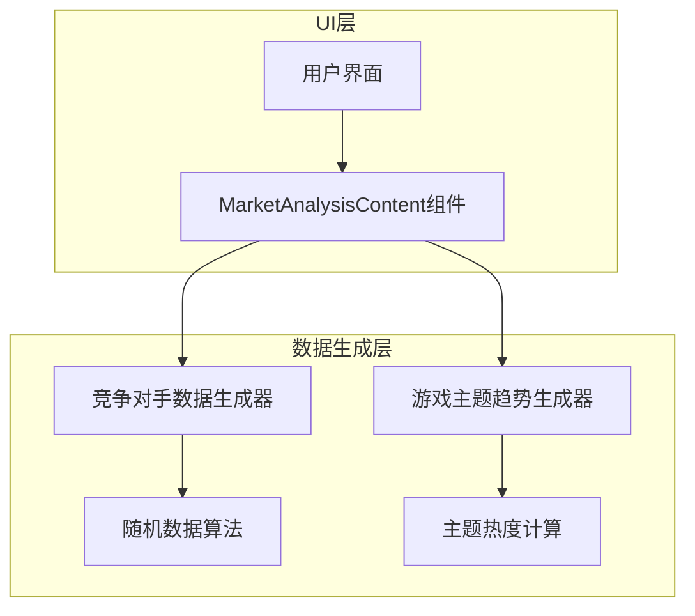
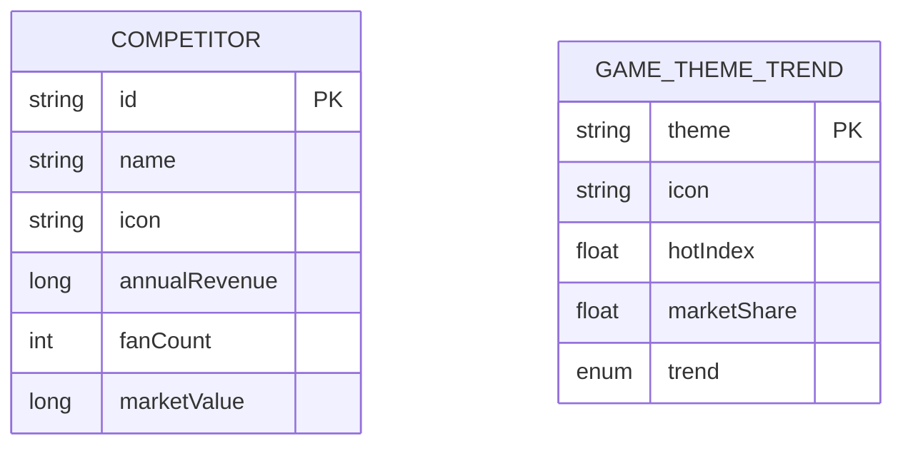

## 1.Architecture design



## 2.Technology Description
- Frontend: Android Jetpack Compose + Kotlin
- 数据生成: Kotlin Random类 + 预定义数据集
- UI组件: Material Design 3组件库

## 3.Route definitions

| Route | Purpose |
|-------|----------|
| MainActivity | 主活动，包含市场分析标签页导航 |
| MarketAnalysisContent | 市场分析功能的主要Composable组件 |

## 4.API definitions

### 4.1 数据模型定义

竞争对手数据模型
```kotlin
data class Competitor(
    val id: String,
    val name: String,
    val icon: String, // emoji图标
    val annualRevenue: Long, // 年收入（万元）
    val fanCount: Int, // 粉丝数（万人）
    val marketValue: Long // 市值（万元）
)
```

游戏主题趋势数据模型
```kotlin
data class GameThemeTrend(
    val theme: String, // 主题名称
    val icon: String, // emoji图标
    val hotIndex: Float, // 热度指数 0-100
    val marketShare: Float, // 市场占有率 0-100%
    val trend: TrendDirection // 趋势方向
)

enum class TrendDirection {
    UP, DOWN, STABLE
}
```

### 4.2 自动数据更新系统

竞争对手数据生成器（支持动态更新）
```kotlin
class CompetitorDataGenerator {
    private val companyNames = listOf(
        "星辰游戏", "梦想工作室", "创新互娱", 
        "未来科技", "极光工作室"
    )
    private val icons = listOf("🎮", "🌟", "🚀", "💎", "⚡")
    
    fun generateCompetitors(): List<Competitor> {
        return companyNames.mapIndexed { index, name ->
            Competitor(
                id = "comp_$index",
                name = name,
                icon = icons[index],
                annualRevenue = Random.nextLong(1000, 50000),
                fanCount = Random.nextInt(10, 1000),
                marketValue = Random.nextLong(5000, 200000)
            )
        }
    }
    
    // 动态更新现有竞争对手数据（模拟市场波动）
    fun updateCompetitorData(current: Competitor): Competitor {
        val revenueChange = Random.nextFloat() * 0.2f - 0.1f // ±10%变化
        val fanChange = Random.nextFloat() * 0.15f - 0.075f // ±7.5%变化
        val valueChange = Random.nextFloat() * 0.25f - 0.125f // ±12.5%变化
        
        return current.copy(
            annualRevenue = (current.annualRevenue * (1 + revenueChange)).toLong().coerceAtLeast(500),
            fanCount = (current.fanCount * (1 + fanChange)).toInt().coerceAtLeast(5),
            marketValue = (current.marketValue * (1 + valueChange)).toLong().coerceAtLeast(1000)
        )
    }
}
```

游戏主题趋势生成器（支持动态更新）
```kotlin
class GameThemeTrendGenerator {
    private val themes = listOf(
        "动作" to "⚔️",
        "角色扮演" to "🧙",
        "策略" to "🏰",
        "模拟" to "🏗️",
        "休闲" to "🎯",
        "竞技" to "🏆"
    )
    
    fun generateGameThemeTrends(): List<GameThemeTrend> {
        return themes.map { (theme, icon) ->
            GameThemeTrend(
                theme = theme,
                icon = icon,
                hotIndex = Random.nextFloat() * 100,
                marketShare = Random.nextFloat() * 30,
                trend = TrendDirection.values().random()
            )
        }.sortedByDescending { it.hotIndex }
    }
    
    // 动态更新主题趋势（模拟市场变化）
    fun updateThemeTrend(current: GameThemeTrend): GameThemeTrend {
        val hotIndexChange = Random.nextFloat() * 20f - 10f // ±10点变化
        val shareChange = Random.nextFloat() * 5f - 2.5f // ±2.5%变化
        
        return current.copy(
            hotIndex = (current.hotIndex + hotIndexChange).coerceIn(0f, 100f),
            marketShare = (current.marketShare + shareChange).coerceIn(0f, 50f),
            trend = when {
                hotIndexChange > 3f -> TrendDirection.UP
                hotIndexChange < -3f -> TrendDirection.DOWN
                else -> TrendDirection.STABLE
            }
        )
    }
}
```

定时更新管理器
```kotlin
class MarketDataUpdateManager {
    companion object {
        const val UPDATE_INTERVAL_MS = 30000L // 30秒更新间隔
    }
    
    fun startAutoUpdate(
        onCompetitorsUpdate: (List<Competitor>) -> Unit,
        onTrendsUpdate: (List<GameThemeTrend>) -> Unit
    ): Job {
        return CoroutineScope(Dispatchers.Main).launch {
            while (true) {
                delay(UPDATE_INTERVAL_MS)
                // 触发数据更新
                onCompetitorsUpdate(CompetitorDataGenerator().generateCompetitors())
                onTrendsUpdate(GameThemeTrendGenerator().generateGameThemeTrends())
            }
        }
    }
}
```

## 5.Server architecture diagram

本项目为纯客户端应用，无需服务器架构。

## 6.Data model

### 6.1 Data model definition



### 6.2 自动更新实现方案

采用协程定时器实现自动数据更新，所有数据通过内存中的数据结构管理：

```kotlin
// 在MarketAnalysisContent组件中实现自动更新
@Composable
fun MarketAnalysisContent() {
    val competitorGenerator = remember { CompetitorDataGenerator() }
    val trendGenerator = remember { GameThemeTrendGenerator() }
    val updateManager = remember { MarketDataUpdateManager() }
    
    var competitors by remember { mutableStateOf(competitorGenerator.generateCompetitors()) }
    var themeTrends by remember { mutableStateOf(trendGenerator.generateGameThemeTrends()) }
    
    // 数据更新动画状态
    var isUpdating by remember { mutableStateOf(false) }
    val animatedAlpha by animateFloatAsState(
        targetValue = if (isUpdating) 0.7f else 1f,
        animationSpec = tween(300)
    )
    
    // 启动自动更新
    LaunchedEffect(Unit) {
        updateManager.startAutoUpdate(
            onCompetitorsUpdate = { newCompetitors ->
                isUpdating = true
                delay(300) // 动画时间
                competitors = newCompetitors
                isUpdating = false
            },
            onTrendsUpdate = { newTrends ->
                isUpdating = true
                delay(300) // 动画时间
                themeTrends = newTrends
                isUpdating = false
            }
        )
    }
    
    // UI实现（添加透明度动画）
    Column(
        modifier = Modifier
            .fillMaxSize()
            .alpha(animatedAlpha)
    ) {
        // 现有UI代码...
    }
}
```

增量更新实现（可选优化）
```kotlin
// 更平滑的增量更新方式
@Composable
fun MarketAnalysisContentWithIncrementalUpdate() {
    val competitorGenerator = remember { CompetitorDataGenerator() }
    val trendGenerator = remember { GameThemeTrendGenerator() }
    
    var competitors by remember { mutableStateOf(competitorGenerator.generateCompetitors()) }
    var themeTrends by remember { mutableStateOf(trendGenerator.generateGameThemeTrends()) }
    
    // 增量更新定时器
    LaunchedEffect(Unit) {
        while (true) {
            delay(30000L) // 30秒间隔
            
            // 增量更新竞争对手数据
            competitors = competitors.map { competitor ->
                competitorGenerator.updateCompetitorData(competitor)
            }
            
            // 增量更新主题趋势
            themeTrends = themeTrends.map { trend ->
                trendGenerator.updateThemeTrend(trend)
            }.sortedByDescending { it.hotIndex }
        }
    }
    
    // UI实现...
}
```

### 6.3 组件集成方案

在现有的MarketAnalysisContent函数中，替换占位符内容：

1. 保持现有的Column和Card结构
2. 在Card内部添加竞争对手信息展示
3. 添加新的Card展示游戏主题趋势
4. 添加刷新按钮触发数据重新生成

具体实现时需要：
- 保持现有的UI风格和颜色方案
- 使用现有的Modifier和样式定义
- 确保新增内容与现有布局协调一致
- 不修改函数签名和外部调用方式