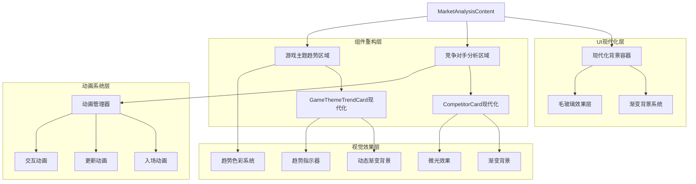

## 1.Architecture design



## 2.Technology Description
- Frontend: Android Jetpack Compose + Kotlin
- 动画系统: Compose Animation API + Spring动画
- 渐变系统: Brush.verticalGradient + Brush.horizontalGradient
- 响应式设计: LocalConfiguration + 自适应布局
- 性能优化: remember缓存 + LaunchedEffect管理

## 3.Route definitions

| Route | Purpose |
|-------|---------|
| MarketAnalysisContent | 市场分析主界面，应用现代化设计系统 |
| ModernCompetitorCard | 现代化竞争对手卡片组件 |
| ModernGameThemeTrendCard | 现代化游戏主题趋势卡片组件 |
| AnimationManager | 统一的动画管理组件 |

## 4.API definitions

### 4.1 现代化设计系统API

现代化色彩系统
```kotlin
object ModernColorSystem {
    val primaryGradient = Brush.verticalGradient(
        colors = listOf(
            Color(0xFF0F172A),
            Color(0xFF1E293B),
            Color(0xFF334155)
        )
    )
    
    val cardGlassEffect = Color.White.copy(alpha = 0.08f)
    val accentNeon = Color(0xFF06B6D4)
    val successGreen = Color(0xFF10B981)
    val warningAmber = Color(0xFFF59E0B)
    val dangerCoral = Color(0xFFEF4444)
    
    fun getTrendGradient(trend: TrendDirection): Brush {
        return when (trend) {
            TrendDirection.UP -> Brush.horizontalGradient(
                colors = listOf(
                    successGreen.copy(alpha = 0.2f),
                    Color(0xFF059669).copy(alpha = 0.1f)
                )
            )
            TrendDirection.DOWN -> Brush.horizontalGradient(
                colors = listOf(
                    dangerCoral.copy(alpha = 0.2f),
                    Color(0xFFDC2626).copy(alpha = 0.1f)
                )
            )
            TrendDirection.STABLE -> Brush.horizontalGradient(
                colors = listOf(
                    warningAmber.copy(alpha = 0.2f),
                    Color(0xFFD97706).copy(alpha = 0.1f)
                )
            )
        }
    }
}
```

现代化动画系统
```kotlin
object ModernAnimationSystem {
    val updateAnimation = spring<Float>(
        dampingRatio = Spring.DampingRatioMediumBouncy,
        stiffness = Spring.StiffnessLow
    )
    
    val scaleAnimation = spring<Float>(
        dampingRatio = Spring.DampingRatioMediumBouncy,
        stiffness = Spring.StiffnessMedium
    )
    
    val staggeredEntrance = tween<Float>(
        durationMillis = 300,
        easing = FastOutSlowInEasing
    )
    
    fun createStaggeredDelay(index: Int): Int = index * 100
}
```

毛玻璃效果组件
```kotlin
@Composable
fun GlassCard(
    modifier: Modifier = Modifier,
    cornerRadius: Dp = 20.dp,
    glassAlpha: Float = 0.08f,
    content: @Composable BoxScope.() -> Unit
) {
    Card(
        modifier = modifier,
        colors = CardDefaults.cardColors(
            containerColor = Color.White.copy(alpha = glassAlpha)
        ),
        elevation = CardDefaults.cardElevation(defaultElevation = 0.dp),
        shape = RoundedCornerShape(cornerRadius),
        border = null
    ) {
        Box(
            modifier = Modifier
                .fillMaxWidth()
                .background(
                    Brush.linearGradient(
                        colors = listOf(
                            Color.White.copy(alpha = 0.1f),
                            Color.White.copy(alpha = 0.05f)
                        ),
                        start = Offset(0f, 0f),
                        end = Offset(1000f, 1000f)
                    )
                )
        ) {
            content()
        }
    }
}
```

### 4.2 响应式布局系统

自适应尺寸管理器
```kotlin
@Composable
fun rememberAdaptiveSizes(): AdaptiveSizes {
    val configuration = LocalConfiguration.current
    val screenWidth = configuration.screenWidthDp.dp
    
    return remember(screenWidth) {
        AdaptiveSizes(
            padding = when {
                screenWidth < 360.dp -> 16.dp
                screenWidth < 480.dp -> 20.dp
                else -> 24.dp
            },
            titleFontSize = when {
                screenWidth < 360.dp -> 24.sp
                screenWidth < 480.dp -> 28.sp
                else -> 32.sp
            },
            cardCornerRadius = when {
                screenWidth < 360.dp -> 16.dp
                screenWidth < 480.dp -> 18.dp
                else -> 20.dp
            }
        )
    }
}

data class AdaptiveSizes(
    val padding: Dp,
    val titleFontSize: TextUnit,
    val cardCornerRadius: Dp
)
```

### 4.3 现代化组件重构API

现代化竞争对手卡片
```kotlin
@Composable
fun ModernCompetitorCard(
    competitor: Competitor,
    modifier: Modifier = Modifier,
    animationDelay: Int = 0
) {
    val animatedVisibility by animateFloatAsState(
        targetValue = 1f,
        animationSpec = tween(
            durationMillis = 300,
            delayMillis = animationDelay
        )
    )
    
    GlassCard(
        modifier = modifier
            .alpha(animatedVisibility)
            .offset(y = (20 * (1 - animatedVisibility)).dp)
            .padding(vertical = 6.dp),
        cornerRadius = 16.dp
    ) {
        Row(
            modifier = Modifier
                .fillMaxWidth()
                .padding(16.dp),
            verticalAlignment = Alignment.CenterVertically
        ) {
            // 公司图标
            Text(
                text = competitor.icon,
                fontSize = 28.sp,
                modifier = Modifier.padding(end = 16.dp)
            )
            
            Column(
                modifier = Modifier.weight(1f)
            ) {
                // 公司名称
                Text(
                    text = competitor.name,
                    fontSize = 16.sp,
                    fontWeight = FontWeight.Bold,
                    color = Color.White,
                    letterSpacing = 0.3.sp
                )
                
                Spacer(modifier = Modifier.height(8.dp))
                
                // 数据行
                Row(
                    modifier = Modifier.fillMaxWidth(),
                    horizontalArrangement = Arrangement.SpaceBetween
                ) {
                    DataChip(
                        label = "年收入",
                        value = "${formatMoney(competitor.annualRevenue)}万",
                        color = ModernColorSystem.successGreen
                    )
                    DataChip(
                        label = "粉丝",
                        value = "${competitor.fanCount}万",
                        color = ModernColorSystem.accentNeon
                    )
                }
                
                Spacer(modifier = Modifier.height(4.dp))
                
                DataChip(
                    label = "市值",
                    value = "${formatMoney(competitor.marketValue)}万",
                    color = ModernColorSystem.warningAmber
                )
            }
        }
        
        // 微光效果
        Box(
            modifier = Modifier
                .fillMaxWidth()
                .height(1.dp)
                .background(
                    Brush.horizontalGradient(
                        colors = listOf(
                            Color.Transparent,
                            ModernColorSystem.accentNeon.copy(alpha = 0.5f),
                            Color.Transparent
                        )
                    )
                )
        )
    }
}
```

数据芯片组件
```kotlin
@Composable
fun DataChip(
    label: String,
    value: String,
    color: Color,
    modifier: Modifier = Modifier
) {
    Row(
        modifier = modifier,
        verticalAlignment = Alignment.CenterVertically
    ) {
        Box(
            modifier = Modifier
                .size(6.dp)
                .background(
                    color = color,
                    shape = CircleShape
                )
        )
        
        Spacer(modifier = Modifier.width(6.dp))
        
        Text(
            text = "$label: $value",
            fontSize = 12.sp,
            fontWeight = FontWeight.Medium,
            color = color,
            letterSpacing = 0.2.sp
        )
    }
}
```

现代化趋势卡片
```kotlin
@Composable
fun ModernGameThemeTrendCard(
    trend: GameThemeTrend,
    modifier: Modifier = Modifier,
    animationDelay: Int = 0
) {
    val animatedVisibility by animateFloatAsState(
        targetValue = 1f,
        animationSpec = tween(
            durationMillis = 300,
            delayMillis = animationDelay
        )
    )
    
    Card(
        modifier = modifier
            .alpha(animatedVisibility)
            .offset(y = (20 * (1 - animatedVisibility)).dp)
            .padding(vertical = 6.dp)
            .animateContentSize(),
        colors = CardDefaults.cardColors(
            containerColor = Color.Transparent
        ),
        elevation = CardDefaults.cardElevation(defaultElevation = 0.dp),
        shape = RoundedCornerShape(16.dp)
    ) {
        Box(
            modifier = Modifier
                .fillMaxWidth()
                .background(ModernColorSystem.getTrendGradient(trend.trend))
                .padding(16.dp)
        ) {
            Row(
                modifier = Modifier.fillMaxWidth(),
                verticalAlignment = Alignment.CenterVertically
            ) {
                // 主题图标
                Text(
                    text = trend.icon,
                    fontSize = 28.sp,
                    modifier = Modifier.padding(end = 16.dp)
                )
                
                Column(
                    modifier = Modifier.weight(1f)
                ) {
                    Row(
                        modifier = Modifier.fillMaxWidth(),
                        horizontalArrangement = Arrangement.SpaceBetween,
                        verticalAlignment = Alignment.CenterVertically
                    ) {
                        Text(
                            text = trend.theme,
                            fontSize = 16.sp,
                            fontWeight = FontWeight.Bold,
                            color = Color.White,
                            letterSpacing = 0.3.sp
                        )
                        
                        TrendIndicator(trend = trend.trend)
                    }
                    
                    Spacer(modifier = Modifier.height(8.dp))
                    
                    Row(
                        modifier = Modifier.fillMaxWidth(),
                        horizontalArrangement = Arrangement.SpaceBetween
                    ) {
                        DataChip(
                            label = "热度",
                            value = String.format("%.1f", trend.hotIndex),
                            color = ModernColorSystem.dangerCoral
                        )
                        DataChip(
                            label = "占有率",
                            value = "${String.format("%.1f", trend.marketShare)}%",
                            color = Color(0xFF8B5CF6)
                        )
                    }
                }
            }
        }
    }
}
```

趋势指示器组件
```kotlin
@Composable
fun TrendIndicator(
    trend: TrendDirection,
    modifier: Modifier = Modifier
) {
    val (icon, color) = when (trend) {
        TrendDirection.UP -> "📈" to ModernColorSystem.successGreen
        TrendDirection.DOWN -> "📉" to ModernColorSystem.dangerCoral
        TrendDirection.STABLE -> "➡️" to ModernColorSystem.warningAmber
    }
    
    Box(
        modifier = modifier
            .background(
                color = color.copy(alpha = 0.2f),
                shape = RoundedCornerShape(8.dp)
            )
            .padding(horizontal = 8.dp, vertical = 4.dp)
    ) {
        Text(
            text = icon,
            fontSize = 16.sp
        )
    }
}
```

## 5.Server architecture diagram

本项目为纯客户端应用，无需服务器架构。现代化重构仅涉及UI层面的优化。

## 6.Data model

### 6.1 现有数据模型保持不变

现代化重构不改变现有的数据结构，继续使用：
- `Competitor` 数据类
- `GameThemeTrend` 数据类
- `TrendDirection` 枚举
- `CompetitorDataGenerator` 类
- `GameThemeTrendGenerator` 类

### 6.2 新增UI状态管理

```kotlin
data class ModernUIState(
    val isAnimating: Boolean = false,
    val currentTheme: ModernTheme = ModernTheme.Default,
    val adaptiveSizes: AdaptiveSizes = AdaptiveSizes.Default
)

enum class ModernTheme {
    Default, HighContrast, Minimal
}
```

### 6.3 性能优化数据结构

```kotlin
class AnimationCache {
    private val gradientCache = mutableMapOf<String, Brush>()
    private val colorCache = mutableMapOf<String, Color>()
    
    fun getOrCreateGradient(key: String, factory: () -> Brush): Brush {
        return gradientCache.getOrPut(key, factory)
    }
    
    fun getOrCreateColor(key: String, factory: () -> Color): Color {
        return colorCache.getOrPut(key, factory)
    }
}
```

## 7.实施策略

### 7.1 渐进式重构步骤

1. **阶段一：基础现代化**
   - 实现现代化色彩系统
   - 更新背景渐变
   - 移除传统边框

2. **阶段二：组件重构**
   - 重构CompetitorCard组件
   - 重构GameThemeTrendCard组件
   - 实现毛玻璃效果

3. **阶段三：动画系统**
   - 添加入场动画
   - 实现更新动画
   - 优化交互反馈

4. **阶段四：响应式优化**
   - 实现自适应布局
   - 优化不同屏幕尺寸显示
   - 性能优化

### 7.2 兼容性保证

- 保持现有API接口不变
- 确保数据流逻辑不受影响
- 提供降级方案支持低端设备
- 维持现有的业务逻辑完整性

### 7.3 测试策略

- UI自动化测试确保视觉一致性
- 性能测试验证动画流畅度
- 兼容性测试覆盖不同设备
- 用户体验测试收集反馈