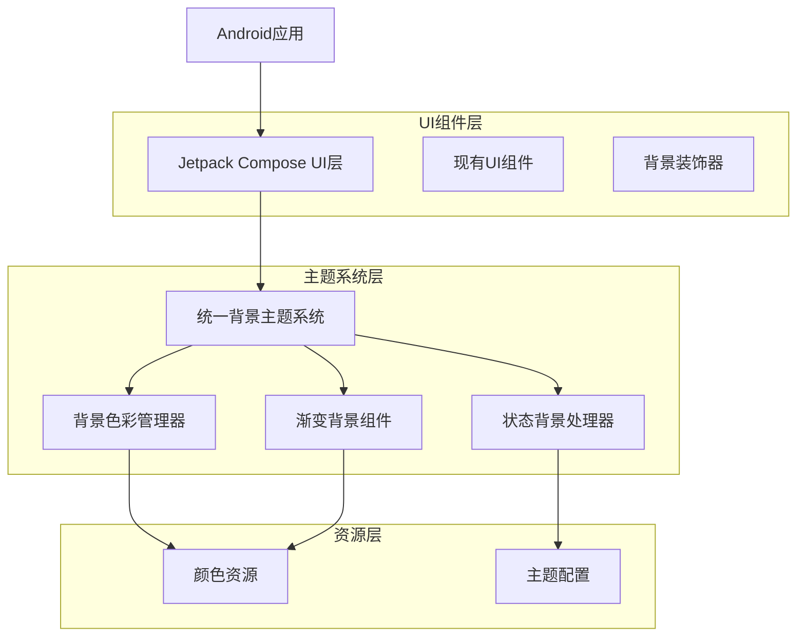
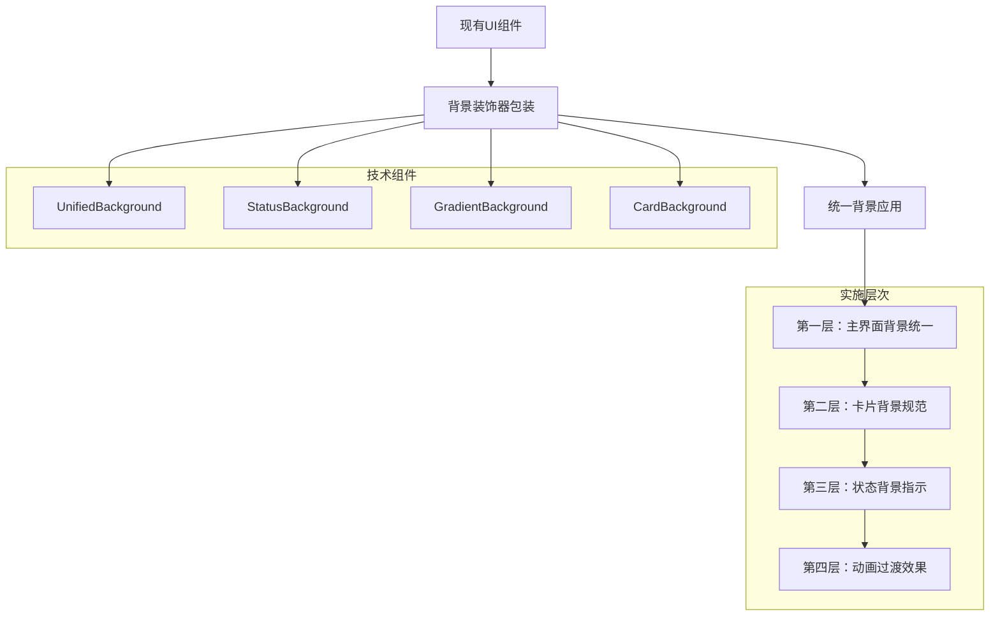

# 游戏UI界面统一背景技术架构文档

## 1. 架构设计



## 2. 技术描述

- **前端**: Jetpack Compose + Kotlin + Material3
- **架构模式**: MVVM + 组合模式
- **主题系统**: Material Design 3 + 自定义背景扩展
- **状态管理**: Compose State + ViewModel
- **动画系统**: Compose Animation API

## 3. 路由定义

| 路由 | 用途 | 背景类型 |
|------|------|----------|
| /main_menu | 主菜单界面 | 渐变背景 |
| /game | 游戏主界面 | 多层背景系统 |
| /hr_center | 人事中心 | 统一灰色背景 |
| /recruitment | 招聘模块 | 卡片白色背景 |
| /project_management | 项目管理 | 深色主题背景 |
| /employee_management | 员工管理 | 渐变卡片背景 |

## 4. 核心组件设计

### 4.1 统一背景主题系统

```kotlin
// 背景主题扩展
object UnifiedBackgroundTheme {
    // 主渐变背景
    val primaryGradient = Brush.verticalGradient(
        colors = listOf(
            Color(0xFF1E3A8A), // 深蓝色
            Color(0xFF7C3AED)  // 紫色
        )
    )
    
    // 辅助渐变背景
    val secondaryGradient = Brush.verticalGradient(
        colors = listOf(
            Color(0xFF667eea),
            Color(0xFF764ba2)
        )
    )
    
    // 浅色主背景
    val lightBackground = Color(0xFFF5F5F5)
    
    // 深色主背景
    val darkBackground = Color(0xFF1F2937)
    
    // 卡片背景色彩
    val cardBackground = Color.White
    val transparentCard = Color.White.copy(alpha = 0.9f)
    val darkCard = Color(0xFF374151)
    
    // 状态背景色彩
    val successBackground = Color(0xFF10B981).copy(alpha = 0.2f)
    val warningBackground = Color(0xFFF59E0B).copy(alpha = 0.2f)
    val errorBackground = Color(0xFFEF4444).copy(alpha = 0.2f)
    val infoBackground = Color(0xFF3B82F6).copy(alpha = 0.2f)
}
```

### 4.2 背景装饰器组件

```kotlin
// 统一背景装饰器
@Composable
fun UnifiedBackground(
    type: BackgroundType = BackgroundType.LIGHT,
    modifier: Modifier = Modifier,
    content: @Composable () -> Unit
) {
    val background = when (type) {
        BackgroundType.PRIMARY_GRADIENT -> UnifiedBackgroundTheme.primaryGradient
        BackgroundType.SECONDARY_GRADIENT -> UnifiedBackgroundTheme.secondaryGradient
        BackgroundType.LIGHT -> Brush.verticalGradient(listOf(
            UnifiedBackgroundTheme.lightBackground,
            UnifiedBackgroundTheme.lightBackground
        ))
        BackgroundType.DARK -> Brush.verticalGradient(listOf(
            UnifiedBackgroundTheme.darkBackground,
            UnifiedBackgroundTheme.darkBackground
        ))
    }
    
    Box(
        modifier = modifier
            .fillMaxSize()
            .background(background)
    ) {
        content()
    }
}

enum class BackgroundType {
    PRIMARY_GRADIENT,
    SECONDARY_GRADIENT,
    LIGHT,
    DARK
}
```

### 4.3 状态背景处理器

```kotlin
// 状态背景处理器
@Composable
fun StatusBackground(
    status: ComponentStatus,
    modifier: Modifier = Modifier,
    content: @Composable () -> Unit
) {
    val backgroundColor = when (status) {
        ComponentStatus.SUCCESS -> UnifiedBackgroundTheme.successBackground
        ComponentStatus.WARNING -> UnifiedBackgroundTheme.warningBackground
        ComponentStatus.ERROR -> UnifiedBackgroundTheme.errorBackground
        ComponentStatus.INFO -> UnifiedBackgroundTheme.infoBackground
        ComponentStatus.NORMAL -> Color.Transparent
    }
    
    Box(
        modifier = modifier
            .background(
                color = backgroundColor,
                shape = RoundedCornerShape(8.dp)
            )
    ) {
        content()
    }
}

enum class ComponentStatus {
    SUCCESS, WARNING, ERROR, INFO, NORMAL
}
```

## 5. 实施架构图



## 6. 数据模型

### 6.1 背景配置数据模型

```kotlin
// 背景配置数据类
data class BackgroundConfig(
    val type: BackgroundType,
    val primaryColor: Color,
    val secondaryColor: Color? = null,
    val alpha: Float = 1.0f,
    val cornerRadius: Dp = 0.dp,
    val animationDuration: Int = 300
)

// 主题背景配置
data class ThemeBackgroundConfig(
    val lightTheme: BackgroundConfig,
    val darkTheme: BackgroundConfig,
    val isSystemTheme: Boolean = true
)

// 状态背景映射
data class StatusBackgroundMapping(
    val success: Color,
    val warning: Color,
    val error: Color,
    val info: Color,
    val normal: Color = Color.Transparent
)
```

### 6.2 背景状态管理

```kotlin
// 背景状态管理器
class BackgroundStateManager {
    private val _currentTheme = mutableStateOf(BackgroundType.LIGHT)
    val currentTheme: State<BackgroundType> = _currentTheme
    
    private val _isDarkMode = mutableStateOf(false)
    val isDarkMode: State<Boolean> = _isDarkMode
    
    fun setTheme(theme: BackgroundType) {
        _currentTheme.value = theme
    }
    
    fun toggleDarkMode() {
        _isDarkMode.value = !_isDarkMode.value
    }
    
    fun getBackgroundForScreen(screenName: String): BackgroundType {
        return when (screenName) {
            "main_menu" -> BackgroundType.PRIMARY_GRADIENT
            "hr_center" -> BackgroundType.LIGHT
            "project_management" -> BackgroundType.DARK
            "employee_management" -> BackgroundType.SECONDARY_GRADIENT
            else -> BackgroundType.LIGHT
        }
    }
}
```

## 7. 集成方案

### 7.1 现有代码集成策略

```kotlin
// 原有代码保持不变，仅添加背景装饰器

// 原有写法：
@Composable
fun HRCenterScreen() {
    Column(
        modifier = Modifier
            .fillMaxSize()
            .background(Color(0xFFF5F5F5)) // 现有背景
            .padding(16.dp)
    ) {
        // 现有内容
    }
}

// 新的统一背景写法：
@Composable
fun HRCenterScreen() {
    UnifiedBackground(type = BackgroundType.LIGHT) {
        Column(
            modifier = Modifier
                .fillMaxSize()
                .padding(16.dp)
        ) {
            // 现有内容保持不变
        }
    }
}
```

### 7.2 渐进式迁移计划

```kotlin
// 阶段1：创建背景组件库
object BackgroundComponents {
    @Composable
    fun MainMenuBackground(content: @Composable () -> Unit) {
        UnifiedBackground(BackgroundType.PRIMARY_GRADIENT, content = content)
    }
    
    @Composable
    fun HRCenterBackground(content: @Composable () -> Unit) {
        UnifiedBackground(BackgroundType.LIGHT, content = content)
    }
    
    @Composable
    fun ProjectManagementBackground(content: @Composable () -> Unit) {
        UnifiedBackground(BackgroundType.DARK, content = content)
    }
}

// 阶段2：包装现有界面
@Composable
fun EnhancedHRCenterScreen() {
    BackgroundComponents.HRCenterBackground {
        // 调用原有的HRCenterScreen内容
        OriginalHRCenterContent()
    }
}
```

## 8. 性能优化

### 8.1 渲染优化

```kotlin
// 背景缓存机制
object BackgroundCache {
    private val gradientCache = mutableMapOf<String, Brush>()
    
    fun getCachedGradient(key: String, colors: List<Color>): Brush {
        return gradientCache.getOrPut(key) {
            Brush.verticalGradient(colors)
        }
    }
}

// GPU加速渲染
@Composable
fun OptimizedGradientBackground(
    colors: List<Color>,
    modifier: Modifier = Modifier,
    content: @Composable () -> Unit
) {
    val gradient = remember(colors) {
        Brush.verticalGradient(colors)
    }
    
    Box(
        modifier = modifier
            .fillMaxSize()
            .background(gradient)
            .graphicsLayer { // GPU加速
                compositingStrategy = CompositingStrategy.Offscreen
            }
    ) {
        content()
    }
}
```

### 8.2 内存管理

```kotlin
// 背景资源管理
class BackgroundResourceManager {
    private val colorResources = mutableMapOf<String, Color>()
    private val brushResources = mutableMapOf<String, Brush>()
    
    fun getColor(key: String): Color? = colorResources[key]
    fun getBrush(key: String): Brush? = brushResources[key]
    
    fun preloadResources() {
        // 预加载常用背景资源
        colorResources["light_bg"] = Color(0xFFF5F5F5)
        colorResources["dark_bg"] = Color(0xFF1F2937)
        
        brushResources["primary_gradient"] = Brush.verticalGradient(
            listOf(Color(0xFF1E3A8A), Color(0xFF7C3AED))
        )
    }
    
    fun clearCache() {
        colorResources.clear()
        brushResources.clear()
    }
}
```

## 9. 测试策略

### 9.1 单元测试

```kotlin
// 背景组件测试
@Test
fun testUnifiedBackgroundComponent() {
    composeTestRule.setContent {
        UnifiedBackground(BackgroundType.PRIMARY_GRADIENT) {
            Text("Test Content")
        }
    }
    
    composeTestRule.onNodeWithText("Test Content").assertIsDisplayed()
}

// 状态背景测试
@Test
fun testStatusBackgroundColors() {
    val statusColors = mapOf(
        ComponentStatus.SUCCESS to Color(0xFF10B981),
        ComponentStatus.WARNING to Color(0xFFF59E0B),
        ComponentStatus.ERROR to Color(0xFFEF4444)
    )
    
    statusColors.forEach { (status, expectedColor) ->
        // 验证状态背景颜色正确性
    }
}
```

### 9.2 UI测试

```kotlin
// 背景渲染测试
@Test
fun testBackgroundRendering() {
    // 测试不同屏幕尺寸下的背景显示
    // 测试深浅主题切换
    // 测试背景动画效果
}

// 性能测试
@Test
fun testBackgroundPerformance() {
    // 测试背景渲染性能
    // 测试内存使用情况
    // 测试GPU使用率
}
```

## 10. 部署和维护

### 10.1 部署策略

1. **开发环境**：本地测试统一背景效果
2. **测试环境**：验证不同设备的兼容性
3. **生产环境**：渐进式发布，监控性能指标

### 10.2 维护计划

- **日常维护**：监控背景渲染性能，及时优化
- **版本更新**：根据用户反馈调整背景色彩方案
- **兼容性维护**：确保新版本Android系统的兼容性
- **主题扩展**：支持更多自定义背景主题

## 11. 风险评估

### 11.1 技术风险

- **性能风险**：复杂渐变可能影响渲染性能
- **兼容性风险**：不同Android版本的显示差异
- **内存风险**：背景资源占用过多内存

### 11.2 缓解措施

- 使用GPU加速渲染减少CPU负担
- 实施背景资源缓存机制
- 提供降级方案，支持纯色背景
- 定期进行性能测试和优化