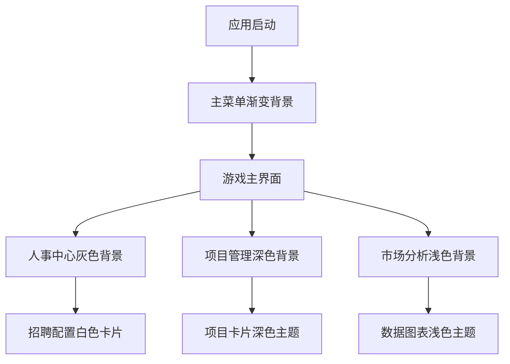

# 游戏UI界面统一背景设计方案

## 1. 产品概述

本方案旨在为游戏公司模拟经营APP创建统一的UI背景主题，提升用户体验的一致性和视觉美感。通过分析现有界面的背景使用情况，设计一套完整的背景色彩体系，确保在不修改现有代码的前提下实现视觉统一。

## 2. 核心功能

### 2.1 用户角色
本设计方案主要面向：
- 游戏玩家：享受统一、美观的游戏界面体验
- 开发团队：遵循统一的设计规范进行后续开发

### 2.2 功能模块

我们的统一背景设计方案包含以下主要模块：

1. **主背景系统**：统一的渐变背景和纯色背景方案
2. **卡片背景系统**：不同层级卡片的背景色彩规范
3. **状态背景系统**：不同状态下的背景色彩指示
4. **主题适配系统**：深色和浅色主题的背景适配

### 2.3 页面详情

| 页面名称 | 模块名称 | 功能描述 |
|---------|---------|----------|
| 主菜单界面 | 渐变背景系统 | 使用深蓝到紫色的渐变背景，营造科技感氛围 |
| 游戏主界面 | 多层背景系统 | 主背景+卡片背景的层次化设计 |
| 人事中心 | 统一灰色背景 | 使用Color(0xFFF5F5F5)作为主背景色 |
| 招聘配置 | 卡片白色背景 | 白色卡片背景配合灰色主背景 |
| 员工管理 | 渐变卡片背景 | 使用渐变背景增强视觉层次 |
| 项目管理 | 深色主题背景 | Color(0xFF1F2937)深色背景系统 |

## 3. 核心流程

### 主要背景应用流程：
1. 用户进入应用 → 显示主菜单渐变背景
2. 进入游戏界面 → 应用多层背景系统
3. 访问功能模块 → 根据模块类型应用对应背景
4. 状态变化时 → 背景色彩随状态动态调整



## 4. 用户界面设计

### 4.1 设计风格

- **主色调**：深蓝色(#1E3A8A)到紫色(#7C3AED)的渐变
- **辅助色调**：浅灰色(#F5F5F5)、白色(#FFFFFF)、深灰色(#1F2937)
- **强调色**：橙色(#F59E0B)、绿色(#10B981)、蓝色(#3B82F6)
- **背景风格**：现代化渐变+纯色组合，支持深浅主题切换
- **层次设计**：通过背景色彩深浅营造视觉层次
- **动画效果**：背景色彩的平滑过渡动画

### 4.2 页面设计概览

| 页面名称 | 模块名称 | UI元素 |
|---------|---------|--------|
| 主菜单界面 | 渐变背景 | 深蓝到紫色垂直渐变，Logo居中，按钮半透明背景 |
| 游戏主界面 | 多层背景 | 主背景渐变，信息栏半透明，卡片白色背景带阴影 |
| 人事中心 | 统一背景 | #F5F5F5主背景，白色卡片，蓝色强调元素 |
| 招聘模块 | 卡片系统 | 灰色主背景，白色卡片，状态色彩指示 |
| 项目管理 | 深色主题 | #1F2937深色背景，半透明卡片，彩色状态指示 |
| 员工管理 | 渐变卡片 | 浅色渐变背景，员工卡片渐变边框 |

### 4.3 响应式设计

- **桌面优先**：针对Android平板和大屏设备优化
- **移动适配**：完美适配手机屏幕，背景自动缩放
- **触摸优化**：背景元素支持触摸反馈效果
- **性能优化**：渐变背景使用GPU加速渲染

## 5. 背景色彩规范

### 5.1 主背景色彩

```kotlin
// 主渐变背景
val primaryGradient = listOf(
    Color(0xFF1E3A8A), // 深蓝色
    Color(0xFF7C3AED)  // 紫色
)

// 辅助渐变背景
val secondaryGradient = listOf(
    Color(0xFF667eea),
    Color(0xFF764ba2)
)

// 浅色主背景
val lightBackground = Color(0xFFF5F5F5)

// 深色主背景
val darkBackground = Color(0xFF1F2937)
```

### 5.2 卡片背景色彩

```kotlin
// 主要卡片背景
val cardBackground = Color.White

// 半透明卡片背景
val transparentCard = Color.White.copy(alpha = 0.9f)

// 深色卡片背景
val darkCard = Color(0xFF374151)

// 强调卡片背景
val accentCard = Color(0xFF10B981).copy(alpha = 0.1f)
```

### 5.3 状态背景色彩

```kotlin
// 成功状态
val successBackground = Color(0xFF10B981).copy(alpha = 0.2f)

// 警告状态
val warningBackground = Color(0xFFF59E0B).copy(alpha = 0.2f)

// 错误状态
val errorBackground = Color(0xFFEF4444).copy(alpha = 0.2f)

// 信息状态
val infoBackground = Color(0xFF3B82F6).copy(alpha = 0.2f)
```

## 6. 实施建议

### 6.1 渐进式实施

1. **第一阶段**：统一主要界面的背景色彩
2. **第二阶段**：优化卡片和组件的背景设计
3. **第三阶段**：添加动画和过渡效果
4. **第四阶段**：完善深色主题适配

### 6.2 技术实现

- 在现有主题系统中添加背景色彩定义
- 创建统一的背景组件库
- 使用Compose的Modifier.background()统一应用
- 保持现有代码结构不变，仅添加背景样式

### 6.3 质量保证

- 确保所有背景色彩符合无障碍设计标准
- 测试不同设备和屏幕尺寸的显示效果
- 验证背景色彩与文字内容的对比度
- 优化背景渲染性能，避免卡顿

## 7. 预期效果

通过实施统一背景设计方案，预期达到：

- **视觉一致性**：所有界面背景风格统一，提升品牌形象
- **用户体验**：减少视觉跳跃，提供流畅的使用体验
- **开发效率**：统一的背景规范，降低后续开发成本
- **维护便利**：集中的背景色彩管理，便于后续调整和维护