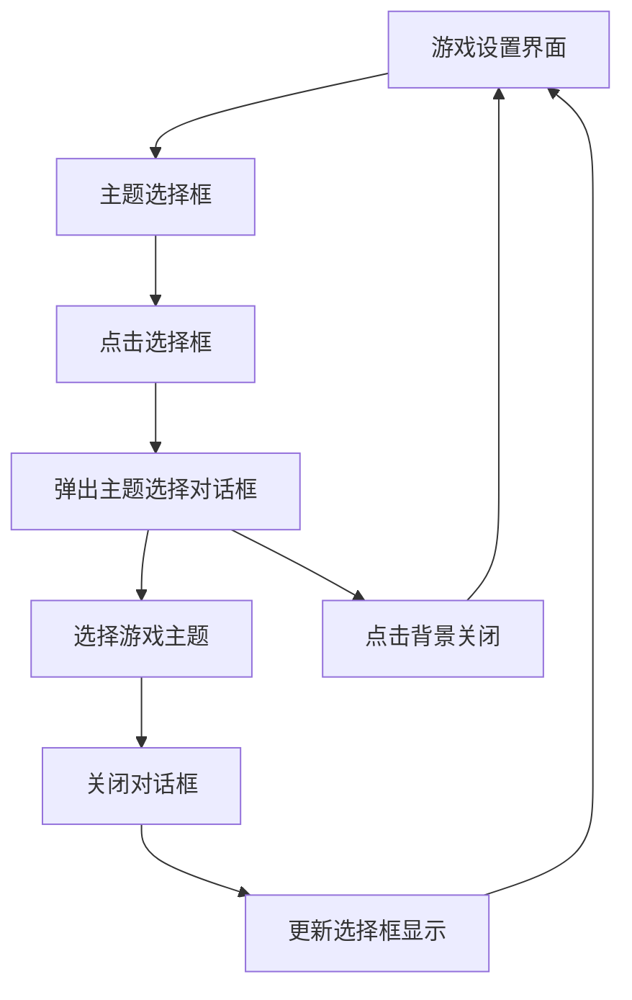

# 游戏主题选择弹出式选择框产品需求文档

## 1. 产品概述

将游戏主题选择功能从当前的水平布局优化为弹出式选择框设计，提供更现代化和用户友好的交互体验。用户点击选择框后，将弹出居中的模态对话框显示所有可选主题，选择后自动关闭并更新显示。

## 2. 核心功能

### 2.1 功能模块

本需求包含以下主要组件：
1. **主题选择框**：显示当前选中主题的紧凑型选择框
2. **弹出对话框**：居中显示的模态对话框，包含所有主题选项
3. **主题选项卡片**：对话框内的主题选择卡片列表

### 2.2 页面详情

| 组件名称 | 模块名称 | 功能描述 |
|---------|---------|----------|
| 主题选择框 | 选择框显示 | 显示当前选中主题的图标和名称，包含下拉箭头指示器 |
| 主题选择框 | 点击交互 | 点击后触发弹出对话框显示 |
| 弹出对话框 | 模态容器 | 居中显示的半透明背景模态对话框 |
| 弹出对话框 | 主题网格 | 以网格布局显示所有可选游戏主题 |
| 主题卡片 | 主题展示 | 显示主题图标、名称和选中状态 |
| 主题卡片 | 选择交互 | 点击选择主题并关闭对话框 |
| 对话框控制 | 关闭功能 | 点击背景或关闭按钮关闭对话框 |

## 3. 核心流程

用户操作流程：
1. 用户在游戏设置界面看到游戏主题选择框
2. 点击选择框触发弹出对话框
3. 在弹出的对话框中浏览和选择游戏主题
4. 选择主题后对话框自动关闭
5. 选择框更新显示新选中的主题

## 4. 用户界面设计

### 4.1 设计风格

- **主色调**：保持现有的深色主题风格
- **选择框样式**：圆角矩形边框，内含图标和文字
- **对话框样式**：居中模态对话框，半透明黑色背景
- **卡片样式**：圆角卡片设计，选中状态有绿色边框高亮
- **字体**：保持现有字体规范
- **动画效果**：淡入淡出过渡动画

### 4.2 页面设计概览

| 组件名称 | 模块名称 | UI元素 |
|---------|---------|--------|
| 主题选择框 | 选择框容器 | 高度48dp，圆角8dp，边框1dp，内边距12dp |
| 主题选择框 | 内容布局 | 水平布局：主题图标(24dp) + 主题名称 + 下拉箭头图标(16dp) |
| 弹出对话框 | 背景遮罩 | 全屏半透明黑色背景(alpha=0.5) |
| 弹出对话框 | 对话框容器 | 宽度80%屏宽，最大宽度400dp，圆角12dp，白色背景 |
| 弹出对话框 | 标题栏 | 高度56dp，标题"选择游戏主题"，右侧关闭按钮 |
| 主题网格 | 网格布局 | 2列网格，间距12dp，内边距16dp |
| 主题卡片 | 卡片样式 | 高度80dp，圆角8dp，选中时绿色边框2dp |
| 主题卡片 | 内容布局 | 垂直布局：主题图标(32dp) + 主题名称(14sp) |

### 4.3 响应式设计

- **桌面优先**：针对Android设备优化
- **触摸交互**：所有交互元素支持触摸操作
- **屏幕适配**：对话框宽度根据屏幕尺寸自适应
- **状态反馈**：点击时提供视觉反馈效果