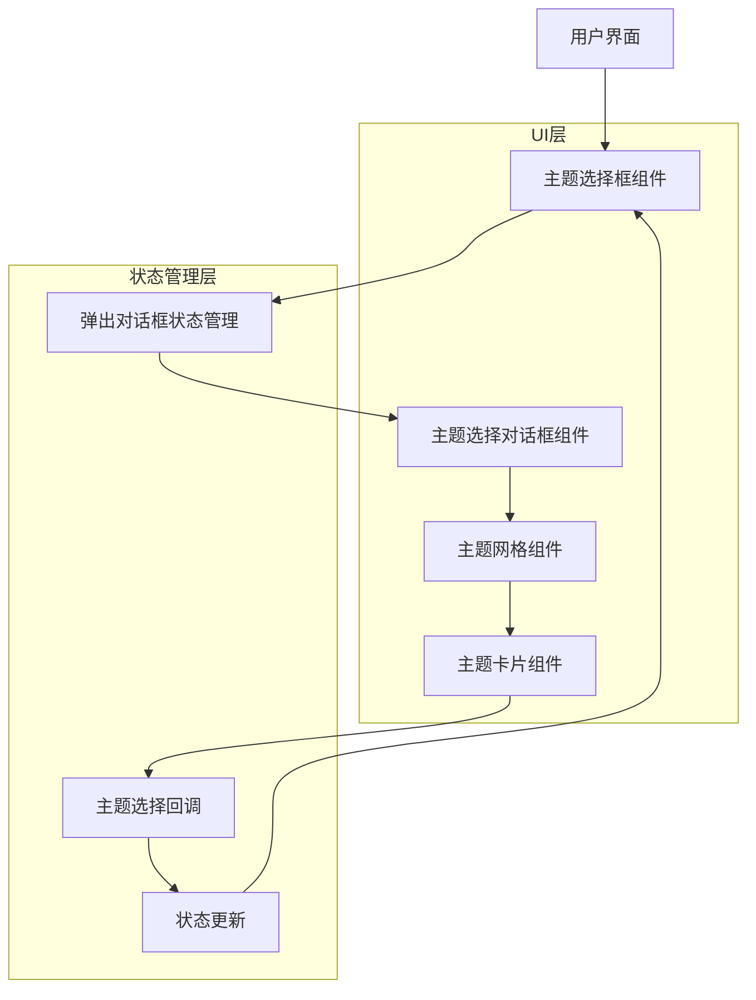

# 游戏主题选择弹出式选择框技术架构文档

## 1. 架构设计



## 2. 技术描述

* Frontend: Kotlin + Jetpack Compose

* 状态管理: Compose State

* UI框架: Material Design 3

* 动画: Compose Animation API

## 3. 组件定义

### 3.1 核心组件

| 组件名称                 | 用途                  |
| -------------------- | ------------------- |
| ThemeSelectionBox    | 主题选择框，显示当前选中主题并触发弹窗 |
| ThemeSelectionDialog | 主题选择弹出对话框           |
| ThemeGrid            | 主题网格布局组件            |
| ThemeCard            | 单个主题卡片组件            |

## 4. 实现方案

### 4.1 状态管理

```kotlin
// 在现有的GameThemeSelectionStep中添加弹窗状态
@Composable
fun GameThemeSelectionStep(
    selectedTheme: GameTheme?,
    onThemeSelected: (GameTheme) -> Unit
) {
    var showDialog by remember { mutableStateOf(false) }
    
    // 主题选择框
    ThemeSelectionBox(
        selectedTheme = selectedTheme,
        onClick = { showDialog = true }
    )
    
    // 弹出对话框
    if (showDialog) {
        ThemeSelectionDialog(
            selectedTheme = selectedTheme,
            onThemeSelected = { theme ->
                onThemeSelected(theme)
                showDialog = false
            },
            onDismiss = { showDialog = false }
        )
    }
}
```

### 4.2 主题选择框组件

```kotlin
@Composable
fun ThemeSelectionBox(
    selectedTheme: GameTheme?,
    onClick: () -> Unit
) {
    Card(
        modifier = Modifier
            .fillMaxWidth()
            .height(48.dp)
            .clickable { onClick() },
        shape = RoundedCornerShape(8.dp),
        border = BorderStroke(1.dp, Color.Gray)
    ) {
        Row(
            modifier = Modifier
                .fillMaxSize()
                .padding(horizontal = 12.dp),
            verticalAlignment = Alignment.CenterVertically
        ) {
            // 主题图标
            Icon(
                painter = painterResource(selectedTheme?.icon ?: R.drawable.ic_game),
                contentDescription = null,
                modifier = Modifier.size(24.dp)
            )
            
            Spacer(modifier = Modifier.width(8.dp))
            
            // 主题名称
            Text(
                text = selectedTheme?.displayName ?: "选择游戏主题",
                modifier = Modifier.weight(1f)
            )
            
            // 下拉箭头
            Icon(
                painter = painterResource(R.drawable.ic_arrow_drop_down),
                contentDescription = null,
                modifier = Modifier.size(16.dp)
            )
        }
    }
}
```

### 4.3 弹出对话框组件

```kotlin
@Composable
fun ThemeSelectionDialog(
    selectedTheme: GameTheme?,
    onThemeSelected: (GameTheme) -> Unit,
    onDismiss: () -> Unit
) {
    Dialog(onDismissRequest = onDismiss) {
        Card(
            modifier = Modifier
                .fillMaxWidth(0.8f)
                .wrapContentHeight(),
            shape = RoundedCornerShape(12.dp)
        ) {
            Column {
                // 标题栏
                Row(
                    modifier = Modifier
                        .fillMaxWidth()
                        .height(56.dp)
                        .padding(horizontal = 16.dp),
                    verticalAlignment = Alignment.CenterVertically
                ) {
                    Text(
                        text = "选择游戏主题",
                        style = MaterialTheme.typography.titleMedium,
                        modifier = Modifier.weight(1f)
                    )
                    
                    IconButton(onClick = onDismiss) {
                        Icon(
                            painter = painterResource(R.drawable.ic_close),
                            contentDescription = "关闭"
                        )
                    }
                }
                
                Divider()
                
                // 主题网格
                ThemeGrid(
                    selectedTheme = selectedTheme,
                    onThemeSelected = onThemeSelected
                )
            }
        }
    }
}
```

### 4.4 主题网格组件

```kotlin
@Composable
fun ThemeGrid(
    selectedTheme: GameTheme?,
    onThemeSelected: (GameTheme) -> Unit
) {
    LazyVerticalGrid(
        columns = GridCells.Fixed(2),
        contentPadding = PaddingValues(16.dp),
        horizontalArrangement = Arrangement.spacedBy(12.dp),
        verticalArrangement = Arrangement.spacedBy(12.dp)
    ) {
        items(GameTheme.values()) { theme ->
            ThemeCard(
                theme = theme,
                isSelected = theme == selectedTheme,
                onClick = { onThemeSelected(theme) }
            )
        }
    }
}
```

### 4.5 主题卡片组件

```kotlin
graph TD
    A[用户界面] --> B[主题选择框组件]
    B --> C[弹出对话框状态管理]
    C --> D[主题选择对话框组件]
    D --> E[主题网格组件]
    E --> F[主题卡片组件]
    F --> G[主题选择回调]
    G --> H[状态更新]
    H --> B

    subgraph "UI层"
        B
        D
        E
        F
    end

    subgraph "状态管理层"
        C
        G
        H
    end
```

## 5. 集成方案

### 5.1 现有代码修改点

1. **EnhancedProjectManagement.kt**

   * 修改 `GameThemeSelectionStep` 函数

   * 将现有的 `LazyRow` 替换为 `ThemeSelectionBox`

   * 添加弹窗状态管理

2. **新增组件文件**

   * 可以在同一文件中添加新的 Composable 函数

   * 或创建新的 UI 组件文件

### 5.2 兼容性保证

* 保持现有的 `onThemeSelected` 回调接口不变

* 保持 `GameTheme` 枚举类不变

* 保持现有的状态管理逻辑不变

* 只替换 UI 展示层，不影响业务逻辑

## 6. 实现步骤

1. 在现有 `GameThemeSelectionStep` 中添加弹窗状态
2. 创建 `ThemeSelectionBox` 组件替换现有布局
3. 创建 `ThemeSelectionDialog` 弹窗组件
4. 创建 `ThemeGrid` 和 `ThemeCard` 子组件
5. 测试交互功能和状态管理
6. 优化动画和用户体验

