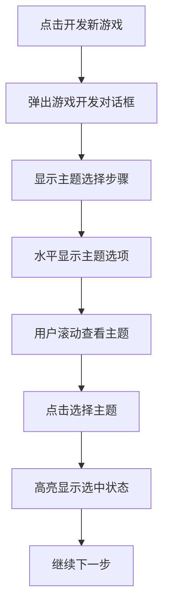

# 游戏主题选择水平布局优化产品需求文档

## 1. 产品概述

本文档描述了将游戏公司模拟经营APP中的游戏主题选择界面从当前的竖列布局优化为水平显示布局的需求。通过改进用户交互体验，使主题选择更加直观和高效。

- 优化现有游戏主题选择界面的布局方式，提升用户体验
- 保持现有功能不变，仅调整UI布局和交互方式
- 目标是创建更现代化、更符合用户习惯的主题选择界面

## 2. 核心功能

### 2.1 用户角色

本优化不涉及用户角色变更，适用于所有游戏玩家。

### 2.2 功能模块

本次优化涉及以下页面：
1. **游戏开发对话框页面**：包含游戏主题选择步骤的弹窗界面
2. **主题选择组件**：水平显示的主题选择器

### 2.3 页面详情

| 页面名称 | 模块名称 | 功能描述 |
|----------|----------|----------|
| 游戏开发对话框 | 主题选择触发按钮 | 显示"选择游戏主题"按钮，点击后弹出水平主题选择器 |
| 游戏开发对话框 | 水平主题选择器 | 以水平滚动方式展示所有游戏主题选项，支持点击选择 |
| 游戏开发对话框 | 选中状态显示 | 高亮显示当前选中的游戏主题，提供视觉反馈 |

## 3. 核心流程

用户在创建新游戏项目时的主题选择流程：

1. 用户点击"开发新游戏"按钮
2. 弹出游戏开发对话框
3. 在主题选择步骤中，用户看到"选择游戏主题"区域
4. 主题以水平排列方式显示，包含图标和名称
5. 用户可以水平滚动查看所有主题选项
6. 点击任意主题进行选择，选中的主题会有视觉高亮
7. 继续后续的游戏创建流程

## 4. 用户界面设计

### 4.1 设计风格

- **主色调**：保持现有的深蓝色(#1E3A8A)到紫色(#7C3AED)渐变背景
- **次要色彩**：绿色(#10B981)用于选中状态，白色半透明用于未选中状态
- **按钮样式**：圆角卡片式设计，带有轻微阴影效果
- **字体**：保持现有字体设置，主题名称14sp，图标24sp
- **布局风格**：水平滚动卡片布局，支持触摸滑动
- **图标风格**：使用emoji图标，保持现有的视觉风格

### 4.2 页面设计概览

| 页面名称 | 模块名称 | UI元素 |
|----------|----------|--------|
| 游戏开发对话框 | 主题选择区域 | 标题"选择游戏主题："，字体16sp，白色，加粗 |
| 游戏开发对话框 | 水平主题列表 | LazyRow布局，卡片间距12dp，支持水平滚动 |
| 游戏开发对话框 | 主题卡片 | 圆角8dp，宽度120dp，高度80dp，包含图标和文字 |
| 游戏开发对话框 | 选中效果 | 绿色边框2dp，背景色绿色半透明，图标和文字白色 |

### 4.3 响应式设计

- **桌面优先**：主要针对移动设备优化
- **触摸交互**：支持触摸滑动和点击选择
- **滚动优化**：水平滚动流畅，支持惯性滚动

## 5. 技术实现要点

### 5.1 布局变更

- 将现有的LazyColumn改为LazyRow
- 调整卡片尺寸为固定宽度，适合水平显示
- 优化间距和内边距，确保视觉平衡

### 5.2 交互优化

- 保持现有的点击选择逻辑
- 添加水平滚动支持
- 优化选中状态的视觉反馈

### 5.3 性能考虑

- 使用LazyRow确保大量主题时的性能
- 保持现有的状态管理机制
- 不影响现有的游戏创建流程