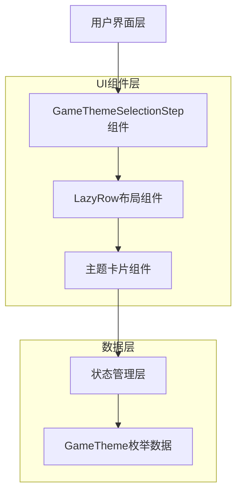

# 游戏主题选择水平布局优化技术架构文档

## 1. 架构设计



## 2. 技术描述

- 前端：Kotlin + Jetpack Compose
- UI框架：Compose UI组件
- 布局：LazyRow + Card组件
- 状态管理：Compose State

## 3. 路由定义

本优化不涉及新的路由，在现有的游戏开发对话框内进行UI组件优化。

| 组件路径 | 用途 |
|----------|------|
| EnhancedProjectManagement.kt | 包含游戏开发对话框的主要逻辑 |
| GameThemeSelectionStep | 主题选择步骤组件 |

## 4. 组件设计

### 4.1 核心组件优化

**GameThemeSelectionStep组件优化**

现有实现使用LazyColumn垂直布局：
```kotlin
LazyColumn(
    verticalArrangement = Arrangement.spacedBy(8.dp)
) {
    items(GameTheme.values().toList()) { theme ->
        // 垂直卡片布局
    }
}
```

优化后使用LazyRow水平布局：
```kotlin
LazyRow(
    horizontalArrangement = Arrangement.spacedBy(12.dp),
    contentPadding = PaddingValues(horizontal = 16.dp)
) {
    items(GameTheme.values().toList()) { theme ->
        // 水平卡片布局
    }
}
```

### 4.2 卡片组件设计

**主题卡片尺寸调整**

现有垂直卡片：
- 宽度：fillMaxWidth()
- 高度：wrap_content
- 内容：水平排列的图标和文字

优化后水平卡片：
- 宽度：120.dp（固定宽度）
- 高度：80.dp（固定高度）
- 内容：垂直排列的图标和文字

**卡片内容布局**
```kotlin
Card(
    modifier = Modifier
        .width(120.dp)
        .height(80.dp)
        .clickable { onThemeSelected(theme) },
    colors = CardDefaults.cardColors(
        containerColor = if (selectedTheme == theme) 
            Color(0xFF10B981).copy(alpha = 0.3f) 
        else 
            Color.White.copy(alpha = 0.1f)
    ),
    shape = RoundedCornerShape(8.dp)
) {
    Column(
        modifier = Modifier
            .fillMaxSize()
            .padding(8.dp),
        horizontalAlignment = Alignment.CenterHorizontally,
        verticalArrangement = Arrangement.Center
    ) {
        Text(
            text = theme.icon,
            fontSize = 24.sp
        )
        Spacer(modifier = Modifier.height(4.dp))
        Text(
            text = theme.displayName,
            color = Color.White,
            fontSize = 12.sp,
            textAlign = TextAlign.Center,
            maxLines = 1,
            overflow = TextOverflow.Ellipsis
        )
    }
}
```

## 5. 实现方案

### 5.1 组件修改策略

**文件位置**：`d:\AI\Yjcy\app\src\main\java\com\example\yjcy\ui\EnhancedProjectManagement.kt`

**修改范围**：第368-408行的GameThemeSelectionStep函数

**修改内容**：
1. 将LazyColumn改为LazyRow
2. 调整卡片尺寸为固定宽度和高度
3. 将卡片内容从Row改为Column布局
4. 优化文字显示，添加溢出处理
5. 调整间距和内边距

### 5.2 布局参数优化

**水平间距**：12.dp（卡片之间的间距）
**内容边距**：PaddingValues(horizontal = 16.dp)
**卡片圆角**：8.dp
**卡片内边距**：8.dp
**图标大小**：24.sp
**文字大小**：12.sp

### 5.3 状态管理

保持现有的状态管理逻辑：
- selectedTheme: GameTheme? - 当前选中的主题
- onThemeSelected: (GameTheme) -> Unit - 主题选择回调

### 5.4 性能优化

**LazyRow优势**：
- 只渲染可见的卡片，提高性能
- 支持大量主题时的流畅滚动
- 内存使用优化

**滚动优化**：
- 启用惯性滚动
- 支持快速滑动
- 自动对齐到卡片边界

## 6. 兼容性考虑

### 6.1 现有功能保持

- 主题选择逻辑不变
- 选中状态管理不变
- 与其他步骤的集成不变
- 数据模型GameTheme枚举不变

### 6.2 向后兼容

- 不影响现有的游戏创建流程
- 不改变API接口
- 保持现有的状态传递机制

### 6.3 测试要点

- 主题选择功能正常
- 水平滚动流畅
- 选中状态正确显示
- 在不同屏幕尺寸下的表现
- 触摸交互响应正常