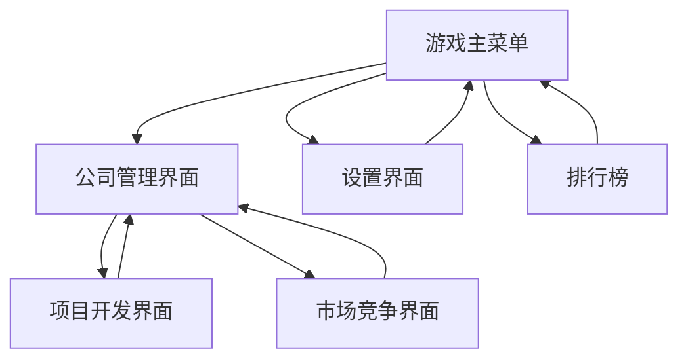

# 游戏公司模拟经营APP产品需求文档

## 1. 产品概述

一款模拟经营类手机游戏，玩家扮演初创游戏公司老板，从零开始组建团队、开发游戏、应对市场竞争，最终打造全球知名游戏公司。
- 核心玩法：团队管理、项目开发、市场竞争、公司扩张，通过策略决策体验游戏行业创业历程。
- 目标市场：面向喜爱模拟经营和策略游戏的玩家群体，预期打造具有深度和可玩性的商业模拟游戏。

## 2. 核心功能

### 2.1 用户角色

| 角色 | 注册方式 | 核心权限 |
|------|----------|----------|
| 玩家 | 游客模式或账号注册 | 可进行游戏、保存进度、查看排行榜等 |

### 2.2 功能模块

我们的游戏公司模拟经营APP包含以下主要页面：
1. **游戏主菜单**：游戏logo展示、开始游戏、继续游戏、设置选项、排行榜入口
2. **公司管理界面**：公司信息展示、员工管理、财务状况、办公室布局
3. **项目开发界面**：游戏项目列表、开发进度、技术研发、质量控制
4. **市场竞争界面**：竞争对手信息、市场分析、营销策略、销售数据
5. **设置界面**：音效设置、画质选项、账号管理、游戏帮助

### 2.3 页面详情

| 页面名称 | 模块名称 | 功能描述 |
|----------|----------|----------|
| 游戏主菜单 | Logo展示区 | 显示游戏标题和精美logo动画，营造专业游戏氛围 |
| 游戏主菜单 | 主要按钮组 | 开始新游戏、继续游戏、设置、排行榜等核心入口按钮 |
| 游戏主菜单 | 背景动效 | 动态背景展示游戏公司办公场景，增强沉浸感 |
| 公司管理界面 | 公司概览 | 显示公司名称、等级、声誉值、资金状况等核心数据 |
| 公司管理界面 | 员工管理 | 员工列表展示、搜索筛选、分页浏览、招聘新员工、查看员工详情、技能培训、员工解雇 |
| 公司管理界面 | 办公室布局 | 购买设备、装修办公室、提升工作环境 |
| 项目开发界面 | 项目列表 | 显示当前和历史游戏项目，包括开发状态和收益 |
| 项目开发界面 | 开发流程 | 策划、美术、程序、测试各阶段进度管理 |
| 项目开发界面 | 技术研发 | 解锁新技术、提升开发能力、学习新平台 |
| 市场竞争界面 | 竞争分析 | 查看其他游戏公司信息、市场占有率、热门游戏 |
| 市场竞争界面 | 营销推广 | 制定营销策略、投放广告、参加游戏展会 |
| 设置界面 | 系统设置 | 音效、画质、语言等基础设置选项 |
| 设置界面 | 账号管理 | 登录、注册、数据同步、客服联系 |

## 3. 核心流程

**主要用户操作流程：**

玩家首次进入游戏时，从主菜单开始新游戏，进入公司管理界面创建自己的游戏公司。然后通过招聘员工组建团队，在项目开发界面启动第一个游戏项目。开发过程中需要在各个阶段做出决策，同时关注市场竞争界面的行业动态。项目完成后获得收益，用于扩大公司规模和开发更大型的项目。

**页面导航流程图：**

## 4. 用户界面设计

### 4.1 设计风格

- **主色调**：深蓝色(#1E3A8A)作为主色，橙色(#F59E0B)作为强调色
- **按钮样式**：圆角矩形按钮，带有渐变效果和点击动画
- **字体**：中文使用思源黑体，英文使用Roboto，主标题18sp，正文14sp
- **布局风格**：卡片式设计，顶部导航栏，底部操作区域
- **图标风格**：扁平化设计风格，使用线性图标和适量的游戏相关emoji 🎮🏢💼

### 4.2 页面设计概览

| 页面名称 | 模块名称 | UI元素 |
|----------|----------|--------|
| 游戏主菜单 | Logo展示区 | 居中大标题，渐变文字效果，下方副标题，整体采用深蓝到紫色渐变背景 |
| 游戏主菜单 | 主要按钮组 | 垂直排列的圆角按钮，橙色渐变背景，白色文字，按钮间距16dp |
| 游戏主菜单 | 背景动效 | 粒子效果背景，模拟代码雨或电路板图案，营造科技感 |
| 公司管理界面 | 公司概览 | 顶部卡片显示关键数据，使用图标+数值的形式，卡片阴影效果 |
| 公司管理界面 | 员工管理 | 现代化卡片设计，支持列表和网格视图切换，包含搜索栏、筛选器、分页控件，员工卡片采用无边框阴影设计 |
| 项目开发界面 | 项目列表 | 列表卡片设计，每个项目显示封面图、名称、进度条、预期收益 |
| 项目开发界面 | 开发流程 | 横向时间轴设计，不同阶段用不同颜色标识，当前阶段高亮显示 |
| 设置界面 | 设置选项 | 分组列表设计，每组用分割线区分，开关和滑块控件样式统一 |

### 4.3 响应式设计

采用移动端优先设计，支持竖屏和横屏模式。针对不同屏幕尺寸优化布局，确保在各种Android设备上都有良好的显示效果。支持触摸手势操作，包括点击、长按、滑动等交互方式。

## 5. 员工管理模块重构需求

### 5.1 核心问题与解决方案

**问题1：员工数量多时查看和管理不便**
- 当前问题：员工列表采用简单垂直滚动，员工数量增多时查找特定员工困难
- 解决方案：
  - 实现智能搜索功能，支持按姓名、职位、技能等级搜索
  - 添加多维度筛选器：职位类型、技能等级范围、薪资范围
  - 引入分页机制，每页显示8-12名员工，提供页码导航
  - 支持列表和网格两种视图模式切换
  - 添加排序功能：按薪资、技能等级、入职时间等排序

**问题2：缺少招聘功能**
- 当前问题：无法主动招聘新员工，限制了团队扩张
- 解决方案：
  - 新增"招聘中心"功能模块
  - 提供候选人才库，展示可招聘的员工信息
  - 实现招聘流程：浏览候选人→查看详情→发送offer→确认入职
  - 招聘成本机制：不同技能等级员工需要不同招聘费用
  - 随机刷新机制：定期更新可招聘人才池

**问题3：界面设计过时，需要现代化改造**
- 当前问题：使用传统边框线条设计，视觉效果陈旧
- 解决方案：
  - 采用无边框卡片设计，使用阴影和圆角营造层次感
  - 实现渐变背景和微妙动画效果
  - 使用现代化图标和emoji组合
  - 优化色彩搭配，增强视觉层次
  - 添加微交互动画，提升用户体验

### 5.2 详细功能规格

**搜索与筛选功能**
- 实时搜索：输入关键词即时显示匹配结果
- 高级筛选：职位、技能等级、薪资范围的组合筛选
- 搜索历史：保存常用搜索条件
- 快速筛选标签："高技能"、"新员工"、"高薪"等预设标签

**招聘中心功能**
- 人才市场：展示可招聘候选人列表
- 候选人详情：技能属性、期望薪资、特殊能力
- 招聘成本计算：基于候选人能力的动态定价
- 招聘成功率：基于公司声誉和offer金额的成功概率
- 人才刷新：每日/每周刷新可招聘人才

**现代化UI设计**
- 卡片式布局：员工信息以卡片形式展示，支持悬浮效果
- 渐变色彩：使用渐变背景增强视觉吸引力
- 动画效果：页面切换、按钮点击、数据加载的流畅动画
- 响应式图标：根据员工状态动态变化的图标
- 深色模式支持：提供深色主题选项

### 5.3 用户体验优化

**交互优化**
- 手势支持：滑动切换视图、长按快速操作
- 快捷操作：员工卡片上直接显示常用操作按钮
- 批量操作：支持多选员工进行批量培训或管理
- 操作反馈：每个操作都有明确的视觉和触觉反馈

**性能优化**
- 虚拟滚动：大量员工数据的高效渲染
- 懒加载：按需加载员工详细信息
- 缓存机制：常用数据本地缓存，提升响应速度
- 离线支持：基础查看功能支持离线使用