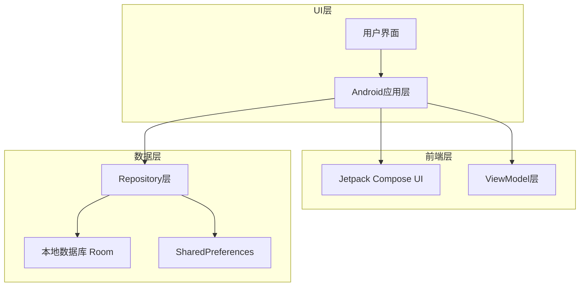
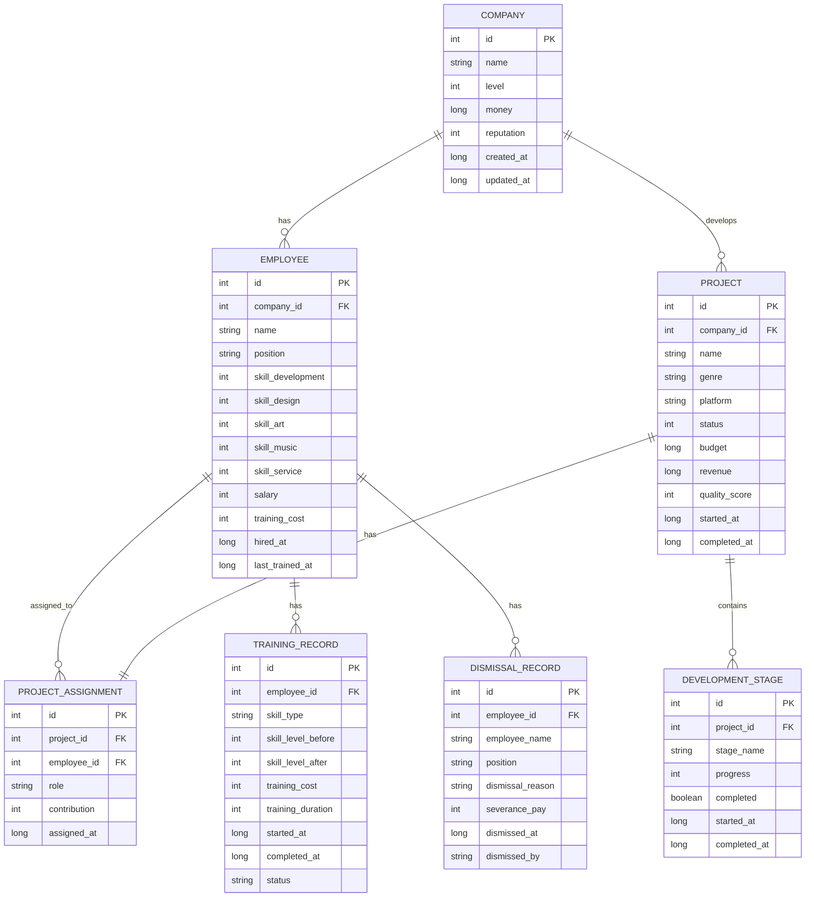

# 游戏公司模拟经营APP技术架构文档

## 1. 架构设计



## 2. 技术描述

- 前端：Android + Kotlin + Jetpack Compose + Material Design 3
- 架构模式：MVVM (Model-View-ViewModel)
- 数据存储：Room数据库 + SharedPreferences
- 依赖注入：Hilt
- 导航：Jetpack Navigation Compose

## 3. 路由定义

| 路由 | 用途 |
|------|------|
| /main_menu | 游戏主菜单，显示游戏logo和主要功能入口 |
| /company_management | 公司管理界面，显示公司信息和员工管理 |
| /employee_management | 员工管理界面，管理5个职业的员工、技能培训和解雇 |
| /project_development | 项目开发界面，管理游戏开发项目和进度 |
| /market_competition | 市场竞争界面，查看竞争对手和市场分析 |
| /settings | 设置界面，包含系统设置和账号管理 |
| /leaderboard | 排行榜界面，显示玩家成就和排名 |

## 4. 数据模型

### 4.1 数据模型定义



### 4.2 数据定义语言

**公司表 (companies)**
```sql
-- 创建公司表
CREATE TABLE companies (
    id INTEGER PRIMARY KEY AUTOINCREMENT,
    name TEXT NOT NULL,
    level INTEGER DEFAULT 1,
    money INTEGER DEFAULT 10000,
    reputation INTEGER DEFAULT 0,
    created_at INTEGER NOT NULL,
    updated_at INTEGER NOT NULL
);

-- 创建索引
CREATE INDEX idx_companies_level ON companies(level);
CREATE INDEX idx_companies_reputation ON companies(reputation DESC);

-- 初始数据
INSERT INTO companies (name, level, money, reputation, created_at, updated_at)
VALUES ('我的游戏公司', 1, 10000, 0, strftime('%s', 'now'), strftime('%s', 'now'));
```

**员工表 (employees)**
```sql
-- 创建员工表
CREATE TABLE employees (
    id INTEGER PRIMARY KEY AUTOINCREMENT,
    company_id INTEGER NOT NULL,
    name TEXT NOT NULL,
    position TEXT NOT NULL CHECK (position IN ('程序员', '策划师', '美术师', '音效师', '客服')),
    skill_development INTEGER DEFAULT 1 CHECK (skill_development BETWEEN 1 AND 5),
    skill_design INTEGER DEFAULT 1 CHECK (skill_design BETWEEN 1 AND 5),
    skill_art INTEGER DEFAULT 1 CHECK (skill_art BETWEEN 1 AND 5),
    skill_music INTEGER DEFAULT 1 CHECK (skill_music BETWEEN 1 AND 5),
    skill_service INTEGER DEFAULT 1 CHECK (skill_service BETWEEN 1 AND 5),
    salary INTEGER NOT NULL,
    training_cost INTEGER DEFAULT 0,
    hired_at INTEGER NOT NULL,
    last_trained_at INTEGER DEFAULT 0,
    FOREIGN KEY (company_id) REFERENCES companies(id)
);

-- 创建索引
CREATE INDEX idx_employees_company_id ON employees(company_id);
CREATE INDEX idx_employees_position ON employees(position);
CREATE INDEX idx_employees_skills ON employees(skill_development, skill_design, skill_art, skill_music, skill_service);

-- 初始数据
INSERT INTO employees (company_id, name, position, skill_development, skill_design, skill_art, skill_music, skill_service, salary, hired_at)
VALUES 
(1, '张程序', '程序员', 3, 1, 1, 1, 1, 8000, strftime('%s', 'now')),
(1, '李美术', '美术师', 1, 1, 3, 1, 1, 7000, strftime('%s', 'now')),
(1, '王策划', '策划师', 1, 3, 1, 1, 1, 6000, strftime('%s', 'now')),
(1, '赵音效', '音效师', 1, 1, 1, 3, 1, 6500, strftime('%s', 'now')),
(1, '钱客服', '客服', 1, 1, 1, 1, 3, 5000, strftime('%s', 'now'));
```

**项目表 (projects)**
```sql
-- 创建项目表
CREATE TABLE projects (
    id INTEGER PRIMARY KEY AUTOINCREMENT,
    company_id INTEGER NOT NULL,
    name TEXT NOT NULL,
    genre TEXT NOT NULL,
    platform TEXT NOT NULL,
    status INTEGER DEFAULT 0, -- 0:规划中 1:开发中 2:已完成 3:已发布
    budget INTEGER NOT NULL,
    revenue INTEGER DEFAULT 0,
    quality_score INTEGER DEFAULT 0,
    started_at INTEGER,
    completed_at INTEGER,
    FOREIGN KEY (company_id) REFERENCES companies(id)
);

-- 创建索引
CREATE INDEX idx_projects_company_id ON projects(company_id);
CREATE INDEX idx_projects_status ON projects(status);
CREATE INDEX idx_projects_revenue ON projects(revenue DESC);
```

**开发阶段表 (development_stages)**
```sql
-- 创建开发阶段表
CREATE TABLE development_stages (
    id INTEGER PRIMARY KEY AUTOINCREMENT,
    project_id INTEGER NOT NULL,
    stage_name TEXT NOT NULL, -- '策划', '美术', '程序', '测试'
    progress INTEGER DEFAULT 0, -- 0-100
    completed BOOLEAN DEFAULT FALSE,
    started_at INTEGER,
    completed_at INTEGER,
    FOREIGN KEY (project_id) REFERENCES projects(id)
);

-- 创建索引
CREATE INDEX idx_development_stages_project_id ON development_stages(project_id);
CREATE INDEX idx_development_stages_completed ON development_stages(completed);
```

**项目分配表 (project_assignments)**
```sql
-- 创建项目分配表
CREATE TABLE project_assignments (
    id INTEGER PRIMARY KEY AUTOINCREMENT,
    project_id INTEGER NOT NULL,
    employee_id INTEGER NOT NULL,
    role TEXT NOT NULL, -- '主程序', '主美术', '主策划'等
    contribution INTEGER DEFAULT 0, -- 贡献度 0-100
    assigned_at INTEGER NOT NULL,
    FOREIGN KEY (project_id) REFERENCES projects(id),
    FOREIGN KEY (employee_id) REFERENCES employees(id)
);

-- 创建索引
CREATE INDEX idx_project_assignments_project_id ON project_assignments(project_id);
CREATE INDEX idx_project_assignments_employee_id ON project_assignments(employee_id);
```

**员工培训记录表 (employee_training_records)**
```sql
-- 创建员工培训记录表
CREATE TABLE employee_training_records (
    id INTEGER PRIMARY KEY AUTOINCREMENT,
    employee_id INTEGER NOT NULL,
    skill_type TEXT NOT NULL CHECK (skill_type IN ('development', 'design', 'art', 'music', 'service')),
    skill_level_before INTEGER NOT NULL,
    skill_level_after INTEGER NOT NULL,
    training_cost INTEGER NOT NULL,
    training_duration INTEGER NOT NULL, -- 培训天数
    started_at INTEGER NOT NULL,
    completed_at INTEGER,
    status TEXT DEFAULT 'in_progress' CHECK (status IN ('in_progress', 'completed', 'cancelled')),
    FOREIGN KEY (employee_id) REFERENCES employees(id)
);

-- 创建索引
CREATE INDEX idx_training_records_employee_id ON employee_training_records(employee_id);
CREATE INDEX idx_training_records_status ON employee_training_records(status);
CREATE INDEX idx_training_records_skill_type ON employee_training_records(skill_type);
```

**员工解雇记录表 (employee_dismissal_records)**
```sql
-- 创建员工解雇记录表
CREATE TABLE employee_dismissal_records (
    id INTEGER PRIMARY KEY AUTOINCREMENT,
    employee_id INTEGER NOT NULL,
    employee_name TEXT NOT NULL,
    position TEXT NOT NULL,
    dismissal_reason TEXT,
    severance_pay INTEGER DEFAULT 0, -- 遣散费
    dismissed_at INTEGER NOT NULL,
    dismissed_by TEXT DEFAULT 'system',
    FOREIGN KEY (employee_id) REFERENCES employees(id)
);

-- 创建索引
CREATE INDEX idx_dismissal_records_dismissed_at ON employee_dismissal_records(dismissed_at DESC);
CREATE INDEX idx_dismissal_records_position ON employee_dismissal_records(position);
```

**候选人才库表 (candidate_pool)**
```sql
-- 创建候选人才库表
CREATE TABLE candidate_pool (
    id INTEGER PRIMARY KEY AUTOINCREMENT,
    name TEXT NOT NULL,
    position TEXT NOT NULL CHECK (position IN ('程序员', '策划师', '美术师', '音效师', '客服')),
    skill_development INTEGER DEFAULT 1 CHECK (skill_development BETWEEN 1 AND 5),
    skill_design INTEGER DEFAULT 1 CHECK (skill_design BETWEEN 1 AND 5),
    skill_art INTEGER DEFAULT 1 CHECK (skill_art BETWEEN 1 AND 5),
    skill_music INTEGER DEFAULT 1 CHECK (skill_music BETWEEN 1 AND 5),
    skill_service INTEGER DEFAULT 1 CHECK (skill_service BETWEEN 1 AND 5),
    expected_salary INTEGER NOT NULL,
    recruitment_cost INTEGER NOT NULL,
    availability_days INTEGER DEFAULT 7, -- 可招聘天数
    special_ability TEXT, -- 特殊能力描述
    generated_at INTEGER NOT NULL,
    expires_at INTEGER NOT NULL
);

-- 创建索引
CREATE INDEX idx_candidate_pool_position ON candidate_pool(position);
CREATE INDEX idx_candidate_pool_expires_at ON candidate_pool(expires_at);
CREATE INDEX idx_candidate_pool_expected_salary ON candidate_pool(expected_salary);
```

## 5. 员工管理模块技术实现方案

### 5.1 搜索与筛选技术方案

**实时搜索实现**
```kotlin
// 搜索状态管理
data class EmployeeSearchState(
    val searchQuery: String = "",
    val selectedPosition: String = "全部",
    val salaryRange: IntRange = 0..50000,
    val skillLevelRange: IntRange = 1..5,
    val sortBy: EmployeeSortType = EmployeeSortType.NAME,
    val sortOrder: SortOrder = SortOrder.ASC
)

// 搜索Repository
class EmployeeSearchRepository {
    suspend fun searchEmployees(
        query: String,
        filters: EmployeeFilters
    ): Flow<List<Employee>> {
        return employeeDao.searchEmployees(
            "%$query%", 
            filters.position,
            filters.minSalary,
            filters.maxSalary,
            filters.minSkillLevel,
            filters.maxSkillLevel
        )
    }
}
```

**分页实现方案**
```kotlin
// 使用Paging 3实现分页
class EmployeePagingSource(
    private val employeeDao: EmployeeDao,
    private val searchQuery: String,
    private val filters: EmployeeFilters
) : PagingSource<Int, Employee>() {
    
    override suspend fun load(params: LoadParams<Int>): LoadResult<Int, Employee> {
        val page = params.key ?: 0
        val pageSize = params.loadSize
        
        return try {
            val employees = employeeDao.getEmployeesPaged(
                query = searchQuery,
                filters = filters,
                limit = pageSize,
                offset = page * pageSize
            )
            
            LoadResult.Page(
                data = employees,
                prevKey = if (page == 0) null else page - 1,
                nextKey = if (employees.isEmpty()) null else page + 1
            )
        } catch (e: Exception) {
            LoadResult.Error(e)
        }
    }
}
```

### 5.2 招聘系统技术实现

**候选人生成算法**
```kotlin
class CandidateGenerator {
    private val namePool = listOf("张三", "李四", "王五", "赵六", "钱七")
    private val positions = listOf("程序员", "策划师", "美术师", "音效师", "客服")
    
    fun generateCandidates(count: Int): List<Candidate> {
        return (1..count).map {
            val position = positions.random()
            val baseSkill = Random.nextInt(1, 4)
            
            Candidate(
                name = generateRandomName(),
                position = position,
                skills = generateSkillsForPosition(position, baseSkill),
                expectedSalary = calculateExpectedSalary(position, baseSkill),
                recruitmentCost = calculateRecruitmentCost(baseSkill),
                specialAbility = generateSpecialAbility(),
                availabilityDays = Random.nextInt(3, 8),
                generatedAt = System.currentTimeMillis(),
                expiresAt = System.currentTimeMillis() + TimeUnit.DAYS.toMillis(7)
            )
        }
    }
}
```

**招聘成功率计算**
```kotlin
class RecruitmentCalculator {
    fun calculateSuccessRate(
        candidate: Candidate,
        offerSalary: Int,
        companyReputation: Int
    ): Float {
        val salaryFactor = (offerSalary.toFloat() / candidate.expectedSalary).coerceIn(0.5f, 2.0f)
        val reputationFactor = (companyReputation / 100f).coerceIn(0.1f, 1.0f)
        val baseProbability = 0.6f
        
        return (baseProbability * salaryFactor * reputationFactor).coerceIn(0.1f, 0.95f)
    }
}
```

### 5.3 现代化UI技术实现

**动画效果实现**
```kotlin
@Composable
fun ModernEmployeeCard(
    employee: Employee,
    onClick: () -> Unit
) {
    var isPressed by remember { mutableStateOf(false) }
    val scale by animateFloatAsState(
        targetValue = if (isPressed) 0.95f else 1f,
        animationSpec = spring(dampingRatio = Spring.DampingRatioMediumBouncy)
    )
    
    Card(
        modifier = Modifier
            .fillMaxWidth()
            .scale(scale)
            .pointerInput(Unit) {
                detectTapGestures(
                    onPress = {
                        isPressed = true
                        tryAwaitRelease()
                        isPressed = false
                    },
                    onTap = { onClick() }
                )
            },
        shape = RoundedCornerShape(16.dp),
        elevation = CardDefaults.cardElevation(
            defaultElevation = 8.dp,
            pressedElevation = 12.dp
        ),
        colors = CardDefaults.cardColors(
            containerColor = MaterialTheme.colorScheme.surface
        )
    ) {
        // 卡片内容
    }
}
```

**渐变背景实现**
```kotlin
@Composable
fun GradientBackground() {
    Box(
        modifier = Modifier
            .fillMaxSize()
            .background(
                brush = Brush.verticalGradient(
                    colors = listOf(
                        Color(0xFF1E3A8A),
                        Color(0xFF3B82F6),
                        Color(0xFF60A5FA)
                    )
                )
            )
    )
}
```

### 5.4 性能优化技术方案

**虚拟滚动实现**
```kotlin
@Composable
fun VirtualizedEmployeeList(
    employees: LazyPagingItems<Employee>
) {
    LazyColumn(
        contentPadding = PaddingValues(16.dp),
        verticalArrangement = Arrangement.spacedBy(8.dp)
    ) {
        items(
            count = employees.itemCount,
            key = { index -> employees[index]?.id ?: index }
        ) { index ->
            employees[index]?.let { employee ->
                ModernEmployeeCard(
                    employee = employee,
                    onClick = { /* 处理点击 */ }
                )
            }
        }
    }
}
```

**数据缓存策略**
```kotlin
class EmployeeCacheManager {
    private val memoryCache = LruCache<String, List<Employee>>(50)
    
    suspend fun getCachedEmployees(
        cacheKey: String,
        loader: suspend () -> List<Employee>
    ): List<Employee> {
        return memoryCache.get(cacheKey) ?: run {
            val employees = loader()
            memoryCache.put(cacheKey, employees)
            employees
        }
    }
}
```