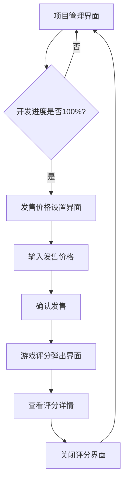

# 游戏发售价格设置与评分弹出功能产品需求文档

## 1. 产品概览

当游戏开发进度达到100%时，系统将自动引导玩家进入发售流程，包括价格设置和最终评分展示。
该功能为游戏公司模拟经营的核心环节，让玩家体验从开发完成到市场发售的完整流程，并获得基于员工技能的客观评分反馈。

## 2. 核心功能

### 2.1 用户角色

| 角色 | 注册方式 | 核心权限 |
|------|----------|----------|
| 游戏公司创始人 | 游戏内角色创建 | 设置发售价格、查看游戏评分、管理游戏项目 |

### 2.2 功能模块

本需求包含以下主要页面：
1. **发售价格设置页面**：游戏完成后的价格设定界面，包含价格输入、市场建议、确认发售功能
2. **游戏评分弹出页面**：发售后的评分展示界面，包含最终评分、评分构成、员工贡献详情

### 2.3 页面详情

| 页面名称 | 模块名称 | 功能描述 |
|----------|----------|----------|
| 发售价格设置页面 | 价格输入区域 | 提供数字输入框，支持自定义游戏发售价格，包含价格范围提示 |
| 发售价格设置页面 | 市场建议模块 | 基于游戏类型、平台、商业模式显示建议价格区间和市场分析 |
| 发售价格设置页面 | 发售确认按钮 | 确认价格设置并正式发售游戏，触发后续评分流程 |
| 游戏评分弹出页面 | 最终评分展示 | 显示游戏最终评分（0-10分制），包含评分等级和描述 |
| 游戏评分弹出页面 | 评分构成详情 | 展示基础分、技能加成分的详细计算过程和占比 |
| 游戏评分弹出页面 | 员工贡献列表 | 列出每个参与员工的技能类型、等级和对评分的具体贡献值 |
| 游戏评分弹出页面 | 关闭按钮 | 关闭评分弹窗，返回项目管理界面 |

## 3. 核心流程

### 主要用户操作流程：
1. 玩家在项目管理界面查看游戏开发进度
2. 当开发进度达到100%时，系统自动弹出发售价格设置界面
3. 玩家查看市场建议价格，输入自定义发售价格
4. 点击确认发售按钮，游戏正式发售
5. 系统立即弹出游戏评分界面，展示基于员工技能计算的评分
6. 玩家查看详细的评分构成和员工贡献情况
7. 点击关闭按钮返回项目管理界面

## 4. 用户界面设计

### 4.1 设计风格
- 主色调：深蓝色渐变背景（#1E3A8A到#7C3AED），保持与游戏整体风格一致
- 次要颜色：绿色（#10B981）用于确认按钮，橙色（#F59E0B）用于警告提示
- 按钮样式：圆角矩形设计，具有渐变效果和阴影
- 字体：中文使用系统默认字体，英文使用Roboto，主要字号16sp，标题20sp
- 布局风格：卡片式设计，居中弹窗布局
- 图标风格：使用Material Design图标，配合emoji表情增强视觉效果

### 4.2 页面设计概览

| 页面名称 | 模块名称 | UI元素 |
|----------|----------|--------|
| 发售价格设置页面 | 价格输入区域 | 白色背景卡片，数字输入框，货币符号前缀，价格范围提示文字 |
| 发售价格设置页面 | 市场建议模块 | 半透明背景卡片，建议价格高亮显示，市场分析文字说明 |
| 发售价格设置页面 | 发售确认按钮 | 绿色渐变按钮，白色文字，圆角设计，点击动画效果 |
| 游戏评分弹出页面 | 最终评分展示 | 大号评分数字，星级图标，评分等级彩色标签，圆形进度条 |
| 游戏评分弹出页面 | 评分构成详情 | 水平进度条显示各项得分，颜色区分基础分和加成分 |
| 游戏评分弹出页面 | 员工贡献列表 | 员工头像图标，姓名职位，技能等级数值，贡献值高亮显示 |

### 4.3 响应式设计
- 采用移动端优先设计，适配Android手机屏幕
- 弹窗界面支持不同屏幕尺寸自适应
- 触摸交互优化，按钮区域足够大便于点击
- 支持竖屏和横屏显示模式