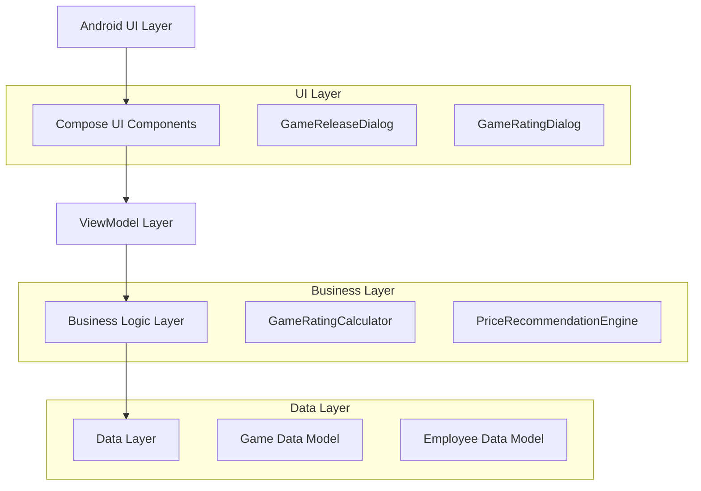
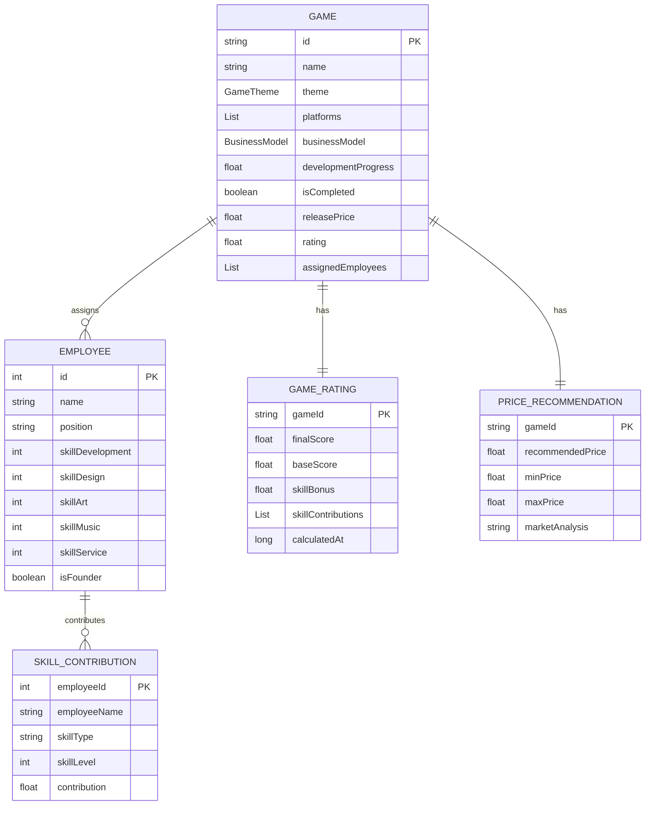

# 游戏发售价格设置与评分弹出功能技术架构文档

## 1. 架构设计



## 2. 技术描述

- Frontend: Android Kotlin + Jetpack Compose + Material3
- Architecture: MVVM + Repository Pattern
- Data Storage: Local data classes and state management
- UI Framework: Jetpack Compose with Material Design 3

## 3. 路由定义

| 路由 | 用途 |
|------|------|
| /project-management | 项目管理主界面，显示游戏开发进度 |
| /game-release-dialog | 发售价格设置弹窗（Dialog形式） |
| /game-rating-dialog | 游戏评分展示弹窗（Dialog形式） |

## 4. API定义

### 4.1 核心业务逻辑

游戏发售价格计算
```kotlin
fun calculateRecommendedPrice(
    game: Game,
    marketFactors: MarketFactors
): PriceRecommendation
```

参数:
| 参数名称 | 参数类型 | 是否必需 | 描述 |
|----------|----------|----------|------|
| game | Game | true | 游戏对象，包含主题、平台、商业模式信息 |
| marketFactors | MarketFactors | true | 市场因素，包含平台定价策略等 |

返回值:
| 参数名称 | 参数类型 | 描述 |
|----------|----------|------|
| recommendedPrice | Float | 建议发售价格 |
| priceRange | PriceRange | 价格区间建议 |
| marketAnalysis | String | 市场分析说明 |

游戏评分计算（已存在）
```kotlin
fun calculateRating(game: Game): GameRating
```

参数:
| 参数名称 | 参数类型 | 是否必需 | 描述 |
|----------|----------|----------|------|
| game | Game | true | 包含已分配员工信息的游戏对象 |

返回值:
| 参数名称 | 参数类型 | 描述 |
|----------|----------|------|
| finalScore | Float | 最终评分(0-10) |
| baseScore | Float | 基础分(5.0) |
| skillBonus | Float | 技能加成分 |
| skillContributions | List<SkillContribution> | 员工技能贡献详情 |

示例:
```json
{
  "gameId": "game-123",
  "finalScore": 7.5,
  "baseScore": 5.0,
  "skillBonus": 2.5,
  "skillContributions": [
    {
      "employeeId": 1,
      "employeeName": "张三",
      "skillType": "开发",
      "skillLevel": 8,
      "contribution": 4.0
    }
  ]
}
```

## 5. 数据模型

### 5.1 数据模型定义



### 5.2 数据定义语言

游戏发售价格推荐数据类
```kotlin
// 价格推荐数据类
data class PriceRecommendation(
    val gameId: String,
    val recommendedPrice: Float, // 建议价格
    val priceRange: PriceRange, // 价格区间
    val marketAnalysis: String, // 市场分析
    val confidence: Float = 0.8f // 推荐置信度
)

data class PriceRange(
    val minPrice: Float, // 最低建议价格
    val maxPrice: Float, // 最高建议价格
    val optimalPrice: Float // 最优价格
)

// 市场因素数据类
data class MarketFactors(
    val platformMultipliers: Map<Platform, Float>, // 平台价格系数
    val themePopularity: Map<GameTheme, Float>, // 主题受欢迎度
    val businessModelFactors: Map<BusinessModel, Float> // 商业模式因素
)

// 游戏发售状态枚举
enum class GameReleaseStatus {
    DEVELOPMENT, // 开发中
    READY_FOR_RELEASE, // 准备发售
    PRICE_SETTING, // 价格设置中
    RELEASED, // 已发售
    RATED // 已评分
}
```

扩展现有Game数据类
```kotlin
data class Game(
    val id: String,
    val name: String,
    val theme: GameTheme,
    val platforms: List<Platform>,
    val businessModel: BusinessModel,
    val developmentProgress: Float = 0f,
    val isCompleted: Boolean = false,
    val releaseStatus: GameReleaseStatus = GameReleaseStatus.DEVELOPMENT, // 新增
    val releasePrice: Float? = null, // 新增：发售价格
    val revenue: Long = 0L,
    val rating: Float? = null,
    val gameRating: GameRating? = null, // 新增：详细评分信息
    val assignedEmployees: List<Employee> = emptyList()
)
```

UI状态管理
```kotlin
// 发售价格设置UI状态
data class GameReleaseUiState(
    val isVisible: Boolean = false,
    val game: Game? = null,
    val priceRecommendation: PriceRecommendation? = null,
    val userInputPrice: String = "",
    val isValidPrice: Boolean = false,
    val isReleasing: Boolean = false
)

// 游戏评分展示UI状态
data class GameRatingUiState(
    val isVisible: Boolean = false,
    val gameRating: GameRating? = null,
    val showDetailedBreakdown: Boolean = true,
    val animationProgress: Float = 0f
)
```