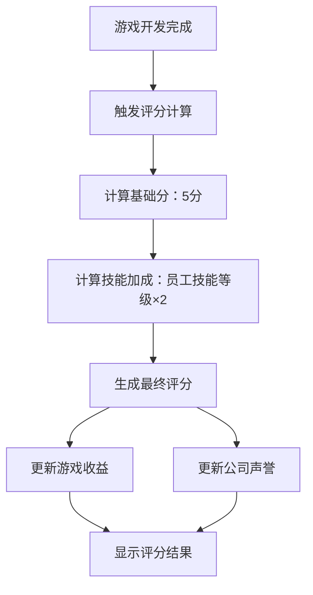

# 游戏评分系统产品需求文档

## 1. 产品概述
本功能为游戏公司模拟经营APP新增游戏评分系统，通过基础分+团队技能加成的方式计算游戏质量评分。
- 为每款完成的游戏提供客观的质量评估，增强游戏的策略性和真实感。
- 评分将直接影响游戏收益和公司声誉，激励玩家优化团队配置。

## 2. 核心功能

### 2.1 用户角色
本功能不涉及用户角色区分，所有玩家均可使用。

### 2.2 功能模块
游戏评分系统包含以下核心页面：
1. **项目管理页面**：显示游戏评分、评分详情
2. **游戏详情页面**：展示评分构成、团队贡献分析
3. **公司概览页面**：历史游戏评分统计、平均评分展示

### 2.3 页面详情

| 页面名称 | 模块名称 | 功能描述 |
|---------|---------|----------|
| 项目管理页面 | 游戏评分显示 | 在游戏卡片上显示最终评分（如：7.5/10分），使用星级或数字形式展示 |
| 项目管理页面 | 评分计算提示 | 鼠标悬停或点击评分时显示计算详情：基础分+技能加成 |
| 游戏详情页面 | 评分构成分析 | 详细展示基础分（5分）和各员工技能贡献，包含计算公式说明 |
| 游戏详情页面 | 团队贡献统计 | 显示每个参与员工的技能等级和对评分的具体贡献值 |
| 公司概览页面 | 历史评分统计 | 展示公司所有游戏的平均评分、最高评分、评分趋势图表 |
| 公司概览页面 | 声誉影响显示 | 根据游戏评分计算并显示公司声誉值的变化 |

## 3. 核心流程

### 主要操作流程
1. **游戏开发完成** → 系统自动触发评分计算
2. **评分计算** → 基础分5分 + 团队技能加成（每个员工技能等级×2）
3. **评分展示** → 在项目管理页面显示最终评分
4. **收益计算** → 根据评分调整游戏收益（高评分获得收益加成）
5. **声誉更新** → 评分影响公司声誉值，影响后续招聘和项目

## 4. 用户界面设计

### 4.1 设计风格
- **主色调**：沿用现有的深蓝色(#1E3A8A)到紫色(#7C3AED)渐变背景
- **评分颜色**：
  - 9-10分：金色(#FFD700)
  - 7-8.9分：绿色(#10B981)
  - 5-6.9分：黄色(#F59E0B)
  - 0-4.9分：红色(#EF4444)
- **字体**：使用系统默认字体，评分数字使用粗体显示
- **图标**：使用星级图标(⭐)或数字评分显示

### 4.2 页面设计概览

| 页面名称 | 模块名称 | UI元素 |
|---------|---------|--------|
| 项目管理页面 | 游戏评分卡片 | 圆角卡片，右上角显示评分徽章，使用渐变背景，评分数字加粗显示 |
| 游戏详情页面 | 评分详情面板 | 半透明白色背景面板，包含进度条显示各技能贡献，使用图表展示 |
| 公司概览页面 | 评分统计图表 | 使用折线图显示评分趋势，柱状图显示评分分布，卡片式布局 |

### 4.3 响应式设计
采用移动端优先设计，支持Android设备的触摸交互，评分详情支持点击展开/收起。