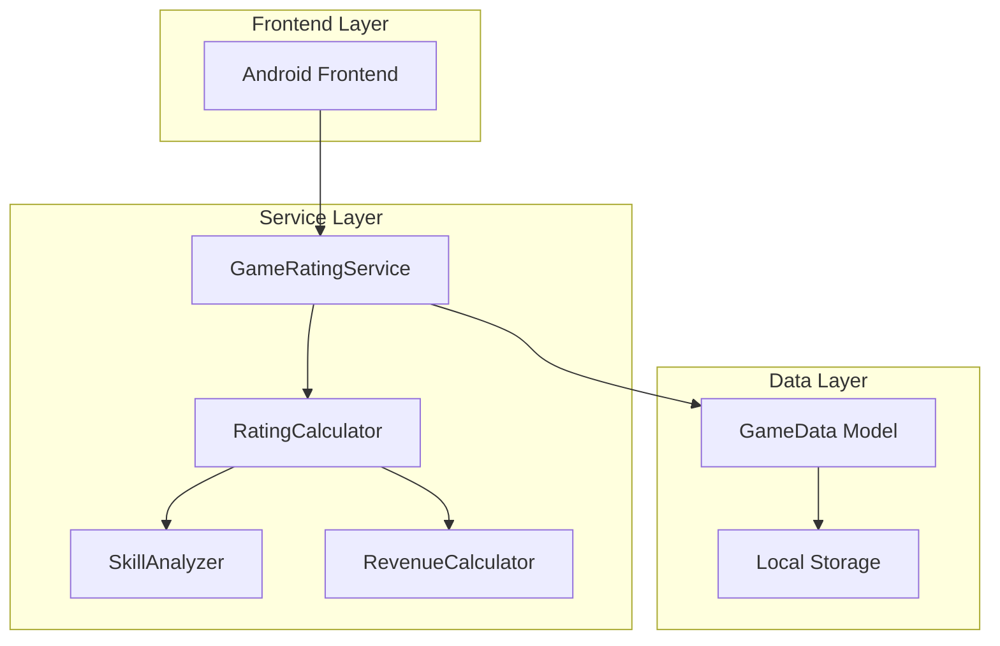
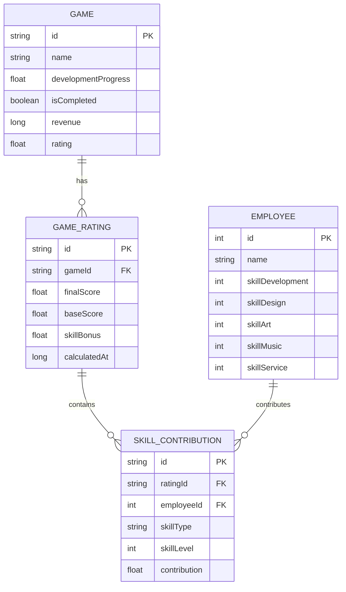

# 游戏评分系统技术架构文档

## 1. 架构设计



## 2. 技术描述
- Frontend: Kotlin + Jetpack Compose
- Backend: 无（本地计算）
- 数据存储: 本地SharedPreferences/Room数据库

## 3. 路由定义
本功能主要在现有页面中集成，不新增独立路由。

| 集成位置 | 功能描述 |
|---------|----------|
| 项目管理页面 | 在游戏卡片中显示评分信息 |
| 游戏详情弹窗 | 显示评分详情和计算过程 |
| 公司概览页面 | 显示历史评分统计 |

## 4. 核心API定义

### 4.1 评分计算服务

**GameRatingService.calculateGameRating()**

参数:
| 参数名称 | 参数类型 | 是否必需 | 描述 |
|---------|---------|---------|------|
| game | Game | true | 游戏对象，包含分配的员工信息 |
| employees | List<Employee> | true | 参与开发的员工列表 |

返回值:
| 参数名称 | 参数类型 | 描述 |
|---------|---------|------|
| rating | GameRating | 包含最终评分和详细计算信息 |

示例:
```kotlin
val rating = GameRatingService.calculateGameRating(
    game = currentGame,
    employees = assignedEmployees
)
// 返回: GameRating(finalScore = 7.5, baseScore = 5.0, skillBonus = 2.5, details = ...)
```

**RevenueCalculator.calculateRevenueWithRating()**

参数:
| 参数名称 | 参数类型 | 是否必需 | 描述 |
|---------|---------|---------|------|
| baseRevenue | Long | true | 基础收益 |
| rating | Float | true | 游戏评分(0-10) |

返回值:
| 参数名称 | 参数类型 | 描述 |
|---------|---------|------|
| adjustedRevenue | Long | 根据评分调整后的收益 |

## 5. 数据模型

### 5.1 数据模型定义



### 5.2 数据定义语言

**Game数据类扩展**
```kotlin
data class Game(
    val id: String,
    val name: String,
    val theme: GameTheme,
    val platforms: List<Platform>,
    val businessModel: BusinessModel,
    val developmentProgress: Float = 0f,
    val isCompleted: Boolean = false,
    val revenue: Long = 0L,
    val rating: Float? = null, // 新增：游戏评分
    val assignedEmployees: List<Employee> = emptyList()
)
```

**GameRating数据类**
```kotlin
data class GameRating(
    val gameId: String,
    val finalScore: Float, // 最终评分 (0-10)
    val baseScore: Float = 5.0f, // 基础分
    val skillBonus: Float, // 技能加成
    val skillContributions: List<SkillContribution>, // 技能贡献详情
    val calculatedAt: Long = System.currentTimeMillis()
)

data class SkillContribution(
    val employeeId: Int,
    val employeeName: String,
    val skillType: String, // 主要技能类型
    val skillLevel: Int, // 技能等级
    val contribution: Float // 对评分的贡献值 (skillLevel / 2)
)
```

**评分计算算法**

游戏评分计算公式：**基础分5分 + 技能等级/2**

算法说明：
1. 基础分：固定5分
2. 技能加成：每个员工的专业技能等级除以2
3. 最终评分：基础分 + 所有员工技能加成之和（最高不超过10分）

计算示例：
- 员工A（程序员，开发技能5级）：贡献 5/2 = 2.5分
- 员工B（策划师，设计技能3级）：贡献 3/2 = 1.5分
- 最终评分：5 + 2.5 + 1.5 = 9.0分

```kotlin
object GameRatingCalculator {
    const val BASE_SCORE = 5.0f
    const val SKILL_DIVISOR = 2.0f
    const val MAX_SCORE = 10.0f
    
    fun calculateRating(game: Game): GameRating {
        val skillContributions = game.assignedEmployees.map { employee ->
            val primarySkill = employee.getSpecialtySkillType()
            val skillLevel = employee.getSpecialtySkillLevel()
            
            SkillContribution(
                employeeId = employee.id,
                employeeName = employee.name,
                skillType = primarySkill,
                skillLevel = skillLevel,
                contribution = skillLevel / SKILL_DIVISOR
            )
        }
        
        val skillBonus = skillContributions.sumOf { it.contribution.toDouble() }.toFloat()
        val finalScore = min(BASE_SCORE + skillBonus, MAX_SCORE)
        
        return GameRating(
            gameId = game.id,
            finalScore = finalScore,
            baseScore = BASE_SCORE,
            skillBonus = skillBonus,
            skillContributions = skillContributions
        )
    }
}
```

**收益调整算法**
```kotlin
class RevenueCalculator {
    fun calculateAdjustedRevenue(baseRevenue: Long, rating: Float): Long {
        // 评分影响收益的倍数：
        // 9-10分: 1.5倍
        // 7-8.9分: 1.2倍
        // 5-6.9分: 1.0倍
        // 0-4.9分: 0.7倍
        val multiplier = when {
            rating >= 9.0f -> 1.5f
            rating >= 7.0f -> 1.2f
            rating >= 5.0f -> 1.0f
            else -> 0.7f
        }
        
        return (baseRevenue * multiplier).toLong()
    }
}
```