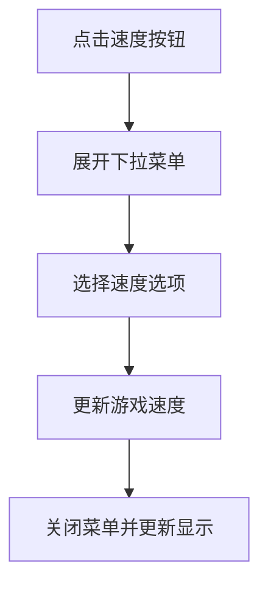

# 游戏速度下拉选项现代化设计方案

## 1. 产品概述

本方案旨在优化游戏速度下拉选项的用户体验，解决当前下拉菜单区域过大、白色背景刺眼以及选中动效不协调的问题。通过精细化的样式调整，提升界面的视觉舒适度和操作便利性。

## 2. 核心功能

### 2.1 用户角色
无需区分用户角色，所有用户均可使用游戏速度控制功能。

### 2.2 功能模块
本优化方案涉及以下核心模块：
1. **下拉按钮区域**：游戏速度显示和触发按钮
2. **下拉菜单区域**：速度选项和暂停功能选择
3. **选中状态反馈**：视觉反馈和动效系统

### 2.3 页面详情

| 页面名称 | 模块名称 | 功能描述 |
|---------|---------|----------|
| 游戏主界面 | 速度控制按钮 | 显示当前游戏速度，点击展开下拉选项 |
| 游戏主界面 | 速度下拉菜单 | 提供暂停、1x、2x、3x速度选项，支持快速切换 |
| 游戏主界面 | 选中状态指示 | 高亮显示当前选中的速度选项 |

## 3. 核心流程

用户操作流程：
1. 用户点击游戏速度按钮
2. 系统展开下拉菜单，显示所有可选速度选项
3. 用户选择目标速度或暂停选项
4. 系统更新游戏速度并关闭下拉菜单
5. 界面反馈当前选中状态

## 4. 用户界面设计

### 4.1 设计风格

**优化前问题分析：**
- 下拉菜单区域过大，占用过多屏幕空间
- 白色背景过于刺眼，影响视觉舒适度
- 选中动效与背景色对比度不协调

**优化后设计风格：**
- **主色调**：深色系背景 `Color(0xFF1F2937)` 替代刺眼白色
- **次要色调**：柔和的灰色边框 `Color(0xFF374151)`
- **强调色**：保持绿色系选中状态 `Color(0xFF10B981)`
- **按钮样式**：圆角矩形，减少阴影强度
- **字体**：14sp，Medium字重，确保可读性
- **布局风格**：紧凑型设计，减少不必要的内边距
- **动效风格**：柔和的渐变过渡，与深色背景协调

### 4.2 页面设计概览

| 页面名称 | 模块名称 | UI元素 |
|---------|---------|--------|
| 游戏主界面 | 速度控制按钮 | 深灰色背景 `Color(0xFF374151)`，白色文字，8dp圆角，减少阴影至1dp |
| 游戏主界面 | 下拉菜单容器 | 深色背景 `Color(0xFF1F2937)`，灰色边框，10dp圆角，柔和阴影8dp |
| 游戏主界面 | 菜单选项项目 | 紧凑内边距 `horizontal=6dp, vertical=4dp`，选中时绿色背景 `Color(0xFF065F46).copy(alpha=0.2f)` |
| 游戏主界面 | 选中状态指示 | 绿色文字 `Color(0xFF10B981)`，SemiBold字重，柔和背景高亮 |

### 4.3 具体优化参数

**下拉菜单尺寸优化：**
- 垂直内边距：从 `4dp` 减少到 `2dp`
- 选项内边距：从 `horizontal=8dp, vertical=6dp` 减少到 `horizontal=6dp, vertical=4dp`
- 菜单圆角：从 `12dp` 减少到 `10dp`

**背景色优化：**
- 主背景：从 `Color.White` 改为 `Color(0xFF1F2937)`
- 边框色：从 `Color(0xFFE5E7EB)` 改为 `Color(0xFF374151)`
- 选中背景：从 `Color(0xFFECFDF5)` 改为 `Color(0xFF065F46).copy(alpha=0.2f)`

**阴影优化：**
- 阴影强度：从 `12dp` 减少到 `8dp`
- 阴影透明度：从 `alpha=0.12f` 减少到 `alpha=0.08f`

**文字颜色优化：**
- 普通文字：从 `Color(0xFF374151)` 改为 `Color(0xFFE5E7EB)`
- 选中文字：保持 `Color(0xFF10B981)` 但增强对比度

### 4.4 响应性设计

本优化方案保持原有的响应性设计：
- 支持桌面和移动端自适应
- 触摸友好的点击区域（48dp最小点击区域）
- 流畅的动画过渡效果

## 5. 实现约束

**重要约束：**
- 不能重写或改动任何现有代码结构
- 只能修改样式相关的参数和颜色值
- 保持现有的功能逻辑和交互行为
- 确保与整体UI风格的一致性

**技术实现要点：**
- 修改 `DropdownMenu` 的 `modifier` 中的背景色和内边距
- 调整 `DropdownMenuItem` 的内边距和背景色
- 优化阴影参数以适配深色背景
- 确保文字颜色在深色背景下的可读性